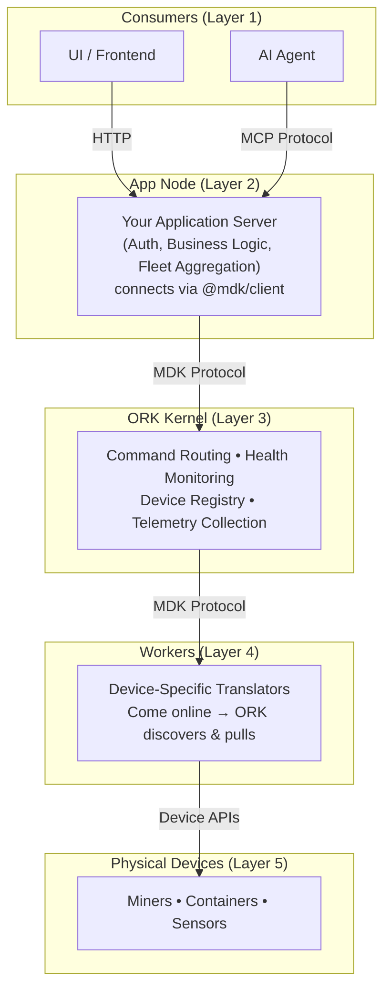

# About MDK

Open, Modular Infrastructure for Bitcoin Mining at Any Scale.

---

## What is MDK?

The Bitcoin mining industry has long been constrained by closed systems, proprietary tooling, and vendor lock-in. MDK changes that.

MDK is an **open-source platform** that delivers a modern, transparent, and modular infrastructure for Bitcoin mining operations. It empowers operators and developers to build, monitor, control, and scale mining operations with full ownership — from a single device to gigawatt-scale facilities — without architectural rewrites.

MDK is composed of three layers:

### 1) ORK — The Orchestration Kernel

ORK is the central coordination engine of MDK. Think of it as the **control tower** — it knows which devices are online, routes commands to the right place, monitors health, and collects performance data.

ORK communicates with devices through a standardized language called the **MDK Protocol** — a common set of messages that every device in the system understands, regardless of manufacturer or model. This means adding a new device type never requires changing the core system.

- **Always in control:** ORK initiates every conversation. Devices never call ORK directly — they simply come online, and ORK automatically discovers them and starts pulling data.
- **Device-agnostic:** ORK doesn't know what a "miner" is. It speaks the MDK Protocol; the device-specific details are handled by isolated Workers that act as translators.
- **Single device definition:** Each device type describes itself through a single contract file ([`mdk-contract.json`](./mdk-contract.json)) — one file that defines what the device can do and what data it reports. This contract drives the entire system: command validation, dashboard generation, and AI tool discovery (see [AI Ready](#ai-ready-with-unified-intelligence)).
- **Continuous health monitoring:** ORK continuously checks every device's liveness with rapid health probes and automatically marks unhealthy devices to prevent commands from being sent to dead hardware.
- **Self-healing:** If the system restarts, ORK automatically rebuilds its device registry, re-queues any interrupted commands, and reconnects to workers — no manual intervention required. All data is stored in crash-resilient, append-only storage (Hypercore).

### 2) `@mdk/client` — The Universal SDK

`@mdk/client` is the connection library that applications use to talk to ORK. Think of it like a universal adapter — it handles all the connection details so developers can focus on building their application.

- **Multi-language support:** Available for Node.js, Python, Go, and more — use whatever language your team prefers.
- **Automatic connection handling:** Manages reconnection, retries, and transport selection behind the scenes.
- **No lock-in:** Developers bring their own stack and connect via the SDK. No framework requirements.

### 3) MDK App Toolkit — Batteries-Included Application Layer

For teams that want to ship fast, the **MDK App Toolkit** provides a complete, optional application layer on top of ORK:

- **`@mdk/ui-core`** — The headless core. Pre-built state management that handles real-time data streams, connection drops, and loading states automatically. Includes optimistic UI — actions feel instant in the interface even before the server confirms. Framework-agnostic by design.
- **Framework adapters** — Thin wrappers that plug `@mdk/ui-core` into your UI framework: `@mdk/react`, `@mdk/vue`, `@mdk/svelte`, `@mdk/wc` (Web Components).
- **`@mdk/ui-devkit-react`** — A production-tested React component library with 100+ components for building mining dashboards instantly. Components follow a copy-paste model (inspired by shadcn/ui) — you own the code and the styling completely.
- **Plugin system** — Third-party developers can package custom dashboards and backend logic as drop-in modules — no core code changes needed.

> Full details: [MDK App Toolkit HLD](./hld-mdk-app.md)

---

## Architecture Overview

- **ORK is the kernel.** Everything above it — dashboards, business logic, AI — is built by you.
- **The App Node is your secure gateway.** All user authentication (JWT), role-based access control (RBAC), and fleet-wide aggregation happen here — keeping ORK secure and focused.
- **Two paths to build:** Write custom business logic directly in the App Node using `@mdk/client`, or use the MDK App Toolkit's plug-and-play shell — both are fully supported.
- **Workers are the source of truth.** The actual hardware state always comes from the device. ORK simply keeps a synchronized view.

---

## Who MDK is for

MDK is built for everyone who mines Bitcoin:

- **Mining operators** — Monitor and control fleets with real-time dashboards. Get fleet-wide summaries (total hashrate, power usage, temperature alerts) across all your sites.
- **Hardware manufacturers** — Integrate new devices by building a Worker and writing one `mdk-contract.json`. No core team involvement needed.
- **Software developers** — Build custom mining applications in any language, or leverage the MDK App Toolkit for rapid development.
- **AI/Automation teams** — Connect intelligent agents that can monitor, diagnose, and act on device issues autonomously (see [AI Ready](#ai-ready-with-unified-intelligence)).

---

## AI Ready with Unified Intelligence

MDK is designed from the ground up for AI-driven operations. Rather than bolting AI on as an afterthought, intelligence is woven directly into the device definition itself.

Every device's contract file (`mdk-contract.json`) contains not just technical schemas, but also:

- **Safety rules** — e.g., *"Outlet temperature > 85°C requires immediate intervention"*
- **Operational constraints** — limits on command frequency, power thresholds, cooling requirements
- **Troubleshooting guides** — if/then recovery steps that AI agents can follow autonomously

This means an AI agent connecting to MDK doesn't need a separate knowledge base or custom prompts per device. The intelligence travels with the device — the same contract that validates commands and generates dashboards also teaches the AI how to reason about that hardware safely.

**How it works:**
- AI agents connect via the **MCP endpoint** on the App Node — treated as just another authenticated client with the same security and access controls as human users.
- **Tools are auto-discovered** at runtime from registered device capabilities. No hardcoded tool definitions — when a new device type connects, the AI automatically gains the ability to query and control it.
- **One contract, three audiences:** The `mdk-contract.json` simultaneously serves the UI (data labels), the orchestrator (validation rules), and the AI agent (reasoning context).

---

## What you can build

- Operational dashboards (hashrate, power, temperature)
- Multi-site fleet management with centralized oversight
- Alerts & notifications for critical device events
- Overheating detection and automated remediation
- AI-driven autonomous monitoring and control
- Custom analytics and reporting pipelines
- White-labeled hosted mining platforms
- Third-party device integrations and plugins

---

## Scaling

MDK scales naturally without architectural changes:

- **More devices?** Add more Workers. Each Worker owns a specific set of devices, and ORK routes commands to the right one automatically.
- **More sites?** Each physical site runs its own ORK. A single App Node connects to all of them — giving you one view across your entire operation.
- **Site isolation:** ORK instances are fully independent. A problem at one site has zero impact on any other.

---

## Summary

| Layer | What it does |
|---|---|
| **ORK** | Central coordination — routes commands, collects data, monitors health |
| **`@mdk/client`** | Universal SDK for connecting applications to ORK (Node.js, Python, Go) |
| **MDK Protocol** | The common language all components speak — standardized messages for discovery, telemetry, commands, and health |
| **App Toolkit** | Optional UI components, framework adapters, and the `@mdk/ui-devkit-react` component library |
| **Plugins** | Drop-in extensions for custom dashboards and backend logic |

MDK enables Bitcoin mining operations to start small, scale smoothly, and remain in full control — without lock-in, rewrites, or hidden complexity.

> **Architecture Deep Dive:** [MDK Core HLD](./hld.md) &nbsp;|&nbsp; [MDK App Toolkit HLD](./hld-mdk-app.md)
