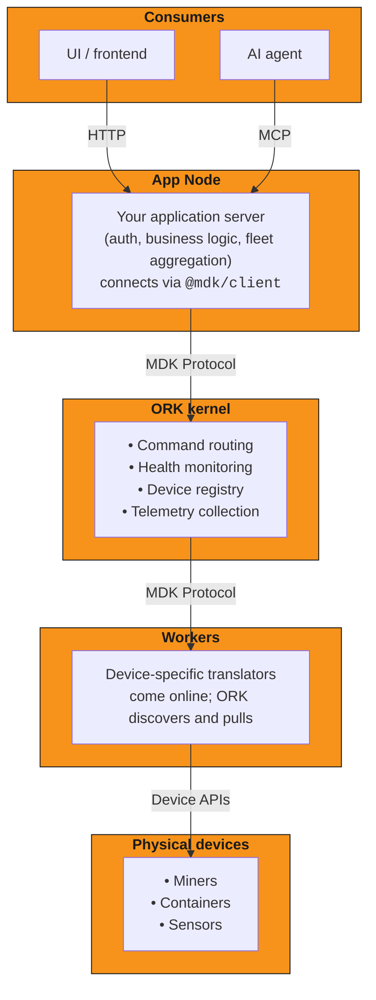

## Introducing MDK

MDK, the Mining Development Kit, is an **open-source platform** that delivers a modern, transparent, and modular infrastructure for Bitcoin mining operations. 
MDK enables Bitcoin mining operations to start small, scale smoothly, and remain in full control, without lock-in, rewrites, or hidden complexity.

## The problem

The Bitcoin mining industry has long been constrained by closed systems, proprietary tooling, and vendor lock-in. MDK changes that.

## The solution 

MDK delivers a modular mining stack that empowers operators and developers to build, monitor, control, and scale mining operations with full ownership: 
from a single device to gigawatt-scale facilities &mdash; without architectural rewrites.

MDK is composed of three layers:

1. [Orchestration kernel (ORK)](#the-orchestration-kernel)
1. [Universal SDK](#the-universal-sdk)
1. [MDK App Toolkit](#mdk-app-toolkit)

These three layers communicate through the **MDK Protocol**, while the App Toolkit can be extended with **Plugins** for custom dashboards and backend logic.

{/* todo determine if there will be links for MDK Protocol and App Toolkit --> also do I need to rename UI kit to App Toolkit?  */}

### The orchestration kernel

ORK is the central coordination engine of MDK. It serves as a controller: it knows which devices are online, routes commands to the right place, 
monitors health, and collects performance data.

ORK communicates with devices through a standardized language called the **MDK Protocol**, a common set of messages that every device in the system understands, 
regardless of manufacturer or model. Adding a new device type never impacts the core system thanks to the Worker, a device-specific translator that sits 
between ORK and your hardware: it speaks the MDK Protocol upward, and the device's native API downward.

ORK's key properties:

- **Always in control**: ORK initiates every conversation. Devices never call ORK directly; as they come online, ORK automatically discovers them 
and starts pulling data.
- **Device-agnostic**: ORK doesn't know what a "miner" is; it speaks the MDK Protocol. Device-specific details are handled by isolated **Workers** that 
act as translators.
- **Single device definition**: each device type describes itself through a single contract file ([`mdk-contract.json`](./mdk-contract.json)). One file 
defines what the device can do and what data it reports. This contract drives the entire system: command validation, dashboard generation, and AI 
tool discovery (see [AI ready with unified intelligence](#ai-ready-with-unified-intelligence)).
- **Continuous health monitoring**: ORK continuously checks every device's liveness with rapid health probes and automatically marks unhealthy devices to 
prevent commands from being sent to dead hardware.
- **Self-healing**: if the system restarts, ORK automatically rebuilds its device registry, re-queues any interrupted commands, and reconnects to Workers; 
no manual intervention required. All data is stored in crash-resilient, append-only storage ([`Hypercore`](https://docs.pears.com/building-blocks/hypercore/)).

### The universal SDK

`@mdk/client` is the universal SDK, a connection library that applications use to talk to ORK. It serves as a universal adapter: handling all the connection details 
so developers can focus on building their application.

- **Multi-language support**: available for Node.js, Python, Go, and more; use whatever language your team prefers
- **Automatic connection handling**: manages reconnection, retries, and transport selection behind the scenes
- **No lock-in**: developers bring their own stack and connect via the SDK. No framework requirements.

### MDK App Toolkit

For teams that want to ship fast, the [**MDK App Toolkit**](./hld-mdk-app.md) provides an optional, batteries-included application layer 
on top of ORK:

- **`@mdk/ui-core`**: the headless core. Pre-built state management that handles real-time data streams, connection drops, and loading states automatically. 
Includes optimistic UI: actions feel instant in the interface even before the server confirms. Framework-agnostic by design.
- **Framework adapters**: thin wrappers that plug `@mdk/ui-core` into your UI framework: `@mdk/react`, `@mdk/vue`, `@mdk/svelte`, `@mdk/wc` (Web Components).
- **`@mdk/ui-devkit-react`**: a production-tested React component library with 100+ components for building mining dashboards instantly. 
Components follow a copy-paste model (inspired by shadcn/ui); you own the code and the styling completely.
- **Plugin system**: third-party developers can package custom dashboards and backend logic as drop-in modules; no core code changes needed.

## Architecture overview

- **ORK is the kernel.** Everything above it (dashboards, business logic, AI) is built by you.
- **The App Node is your secure gateway.** All user authentication (JWT), role-based access control (RBAC), and fleet-wide aggregation happen here, keeping 
ORK secure and focused.
- **Two buid paths**: write custom business logic directly in the App Node using `@mdk/client`, or use the MDK App Toolkit's plug-and-play shell. Both 
are fully supported.
- **Devices are the source of truth.** The actual hardware state is reported by the Worker to ORK; ORK orchestrates the synchronized view.

## Who MDK is for

MDK is built for everyone involved in mining Bitcoin:

- **Mining operators**: monitor and control fleets with real-time dashboards. Get fleet-wide summaries (total hashrate, power usage, temperature alerts) 
across all your sites.
- **Hardware manufacturers**: integrate new devices by building a Worker and writing one `mdk-contract.json`. No core team involvement needed.
- **Software developers**: build custom mining applications in any language, or leverage the MDK App Toolkit for rapid development.
- **AI/Automation teams**: [connect intelligent agents](#ai-ready-with-unified-intelligence) that can monitor, diagnose, and act on device issues autonomously 

## AI ready with unified intelligence

MDK is designed from the ground up for AI-driven operations. Rather than bolting AI on as an afterthought, intelligence is woven directly into the 
device definition itself.

In addition to the technical schemas, every device's contract file (`mdk-contract.json`) contains:

- **Safety rules**: for example, "Outlet temperature > 85°C requires immediate intervention"
- **Operational constraints**: limits on command frequency, power thresholds, cooling requirements
- **Troubleshooting guides**: if/then recovery steps that AI agents can follow autonomously

This means an AI agent connecting to MDK doesn't need a separate knowledge base or custom prompts per device. The intelligence travels with the device; 
the same contract that validates commands and generates dashboards also determines how AI reasons about that hardware safely.

### How it works

- **Authenticated client**: AI agents connect via the **MCP endpoint** on the App Node, treated as just another authenticated client with the same security 
and access controls as human users.
- **Autodiscovered tools**: tools are autodiscovered at runtime from registered device capabilities. No hardcoded tool definitions: when a new device type 
connects, the AI automatically gains the ability to query and control it.
- **One contract, three audiences**: the `mdk-contract.json` simultaneously serves the UI (data labels), the orchestrator (validation rules), and the 
AI agent (reasoning context).

## What you can build

- Operational dashboards (hashrate, power, temperature)
- Multisite fleet management with centralized oversight
- Alerts and notifications for critical device events
- Overheating detection and automated remediation
- AI-driven autonomous monitoring and control
- Custom analytics and reporting pipelines
- White-labeled hosted mining platforms
- Third-party device integrations and plugins

## Scaling

MDK scales naturally without architectural changes:

- **More devices?** Add more Workers. Each Worker owns a specific set of devices, and ORK routes commands to the right one automatically.
- **More sites?** Each physical site runs its own ORK. A single App Node connects to all of them, giving you one view across your entire operation.
- **Site isolation**: ORK instances are fully independent. A problem at one site has zero impact on any other.

## The stack

{/* todo: state/link to licence ?Apache 2.0? this is released under  "The entire MDK stack is released under the Apache 2.0 license" */}

| Component | What it does |
|---|---|
| ORK | Central coordination: routes commands, collects data, monitors health |
| `@mdk/client` | Universal SDK for connecting applications to ORK (Node.js, Python, Go) |
| MDK Protocol | The common language all components speak: standardized messages for discovery, telemetry, commands, and health |
| App Toolkit | Optional UI components, framework adapters, and the `@mdk/ui-devkit-react` component library |
| Plugins | Drop-in extensions for custom dashboards and backend logic |

{/* todo decide how to fix: row 4 is @mdk/ui-devkit-react saying that component library is React-only  while adapters list Vue/Svelte and the SDK is multi-language; */}

## Next steps

{/* todo link to UI kit - Get started with the MDK App Toolkit */}

Learn more about:

- The [core architecture: MDK core](./hld.md)
- The [core architecture: MDK App Toolkit](./hld-mdk-app.md)
- [Connecting intelligent agents](#ai-ready-with-unified-intelligence)