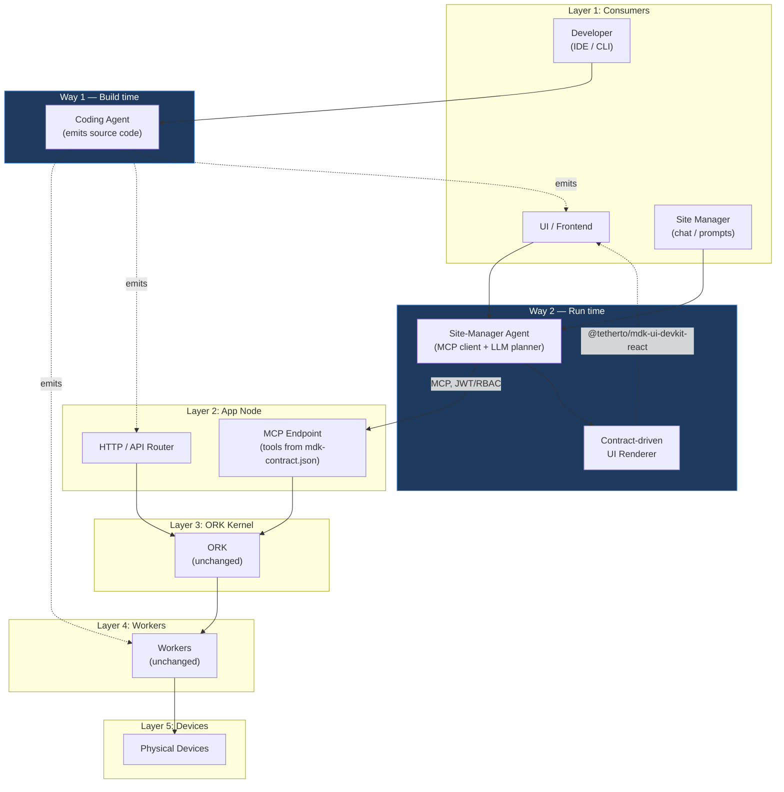

# Agentic Framework on MDK — High-Level Design

> **Version:** 0.2.0 &nbsp;|&nbsp; **Date:** 2026-05-15 &nbsp;|&nbsp; **Status:** In Review
>
> Companion to [`hld.md`](./hld.md) and [`hld-mdk-app.md`](./hld-mdk-app.md). Defines two distinct ways AI agents integrate with the MDK platform: **build-time** (a coding agent that scaffolds workers, App-Node logic, and UI on top of MDK packages) and **run-time** (a site-manager-facing agent that turns natural-language prompts into telemetry queries, fleet actions, and contract-driven UI). A working proof-of-concept for the run-time flow lives under [`mdk-be/poc/`](../poc/).

---

## 1. Introduction

MDK already treats the AI Agent as a first-class consumer of the platform: it shares the same App Node boundary as the UI, gets its tools auto-derived from each worker's `mdk-contract.json`, and is governed by the same JWT/RBAC pipeline (see [`hld.md` §4.2](./hld.md)).

This document goes one step further. It defines **two distinct, complementary agentic surfaces** the platform should support, with separate architectures, owners, security models, and roadmaps:

| | **Way 1 — Coding Agent** (build-time) | **Way 2 — Site-Manager Agent** (run-time) |
| --- | --- | --- |
| **Audience** | Platform developers, device integrators | Site managers, operators, executives |
| **Runs in** | IDE / CLI / CI alongside the developer | Browser (Agent Studio) or operator's chat client |
| **Inputs** | MDK packages, docs, existing `mdk-contract.json` files | Live `mdk-contract.json` capabilities + telemetry |
| **Outputs** | Source code (worker package, App-Node routes, React widgets) | Telemetry visualization + dispatched commands |
| **Security boundary** | The developer's local trust (no production credentials) | App Node JWT/RBAC + worker-side contract validation |
| **Lifecycle** | Once per integration / change | Continuously, every operator interaction |
| **Reference impl** | (proposed) | [`mdk-be/poc/`](../poc/) (Agent Studio + live ORK + workers) |

Both rely on the same fundamental MDK primitive — `mdk-contract.json` as the single source of truth — but they exploit it in opposite directions: the coding agent **emits** contracts and code that conforms to them; the site-manager agent **consumes** contracts at runtime to plan its tool calls and visualizations.

---

## 2. Way 1 — The Coding Agent

### 2.1 Motivation

MDK ships a deliberately layered stack ([`mdk-libraries.md`](./mdk-libraries.md)). To deliver a new device integration end-to-end, a developer must touch at least four packages:

1. **`@tetherto/mdk-worker-base`** — subclass it, implement `onTelemetryPull` and `onCommand`.
2. **`mdk-contract.json`** — declare telemetry channels, command surface, constraints, troubleshooting, semantic AI hints; validate against [`mdk-contract.schema.json`](./mdk-contract.schema.json).
3. **`@tetherto/mdk-app-node`** — wire any custom aggregation / RBAC route that isn't covered by the default MCP-tool surface.
4. **`@tetherto/mdk-ui-devkit-react`** — compose `<DeviceTile />`, `<TelemetryChart />`, `<CommandButton />` into a dashboard widget for that device.

Each layer is mechanical and well-specified — and therefore a perfect target for a coding agent. **The coding agent's job is to take a high-level intent ("integrate a new Antminer model", "add a fleet-aggregate revenue route", "scaffold a dashboard for the new powermeter") and emit the corresponding code, scaffolded against the official MDK templates, validated against the official MDK schemas, and styled with the official MDK design tokens.**

> **Goal:** *Cut a new device integration or app feature from "days of scaffolding" to "minutes of review", without inventing new abstractions outside the MDK contract.*

### 2.2 What the coding agent does (three primary jobs)

The coding agent is a single product surface (an IDE-side agent like Cursor / Claude Code / Cline / a CLI) but exposes three distinct **task templates**, each grounded in an MDK package boundary:

#### 2.2.1 Job A — Scaffold a new Worker (Device-Lib Contract author)

**Trigger:** *"Integrate the Avalon A1366 miner."*

The agent:
1. Reads [`mdk-contract.schema.json`](./mdk-contract.schema.json) and existing reference contracts (`workers/miner-worker/mdk-contract.json`, the Whatsminer / Antminer reference packages from [`mdk-libraries.md`](./mdk-libraries.md)).
2. Pulls vendor documentation (datasheet, native protocol reference) supplied by the developer.
3. Emits a new package under `packages/workers/miners/avalon-a1366/`:
   - `mdk-contract.json` — fully validated capability schema with `description`, `constraints`, and `troubleshooting` written for AI-context consumption.
   - `src/hardware.mjs` — vendor-protocol translation skeleton.
   - `src/mapping.mjs` — `translateTelemetry` + `computeHealth` per the contract's telemetry fields.
   - `src/index.mjs` — subclasses `@tetherto/mdk-worker-base`, implements `onInit`, `onTelemetryPull`, `onCommand`.
   - `package.json` — correct `@tetherto/mdk-worker-*` name + dependency versions.
4. Runs the schema validation pass before handing off; flags any contract field the developer must fill in by hand.

Reference templates already in the monorepo: [`mdk-be/poc/workers/miner-worker/`](../poc/workers/miner-worker/) and [`mdk-be/poc/workers/powermeter-worker/`](../poc/workers/powermeter-worker/).

#### 2.2.2 Job B — Scaffold App-Node business logic

**Trigger:** *"Add a cross-site revenue endpoint that aggregates hashrate × pool price per rack."*

The agent:
1. Reads the relevant `mdk-contract.json` files to know which telemetry fields exist.
2. Picks the right extension model per [`hld.md` §8](./hld.md) — either:
   - **Direct route** in the App Node using `@tetherto/mdk-client` HRPC calls, or
   - **MDK-App Plugin** per [`hld-mdk-app.md` §3](./hld-mdk-app.md) — emits a paired `MDK-App Server` (Fastify route module) + `MDK-App Widget` (React component).
3. Emits the JWT/RBAC scope declaration, the route handler, the unit test stub, and the TypeScript types.
4. Never bypasses the App Node → ORK → Worker call chain — the agent is forbidden from talking to ORK or workers directly. This mirrors the human rule in [`hld.md` §4.2](./hld.md).

#### 2.2.3 Job C — Generate a UI widget

**Trigger:** *"Scaffold a dashboard widget for the Avalon A1366."*

The agent operates as a **deterministic compiler** from `mdk-contract.json` fields to JSX using `@tetherto/mdk-ui-devkit-react`:

| Contract field | Source of truth | Generated primitive | Notes |
| --- | --- | --- | --- |
| `telemetry.<channel>` (numeric, time-series) | `mdk-contract.json` | `<TelemetryChart deviceId metric={channel} />` | Sparkline / line chart from the devkit |
| `telemetry.<channel>` (scalar / status) | `mdk-contract.json` | `<DeviceTile />` metric slot | Single-value readout |
| `commands.<action>` | `mdk-contract.json` | `<CommandButton action={action} />` | One button per safe action |
| `constraints.<rule>` | `mdk-contract.json` | `disabled` prop + tooltip | E.g. *"reboot blocked while curtailed"* |
| `description` / `troubleshooting` | `mdk-contract.json` | `aria-label`, tooltip, empty-state copy | Reuses the same AI-context prose as labels |
| Brand / theme | Host app CSS vars | Untouched (`--mdk-color-*`) | Host always wins per `@layer mdk` rule (see [`hld-mdk-app.md` §2.3.2](./hld-mdk-app.md)) |

Two delivery modes are supported:

- **Mode A — Scaffold-time:** agent generates a static `.tsx` file checked into the repo. Auditable diff, full type-checking, no runtime risk. Requires a redeploy on contract change. Best for net-new device bring-up.
- **Mode B — Runtime:** agent emits a JSON *widget descriptor*; a small `<AgentWidget descriptor={...} />` renderer in the host (likely living in `@tetherto/mdk-react-adapter`) walks the descriptor and instantiates the devkit components. Zero redeploy on contract change. Best for multi-tenant App Shells.

> **Why this works:** `@tetherto/mdk-ui-devkit-react` already enforces a strict, finite vocabulary of components, props, and CSS variables. The agent's "creativity" is bounded by that vocabulary, so generated UI is always on-brand and stylistically consistent with handwritten widgets.

### 2.3 Flow

```mermaid
sequenceDiagram
    actor Dev as Developer
    participant IDE as Coding Agent (IDE/CLI)
    participant Repo as MDK Monorepo
    participant Schema as mdk-contract.schema.json
    participant Pkg as Reference Packages

    Dev->>IDE: "Integrate Avalon A1366"

    rect rgb(70, 50, 40)
    Note over IDE,Pkg: Phase 1 — Ground in MDK
    IDE->>Schema: Read JSON Schema
    IDE->>Pkg: Read reference worker (Whatsminer)
    IDE->>Pkg: Read mdk-ui-devkit-react inventory
    IDE->>Repo: Read existing mdk-contract.json files
    end

    rect rgb(40, 60, 50)
    Note over IDE: Phase 2 — Plan
    IDE->>IDE: Map vendor capabilities → contract schema
    IDE->>IDE: Pick worker template, App-Node extension model, UI mode
    IDE->>Dev: Show plan + open questions
    end

    rect rgb(40, 50, 70)
    Note over IDE,Repo: Phase 3 — Emit
    IDE->>Repo: Write mdk-contract.json
    IDE->>Repo: Write src/{hardware,mapping,index}.mjs
    IDE->>Repo: Write App-Node route / MDK-App Plugin
    IDE->>Repo: Write React widget (.tsx) — Mode A
    IDE->>Schema: Validate generated contract ✓
    end

    rect rgb(50, 50, 40)
    Note over Dev,Repo: Phase 4 — Human review
    Dev->>Repo: Diff review, run tests, ship
    end
```

### 2.4 Boundaries

- **The coding agent never connects to a live ORK or a live worker.** It operates purely on source code and static schemas.
- **The coding agent never invents new MDK primitives.** It composes only the published vocabulary: `@tetherto/mdk-worker-base`, `@tetherto/mdk-client`, `@tetherto/mdk-app-node`, `@tetherto/mdk-ui-*`, and the `mdk-contract.schema.json` shape.
- **Source-of-truth direction:** for hardware behavior the agent's emitted code is the *first draft*; the worker's `mdk-contract.json` and `src/hardware.mjs` remain the ultimate source of truth once shipped (consistent with [`hld.md` §4.4.2](./hld.md)).
- **No changes to ORK, the MDK Protocol, or `mdk-contract.schema.json` are required to enable this agent.** It is a developer-experience layer, not a runtime layer.

---

## 3. Way 2 — The Site-Manager Agent

### 3.1 Motivation

A site manager opens a chat panel and types: *"Show the power factor across all racks"*, *"Generate me a report I can send to the boss"*, or *"Throttle the overheating miners to 2800W"*. The agent must:

1. Understand the intent against the **live** set of capabilities declared by all currently-registered workers.
2. Plan one or more MCP tool calls (`get_worker_capabilities`, `get_fleet_telemetry`, `execute_device_command`).
3. Execute through the App Node — under the same JWT/RBAC governance as a human API consumer ([`hld.md` §4.2](./hld.md)).
4. Render the result back as a **contract-driven visualization** built from `@tetherto/mdk-ui-devkit-react` primitives — never as a chat-only string.

This collapses the gap between *"natural-language operations"* and *"a dashboard a human would have hand-built"* — every fleet question becomes a one-shot, contract-grounded, executable workflow.

### 3.2 Reference implementation — the POC

A complete working implementation of this flow lives at [`mdk-be/poc/`](../poc/), exercising the full real `Agent → MCP → App Node → ORK → Worker → Device` chain in a single-process bootstrap:

- **App Node + Agent Studio UI** — `poc/agentic-studio/server.mjs` (Fastify; serves the chat UI and the MCP endpoint).
- **ORK Kernel** — `poc/ork/src/index.mjs` (HTTP-simulated MDK Protocol; Registry / Health Monitor / Telemetry Collector / Command Dispatcher / Scheduler per [`hld.md` §4.3.1](./hld.md)).
- **Workers** — `poc/workers/miner-worker/` (10 simulated miners) and `poc/workers/powermeter-worker/` (10 simulated power meters), both subclassing a `MDKWorkerBase` that mirrors `@tetherto/mdk-worker-base`.
- **LLM intent resolution** — `poc/lib/llm-interpreter.mjs` (OpenAI / Anthropic / OpenRouter-compatible; the full `mdk-contract.json` is passed as context).
- **Contract-driven UI renderer** — `poc/lib/ui-renderer.mjs` (emits HTML widgets per visualization plan).

The POC validates that **no change to the existing MDK Protocol, ORK, or worker contract is required** to host the site-manager agent — it is purely additive on the App Node + UI side.

### 3.3 Runtime pipeline

```mermaid
sequenceDiagram
    actor Op as Site Manager
    participant UI as Agent Studio UI
    participant AN as App Node (MCP)
    participant LLM as LLM Provider
    participant ORK as ORK Kernel
    participant W1 as Miner Worker
    participant W2 as Powermeter Worker

    Op->>UI: "What is the power factor across all racks?"
    UI->>AN: POST /api/v1/agent/run { prompt }

    rect rgb(70, 50, 40)
    Note over AN,W2: Phase 1 — Discover capabilities
    AN->>ORK: GET /capabilities
    ORK-->>AN: merged registrations from all workers
    end

    rect rgb(40, 50, 70)
    Note over AN,LLM: Phase 2 — Resolve intent
    AN->>LLM: prompt + full mdk-contract.json as context
    LLM-->>AN: { visualization, filter, focus_fields, command? }
    end

    rect rgb(40, 60, 50)
    Note over AN,W2: Phase 3 — Fetch data
    AN->>ORK: GET /telemetry
    par
        ORK->>W1: telemetry.pull
    and
        ORK->>W2: telemetry.pull
    end
    ORK-->>AN: fleet telemetry snapshot
    end

    rect rgb(50, 50, 40)
    Note over AN,Op: Phase 4 — (Optional) Act + Render
    alt action intent
        AN->>ORK: POST /command { deviceId, command, params }
        ORK->>W1: command.request
        W1-->>ORK: command.result
        ORK-->>AN: result
    end
    AN->>AN: Render HTML using contract telemetry schema
    AN-->>UI: { html, narrative, trace[], llm, intent }
    UI-->>Op: Renders contract-driven visualization
    end
```

### 3.4 Use cases

The POC implements both halves of the agent's value — pulling/synthesizing data, and pushing/executing actions.

#### 3.4.1 Use-case A — *"Generate a report I want to send to the boss"*

**Read-only path.** The agent calls `list_devices` and `get_fleet_telemetry(window: 24h)`, aggregates fleet-wide metrics (hashrate, uptime, anomalies, hottest device), narrates trends, and renders a printable HTML artifact.

- Stresses aggregation, not control — validates that the `App Node → ORK → Worker` pull path scales under agent-initiated fan-out.
- Zero risk to live hardware; ideal first milestone.
- High operator-visible value: an executive-ready artifact is a tangible deliverable.

#### 3.4.2 Use-case B — *"Take action"*

**Write path with verification.** The agent detects an anomaly (e.g. outlet temp > 85 °C on `wm005`), matches it to the contract's `troubleshooting` rule, dispatches `setPowerLimit` via MCP, then re-queries telemetry to confirm the temperature is dropping before reporting back to the operator.

#### 3.4.3 Use-case C — *"Show / answer / query"*

**Ad-hoc operator queries** — the most common case. *"What's the total fleet hashrate?"*, *"Which racks are over their power threshold?"*, *"Show voltage and grid status for all power meters"*. The LLM picks a visualization (`thermal_grid`, `metric_focus`, `health_status`, `full_table`, `fleet_summary`, `action_result`) and a focus-field set; the renderer materializes the answer as a dashboard panel — not a chat string.

### 3.5 Contract-driven UI rendering

The site-manager agent's UI is generated **at runtime** from the same `mdk-contract.json` that drives validation and tool discovery. The renderer (`poc/lib/ui-renderer.mjs` in the POC; production target: `@tetherto/mdk-ui-devkit-react`) walks the LLM's plan and maps it to devkit components using the same compiler rules as the build-time coding agent in §2.2.3 — guaranteeing visual consistency between hand-written, scaffolded, and runtime-generated widgets.

> **One contract, four audiences.** [`about.md`](./about.md) defines `mdk-contract.json` as the source of truth for three audiences: ORK validation, MCP tool autodiscovery, and dashboard data labels. The agentic framework adds a fourth: the **agent-as-builder and agent-as-operator** — same contract, two new consumption modes.

### 3.6 Guardrails (non-negotiable)

| Layer | Guardrail | Source |
| --- | --- | --- |
| **App Node** | JWT validation + per-action RBAC (e.g. `device:write`, `device:throttle`) before any agent tool reaches ORK | [`hld.md` §4.1.2](./hld.md) |
| **App Node** | Rate limits scoped to the agent's token | [`hld.md` §4.2](./hld.md) |
| **App Node** | The agent is forbidden from inventing actions; only commands declared in `mdk-contract.json.commands[]` can be chosen | This doc §3.6 |
| **ORK** | Generic-schema validation against the worker's declared capability before dispatch | [`hld.md` §3.4](./hld.md), Hyperschema |
| **Worker** | Final hardware-specific sanity check; source of truth | [`hld.md` §4.4.2](./hld.md) |
| **Contract** | `constraints` declare hard "do not cross" limits; `troubleshooting` declares the *only* approved recovery moves | `mdk-contract.json` |
| **LLM** | The system prompt restricts output to a validated JSON plan; visualization name, command name, and focus-field names are all checked against the live contract before execution | `poc/lib/llm-interpreter.mjs` |

The agent **never** connects directly to ORK or workers — it goes through the App Node MCP endpoint exactly like any other authenticated client (see [`hld.md` §4.2](./hld.md)).

---

## 4. Architectural placement

**Net-new components**

| Component | Layer | Status | Owner |
| --- | --- | --- | --- |
| Coding Agent task templates (Worker / App-Node / UI) | Build-time, outside the runtime stack | Proposed | Platform DevEx team |
| Site-Manager Agent (LLM intent resolver) | App Node (server) or Browser (client) | **Prototyped — [`mdk-be/poc/`](../poc/)** | Platform team |
| Contract-driven UI renderer | App Node response + `@tetherto/mdk-ui-devkit-react` | **Prototyped — `poc/lib/ui-renderer.mjs`** | UI team |
| `<AgentWidget descriptor={...} />` (Mode B) | `@tetherto/mdk-react-adapter` | Proposed | UI team |

**Unchanged components** — ORK, the MDK Protocol, all worker base classes, `mdk-contract.schema.json`, JWT/RBAC enforcement in the App Node. The agentic framework is purely additive.

---

## 5. Security & governance

| Concern | Way 1 — Coding Agent | Way 2 — Site-Manager Agent |
| --- | --- | --- |
| **Identity** | Developer's local credentials (no production access) | Standard MDK Agent JWT issued by the App Node identity provider |
| **Authorization** | Local file-system permissions | RBAC scopes (`telemetry:read`, `device:write`, `device:throttle`, …) — same model as human operators |
| **Audit trail** | Git history of the emitted files | Hyperbee-backed action log at the App Node (proposed) — every prompt, MCP tool call, and command dispatch is recorded; ORK's Command State Machine WAL ([`hld.md` §4.3.1](./hld.md)) is the secondary source |
| **Approval gating** | Human PR review | Configurable per RBAC role — high-risk commands (e.g. `shutdown`) require a mandatory human-in-the-loop confirmation; lower-risk (e.g. `setPowerLimit` within `constraints`) can be auto-approved |
| **Kill switch** | None needed | App Node feature flag immediately blocks `intent: action` plans for all agents |

---

## 6. Open questions

- **Agent runtime placement (Way 2):** does the site-manager agent run server-side as an App Node sidecar, or client-side in the operator's browser? Affects JWT minting, long-running loop supervision, and where the LLM API key lives.
- **Widget descriptor schema (Way 1, Mode B):** if we ship runtime-generated UI, do we ratify the descriptor as a first-class MDK contract — `mdk-widget.schema.json` — and govern it with Hyperschema like the rest of the protocol?
- **Cost / latency:** large fleet reports may require many `telemetry.pull` round-trips. Do we add a dedicated `telemetry.pullBatch` MCP tool, or keep App Node aggregation as the only fan-out path?
- **Audit-log storage:** Hyperbee-backed action log at the App Node vs. piggyback on ORK's Command State Machine WAL? The former is agent-scoped and queryable; the latter is already required for crash recovery.
- **Multi-LLM portability (Way 2):** the POC abstracts OpenAI / Anthropic / OpenRouter behind a single interpreter. Is this the long-term contract, or do we standardize on a single provider for production?
- **Coding-agent grounding (Way 1):** the agent must always work against the latest `mdk-contract.schema.json` and reference packages. Do we publish a dedicated `@tetherto/mdk-agent-context` NPM package that bundles schemas + canonical examples for IDE agents to load?

---

## 7. Roadmap

### 7.1 Way 2 — Site-Manager Agent

| # | Milestone | Layers exercised | Exit criteria | Status |
| --- | --- | --- | --- | --- |
| 1 | Capability discovery | Agent → MCP | Agent lists devices and dumps capabilities for one device | ✅ done in POC |
| 2 | Read-only telemetry | Agent → MCP → ORK → Worker | Agent returns 24h metrics for one device | ✅ done in POC |
| 3 | Fleet aggregation + report | Same as #2, fan-out | Agent generates Use-case A report end-to-end | ✅ done in POC |
| 4 | Single-device action | Full chain (write path) | Agent dispatches `setPowerLimit` after JWT + RBAC + contract validation passes | ✅ done in POC |
| 5 | Closed-loop action | Full chain + verification | Agent executes Use-case B (detect → throttle → verify → report) | ✅ done in POC |
| 6 | Production audit log | App Node + Hyperbee | Every agent run produces a signed, replayable record | Proposed |
| 7 | Approval-gated commands | App Node RBAC | High-risk commands require explicit human confirmation step | Proposed |
| 8 | Contract-driven UI via `@tetherto/mdk-ui-devkit-react` | UI Kit | Replace the POC's inline HTML renderer with devkit components | Proposed |

### 7.2 Way 1 — Coding Agent

| # | Milestone | Job | Exit criteria | Status |
| --- | --- | --- | --- | --- |
| 1 | Worker scaffolder | Job A | New device package compiles, contract validates against schema, ORK registers it in a smoke test | Proposed |
| 2 | App-Node route scaffolder | Job B | New aggregate endpoint ships with passing unit test and correct RBAC scopes | Proposed |
| 3 | UI widget scaffolder (Mode A) | Job C | Generated `.tsx` widget renders side-by-side with handwritten version on the same device | Proposed |
| 4 | UI widget scaffolder (Mode B) | Job C | Runtime descriptor + `<AgentWidget />` ships in `@tetherto/mdk-react-adapter` | Proposed |
| 5 | `@tetherto/mdk-agent-context` package | All jobs | NPM-installable schema + example bundle for IDE agents to load as context | Proposed |

Milestones 1–5 in §7.1 are already validated by the POC and can be promoted from `mdk-be/poc/` to production packages independently. Milestones in §7.2 are net-new but each is bounded to a single MDK package surface and can be developed in parallel.

---

## 8. Next steps

1. **Promote the POC to production packages.** Extract `poc/lib/llm-interpreter.mjs`, `poc/lib/agentic-core.mjs`, and the MCP tool layer into `@tetherto/mdk-app-node` (or a new `@tetherto/mdk-app-node-agent` plugin per the MDK-App Plugin model in [`hld-mdk-app.md` §3](./hld-mdk-app.md)).
2. **Replace the POC's inline HTML renderer with `@tetherto/mdk-ui-devkit-react` components** so site-manager-agent UI is visually identical to handwritten dashboards.
3. **Specify `@tetherto/mdk-agent-context`** — the schema+examples bundle the coding agent loads to ground its generations.
4. **Decide Mode A vs Mode B (or both)** for UI scaffolding and, if Mode B, draft `mdk-widget.schema.json`.
5. **Pick the audit-log storage strategy** (Hyperbee at App Node vs ORK WAL piggyback) and ship the first version behind a feature flag.
6. **Scope approval gating** for high-risk commands; align RBAC roles between human and agent identities.

> **References:** [`hld.md`](./hld.md) · [`hld-mdk-app.md`](./hld-mdk-app.md) · [`about.md`](./about.md) · [`mdk-libraries.md`](./mdk-libraries.md) · [`mdk-contract.schema.json`](./mdk-contract.schema.json) · POC implementation: [`mdk-be/poc/`](../poc/)
