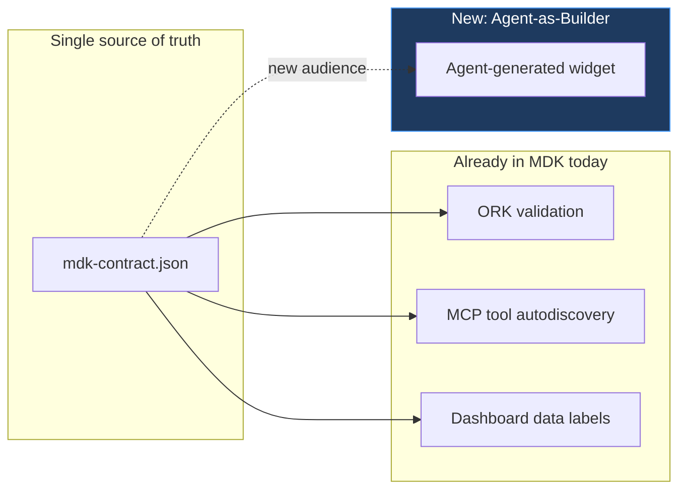
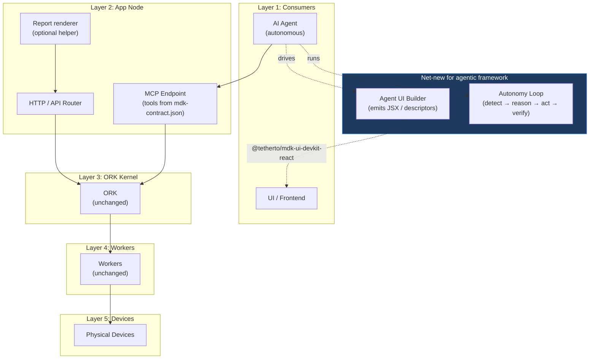

# Agentic Framework on MDK — High-Level Design

> **Version:** 0.1.0 &nbsp;|&nbsp; **Date:** 2026-05-13 &nbsp;|&nbsp; **Status:** Exploration / Proposal
>
> Companion to [`hld.md`](./hld.md) and [`hld-mdk-app.md`](./hld-mdk-app.md). Explores how autonomous AI agents can fully exploit the MDK stack — from contract-driven UI generation to closed-loop command execution.

---

## 1. Introduction

MDK already treats the AI Agent as a first-class consumer of the platform: it shares the same App Node boundary as the UI, gets its tools auto-derived from each worker's `mdk-contract.json`, and is governed by the same JWT/RBAC pipeline (see [`hld.md` §4.2](./hld.md)).

This document goes one step further and asks: **what does it look like when the agent stops being a passive tool-caller and starts driving the user experience and operational decisions end-to-end?**

Two ideas are explored:

1. **Agent-Generated UI** — the agent inspects `mdk-contract.json` and auto-scaffolds dashboard widgets from `@tetherto/mdk-ui-devkit-react` primitives.
2. **End-to-End Agentic POC** — a closed-loop flow `Agent → MCP → App Node → ORK → Worker` driven by natural-language intents like *"Generate a report for the boss"* or *"Take action on the overheating rack"*.

Both ideas leverage the **same** contract (`mdk-contract.json`) that today drives validation, dashboards, and tool discovery — extending the *"one contract, three audiences"* principle from [`about.md`](./about.md) to a fourth audience: the **agent-as-builder**.

---

## 2. Idea 1 — Agent-Generated UI

### 2.1 Motivation

The MDK App Toolkit already standardizes a React component library (`@tetherto/mdk-ui-devkit-react`) with primitives like `<DeviceTile />`, `<TelemetryChart />`, and `<CommandButton />` (see [`hld-mdk-app.md` §2.3.1](./hld-mdk-app.md)). Today, a developer manually composes these into a dashboard for each device type.

Because `mdk-contract.json` is fully self-describing — declaring telemetry channels, command surfaces, constraints, and semantic AI hints — an agent has *exactly enough* information to skip the human-in-the-loop and emit a working widget directly.

> **Goal:** *Given a `deviceId` (or device type), an agent produces a complete, styled React widget that renders live telemetry and exposes the device's safe command surface — without a developer writing JSX.*

### 2.2 Conceptual flow

```mermaid
sequenceDiagram
    actor Dev as Developer / Operator
    participant AI as AI Agent
    participant MCP as App Node (MCP)
    participant ORK as ORK
    participant W as Worker
    participant Host as Host React App

    Dev->>AI: "Scaffold a dashboard widget for wm001"

    rect rgb(70, 50, 40)
    Note over AI,W: Step 1: Contract discovery
    AI->>MCP: get_device_capabilities(deviceId: wm001)
    MCP->>ORK: HRPC (@tetherto/mdk-client)
    ORK->>W: capability.request
    W-->>ORK: mdk-contract.json
    ORK-->>MCP: capabilities payload
    MCP-->>AI: contract (telemetry + commands + semantics)
    end

    rect rgb(40, 60, 50)
    Note over AI: Step 2: Widget synthesis
    AI->>AI: Map telemetry channels -> <TelemetryChart />
    AI->>AI: Map commands -> <CommandButton />
    AI->>AI: Map constraints -> guard rails / disabled states
    AI->>AI: Emit JSX using @tetherto/mdk-ui-devkit-react
    end

    rect rgb(40, 50, 70)
    Note over AI,Host: Step 3: Delivery
    AI-->>Dev: Generated .tsx file (or live preview)
    Dev->>Host: Drop component into MDK UI Shell
    Host-->>Dev: Live widget renders
    end
```



### 2.3 Mapping `mdk-contract.json` to components

The agent operates as a **deterministic compiler** from contract fields to JSX, using the semantic hints in `mdk-contract.json` to pick the right primitive:

| Contract Field | Source of Truth | Generated Primitive | Notes |
|---|---|---|---|
| `telemetry.<channel>` (numeric, time-series) | `mdk-contract.json` | `<TelemetryChart deviceId metric={channel} />` | Sparkline / line chart from the devkit |
| `telemetry.<channel>` (scalar / status) | `mdk-contract.json` | `<DeviceTile />` metric slot | Single-value readout |
| `commands.<action>` | `mdk-contract.json` | `<CommandButton action={action} />` | One button per safe action |
| `constraints.<rule>` | `mdk-contract.json` | `disabled` prop + tooltip | E.g. *"reboot blocked while curtailed"* |
| `description` / `troubleshooting` | `mdk-contract.json` | `aria-label`, tooltip copy, empty-state text | Reuses the same AI-context prose as labels |
| Brand / theme | Host app CSS vars | Untouched (`--mdk-color-*`) | Host always wins per `@layer mdk` rule |

> **Why this works:** `@tetherto/mdk-ui-devkit-react` already enforces a strict, finite vocabulary of components, props, and CSS variables. The agent's "creativity" is bounded by that vocabulary, so generated UI is always on-brand and stylistically consistent with handwritten widgets.

### 2.4 Two delivery modes

The framework supports two delivery models depending on how much trust the developer wants to grant the agent:

#### Mode A — Scaffold-time (offline)

The agent generates a static `.tsx` file checked into the repo. The developer reviews/edits before shipping.

- **Pros:** auditable diff, full type-checking, no runtime risk.
- **Cons:** requires a redeploy whenever the contract changes.
- **Best for:** net-new device integrations, initial bring-up.

#### Mode B — Runtime (dynamic)

The agent emits a JSON "widget descriptor" (not raw JSX). A small renderer in the host app — call it `<AgentWidget descriptor={...} />` — walks the descriptor and instantiates the corresponding devkit components.

- **Pros:** zero redeploy on contract change; ideal for multi-tenant shells.
- **Cons:** the descriptor schema is now another contract to maintain; the renderer must validate strictly.
- **Best for:** the MDK UI Shell (see [`hld-mdk-app.md` §4`](./hld-mdk-app.md)), white-label platforms.

Both modes draw from the same contract; only the materialization step differs.

### 2.5 Where this lives in the architecture



No changes to ORK or the worker contract are required — this is purely an **App Node + Agent + UI Kit** initiative.

---

## 3. Idea 2 — End-to-End Agentic POC

### 3.1 Scope

A proof-of-concept demonstrating a fully autonomous flow across all five MDK layers:

```
AI Agent  →  App Node (MCP)  →  ORK  →  Worker  →  Physical Device
```

The POC exercises **both halves** of the agent's value: pulling/synthesizing data, and pushing/executing actions — without re-architecting the existing stack. Everything reuses the protocol, transport, and routing already defined in [`hld.md` §3`](./hld.md) and the MCP integration in [`hld.md` §4.2`](./hld.md).

### 3.2 Use-case A — *"Generate a report I want to send to the boss"*

**Intent:** Operator asks the agent for an executive summary. The agent must collect fleet-wide telemetry, aggregate it, narrate it, and render a polished artifact.

#### Flow



```mermaid
sequenceDiagram
    actor Op as Operator
    participant AI as AI Agent
    participant MCP as App Node (MCP)
    participant ORK as ORK
    participant W1 as Worker (Texas)
    participant W2 as Worker (Iceland)

    Op->>AI: "Generate a report I can send to the boss"

    rect rgb(70, 50, 40)
    Note over AI,W2: Phase 1 — Discover fleet
    AI->>MCP: list_devices()
    MCP->>ORK: HRPC: registry snapshot
    ORK-->>MCP: [wm001..wm999 across 2 sites]
    MCP-->>AI: fleet inventory
    end

    rect rgb(40, 60, 50)
    Note over AI,W2: Phase 2 — Pull telemetry (parallel)
    par
        AI->>MCP: get_fleet_telemetry(window: 24h)
        MCP->>ORK: telemetry queries
        ORK->>W1: telemetry.pull
        W1-->>ORK: hashrate, temps, power
    and
        ORK->>W2: telemetry.pull
        W2-->>ORK: hashrate, temps, power
    end
    ORK-->>MCP: merged payload
    MCP-->>AI: 24h fleet metrics
    end

    rect rgb(50, 50, 70)
    Note over AI: Phase 3 — Synthesize
    AI->>AI: Aggregate (avg hashrate, uptime, anomalies)
    AI->>AI: Identify outliers & narrate trends
    AI->>AI: Render report (Markdown / PDF / HTML)
    end

    AI-->>Op: "Here's your fleet report for 2026-05-13"
```

#### MCP tools exercised
- `list_devices` — derived from ORK's Worker Registry.
- `get_fleet_telemetry` — fan-out aggregation in the App Node (see [`hld.md` §7.2`](./hld.md) — multi-site centralization).
- *(optional)* `render_report` — App Node helper that formats Markdown into a branded PDF/email-ready HTML.

#### Why this is the right starter POC
- **Read-only:** zero risk to live hardware; ideal first milestone.
- **Stresses aggregation, not control:** validates that the `App Node → ORK → Worker` pull path scales under agent-initiated fan-out.
- **High operator-visible value:** an executive-ready artifact is a tangible deliverable.

### 3.3 Use-case B — *"Take action"*

**Intent:** Agent detects an anomaly (e.g. a miner overheating) and executes a corrective command autonomously, governed by the contract's safety rules.

#### Flow

```mermaid
sequenceDiagram
    actor Op as Operator
    participant AI as AI Agent
    participant MCP as App Node (MCP)
    participant ORK as ORK
    participant W as Worker
    participant Dev as Device wm002

    Op->>AI: "Watch the fleet and take action on anomalies"

    loop Periodic sweep
        AI->>MCP: get_fleet_alerts()
        MCP->>ORK: HRPC query
        ORK-->>MCP: anomalies
        MCP-->>AI: [wm002: outlet temp 89°C]
    end

    rect rgb(70, 50, 40)
    Note over AI: Phase 1 — Reason against contract
    AI->>MCP: get_device_capabilities(wm002)
    MCP-->>AI: contract (constraints + troubleshooting)
    AI->>AI: Match anomaly to troubleshooting rule:
    AI->>AI: "outlet > 85°C → reduce_power then reboot"
    end

    rect rgb(40, 50, 70)
    Note over AI,Dev: Phase 2 — Execute
    AI->>MCP: reduce_power(wm002, target: 70%)
    MCP->>MCP: Validate JWT + 'device:write' RBAC
    MCP->>ORK: command.request (generic envelope)
    ORK->>ORK: Validate vs. capabilities ✓
    ORK->>W: command.request (routed by deviceId)
    W->>Dev: native API call
    Dev-->>W: ack
    W-->>ORK: command.result
    ORK-->>MCP: result OK
    MCP-->>AI: success
    end

    rect rgb(50, 50, 40)
    Note over AI,Op: Phase 3 — Verify & report
    AI->>MCP: get_device_telemetry(wm002)
    MCP-->>AI: outlet now 78°C
    AI-->>Op: "wm002 outlet exceeded 85°C; throttled to 70%. Now stable."
    end
```

#### Guardrails (non-negotiable)

| Layer | Guardrail | Source |
|---|---|---|
| **App Node** | JWT validation + per-action RBAC (e.g. `device:write`, `device:throttle`) | [`hld.md` §4.1.2`](./hld.md) |
| **App Node** | Rate limits scoped to the agent's token | [`hld.md` §4.2`](./hld.md) |
| **ORK** | Generic-schema validation against the worker's declared capability | [`hld.md` §3.4`](./hld.md), Hyperschema |
| **Worker** | Final hardware-specific sanity check; source of truth | [`hld.md` §4.4.2`](./hld.md) |
| **Contract** | `constraints` declare hard "do not cross" limits; `troubleshooting` declares the *only* approved recovery moves | `mdk-contract.json` |

The agent **never** invents a new action — it can only invoke commands that the contract already declares safe and that the App Node RBAC explicitly permits for that agent identity.

### 3.4 POC milestone plan

| # | Milestone | Layers exercised | Exit criteria |
|---|---|---|---|
| 1 | **Capability discovery** | Agent → MCP | Agent can list devices and dump capabilities for one device. |
| 2 | **Read-only telemetry** | Agent → MCP → ORK → Worker | Agent returns 24h metrics for one device. |
| 3 | **Fleet aggregation** | Same as #2, fan-out | Agent generates Use-case A report end-to-end. |
| 4 | **Single-device action** | Full chain (write path) | Agent reboots one device after JWT + RBAC + contract validation passes. |
| 5 | **Closed-loop action** | Full chain + verification | Agent executes Use-case B (detect → throttle → verify → report). |
| 6 | **Agent-Generated UI (Mode A)** | Agent + UI Kit | Agent emits a `.tsx` widget for a new device type that compiles and renders. |

Milestones 1–3 are entirely read-side and can ship behind a feature flag; 4–5 require the operator to explicitly opt into autonomous writes; 6 is independent and can run in parallel.

---

## 4. Architectural placement



**Crucially, nothing in ORK, the workers, the MDK Protocol, or `mdk-contract.json` changes.** The agentic framework is purely additive — it lives in the App Node (new MCP tools + a report renderer) and the UI kit consumer space (the UI Builder and the optional runtime renderer).

---

## 5. Open questions

- **Agent runtime:** does the agent run server-side (App Node sidecar) or client-side (operator's browser/desktop)? Affects how JWTs are minted and how long-running loops are supervised.
- **Widget descriptor schema (Mode B):** if we ship runtime-generated UI, do we ratify the descriptor as a first-class MDK contract — i.e. `mdk-widget.schema.json` — and govern it with Hyperschema like the rest?
- **Cost / latency:** large fleet reports may require many `telemetry.pull` round-trips. Do we add a dedicated `telemetry.pullBatch` MCP tool, or rely on App Node aggregation only?
- **Audit trail:** every autonomous command should produce a signed, replayable record. Hyperbee-backed action log on the App Node, or piggyback on ORK's Command State Machine WAL?
- **Approval gating:** for higher-risk actions (e.g. `shutdown` vs `throttle`), do we want a mandatory human-in-the-loop confirmation step, configurable per RBAC role?

---

## 6. Next steps

1. Land the MCP tool surface needed for Milestone 1–2 (`list_devices`, `get_device_capabilities`, `get_device_telemetry`) — most likely already present, verify and document.
2. Prototype the Agent UI Builder against a single `mdk-contract.json` (e.g. Whatsminer) and produce a generated widget side-by-side with the handwritten one.
3. Scope Milestone 5 (closed-loop action) with explicit RBAC roles and a kill-switch on the App Node.
4. Decide Mode A vs Mode B (or both) for the UI Builder and, if Mode B is chosen, draft `mdk-widget.schema.json`.

> **References:** [`hld.md`](./hld.md) · [`hld-mdk-app.md`](./hld-mdk-app.md) · [`about.md`](./about.md) · [`mdk-contract.json`](./mdk-contract.json) · [`mdk-contract.schema.json`](./mdk-contract.schema.json)
