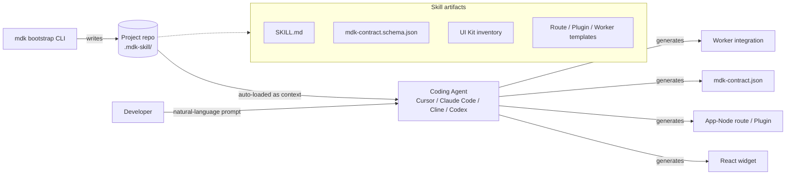
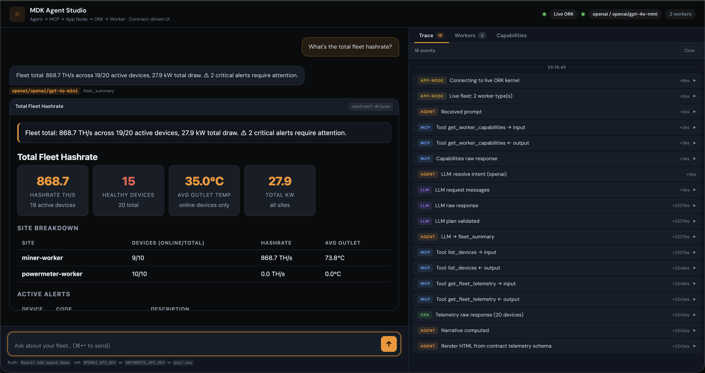
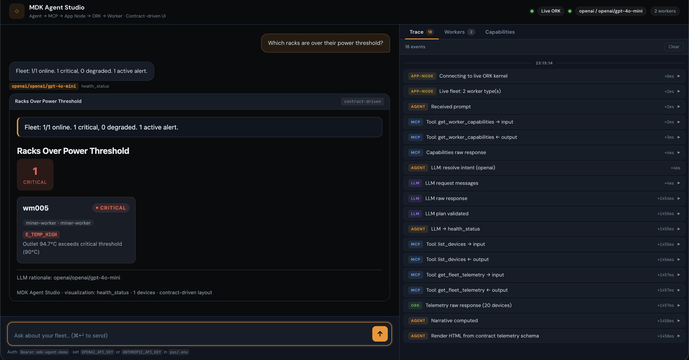
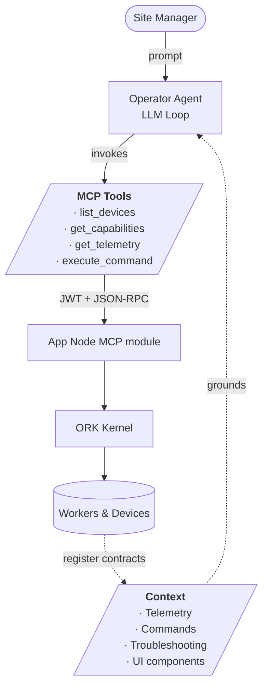

https://github.com/user-attachments/assets/34d49413-83ee-4f29-bbf9-9c57084399c2

# Agentic Framework on MDK — High-Level Design

> **Version:** 0.4.0 | **Date:** 2026-05-18 | **Status:** In Review
>
> Companion to `[hld.md](./hld.md)` and `[hld-mdk-app.md](./hld-mdk-app.md)`.

---

## 1. Overview

This document defines two distinct, complementary surfaces through which AI integrates with the MDK platform:


|                  | **MDK Developer Skill**                                             | **Operator Agent**                                                       |
| ---------------- | ------------------------------------------------------------------- | ------------------------------------------------------------------------ |
| **Nature**       | Static knowledge bundle (build-time context)                        | Autonomous runtime agent                                                 |
| **Audience**     | Platform developers, device integrators                             | Site managers, operators, executives                                     |
| **Runs in**      | Developer's coding agent (Cursor / Claude Code / Cline / Codex CLI) | Browser (Agent Studio) or operator's chat client                         |
| **Inputs**       | MDK documentation, schemas, reference code                          | Live `mdk-contract.json` capabilities from connected workers + telemetry |
| **Outputs**      | Source code — workers, App-Node routes, React widgets, configs      | Contract-driven UI visualizations + dispatched device commands           |
| **Distribution** | Injected into the developer's repo at MDK project bootstrap         | Feature in MDK components                                                |


### Key distinction:

- The **MDK Developer Skill** is not an agent — it is *context* supplied to whatever coding agent the developer already uses. 
- The **Operator Agent** is a true runtime agent: an autonomous loop with its own LLM & MCP tool calls, along with actions on physical hardware.

---

## 2. MDK Developer Skill

### 2.1 Motivation

Any coding agent the developer already uses becomes instantly fluent in MDK conventions — package vocabulary, contract schema, devkit components, deployment topology — the moment a project is bootstrapped.

Delivering a new device integration or operator-facing buisness logic requires understanding of MDK layers. MDK ships a **skill**: a portable knowledge bundle that any general-purpose coding agent can load as grounding context.

### 2.2 Skill Artifacts

A *skill* in this context is a curated bundle of plain-text, schema, and code artifacts. The MDK Developer Skill contains:

| Artifact                                  | Format           | Purpose                                                                                 |
| ----------------------------------------- | ---------------- | --------------------------------------------------------------------------------------- |
| `SKILL.md` (entry-point)                  | Markdown         | Describes when and how to apply MDK conventions; routes the agent to relevant artifacts |
| `mdk-contract.schema.json`                | JSON Schema      | Authoritative shape every worker contract must satisfy                                  |
| `@tetherto/mdk-ui-devkit-react` inventory | Markdown + types | Catalogue of every devkit UI component with props & style variables                  |
| App-Node route / Plugin / Worker templates         | `.mjs` / `.ts`   | Reference code to mimic the patterns                                   |


### 2.3 Distribution & Consumption Flow

The skill is shipped as part of the **project bootstrap step**. When a deployment is scaffolded, the bootstrap tool writes the skill artifacts directly into the repo so any coding agent picks them up automatically.




### 2.4 Worked Examples

The following illustrate how a developer interacts with their coding agent once the skill is loaded. The agent's response is grounded in the skill artifacts — it does not invent package names, schema fields, or component props.

#### Example 1 — Scaffold a new worker

> **Developer:** *"Add a worker for the Acme TH-200 thermal sensor. It reports inlet and outlet temperature every 5 seconds over Modbus TCP, and supports a `setFanSpeed` command from 0–100%. Datasheet & register map: https://acme.example.com/docs/th-200/protocol.pdf"*

**Agent (grounded in the skill + vendor docs):**

1. Reads `SKILL.md` → routes to the *new worker* job.
2. Fetches the linked datasheet to resolve Modbus register addresses, scaling factors, and command payload format.
3. Opens the reference `temperature-sensor/` worker as a template.
4. Generates the full worker package under `workers/acme-th200/` — hardware adapter, telemetry mapping, `MDKWorkerBase` subclass, and a populated `mdk-contract.json`.
5. Validates the contract against `mdk-contract.schema.json` before writing.

#### Example 2 — Add a dashboard widget

> **Developer:** *"Build me a rack-level overview widget that shows hashrate, power draw, and a thermal heatmap for every miner."*

**Agent (grounded in route templates + devkit inventory):**

- Generates a Fastify route on the App Node from the `App-Node route` template that queries ORK via the MDK client for the miner telemetry channels (`hashrate`, `powerDraw`, `outletTemp`) grouped by rack.
- Composes `<DeviceTile />`, `<TelemetryChart />`, and `<ThermalGrid />` from `@tetherto/mdk-ui-devkit-react` into the rack-level widget.
- Wires each component to the new endpoint using telemetry channel names *as declared in the miner contract*.

#### Example 3 — Aggregated endpoint with a UI panel

> **Developer:** *"Expose an aggregated endpoint that returns total fleet hashrate broken down by site, and show it in the dashboard as a stacked bar chart with a per-site summary."*

**Agent (grounded in route templates + devkit inventory):**

- Generates a Fastify route on the App Node from the `App-Node route` template that queries ORK via the MDK client for the `hashrate` telemetry channel across all miners, then aggregates the values per site.
- Picks the `<StackedBarChart />` and `<MetricSummary />` components from the devkit inventory as the natural fit for "site-wise totals + summary".
- Wires the components to the new endpoint and drops the widget into the existing dashboard, using the documented CSS-variable.

---

## 3. Operator Agent

### 3.1 Motivation

A site manager types: *"Show the power factor across all racks"*, *"Generate a report for the boss"*, or *"Throttle the overheating miners to 2800 W"*. The agent must:

1. Understand the intent against the **live** set of capabilities declared by all registered workers.
2. Plan and execute one or more MCP tool calls (`get_worker_capabilities`, `get_fleet_telemetry`, `execute_device_command`) through the App Node under the same JWT/RBAC governance as any other API consumer.
3. **Select the right UI component** — guided by the `@tetherto/mdk-ui-devkit-react` inventory from the Developer Skill — and render live data into it, delivering a real dashboard panel rather than a plain-text reply.

This collapses the gap between natural-language operations and a dashboard a human would have hand-built.

### 3.2 Demo

A working end-to-end POC of the Operator Agent — exercising the full `Agent → MCP → App Node → ORK → Worker → Device` chain in a single-process bootstrap — lives at [`mdk-be/poc/`](../poc/).

Each asset below captures one operator prompt flowing through the live system and rendering back as a contract-driven UI panel. All assets live under [`mdk-be/docs/demo/`](./demo/).

#### Videos

##### 1. Single-miner temperature query

*"What's the outlet temperature on miners?"* — read-only path: `get_fleet_telemetry(filter)` → `metric_focus` visualization.

<video src="./demo/get_miner_temperature.mp4" controls width="720"></video>

> Fallback: [`get_miner_temperature.mp4`](./demo/get_miner_temperature.mp4)

##### 2. Power status query

*"What's the current power draw usage?"* — read-only path: `get_fleet_telemetry` → `health_status` / `metric_focus` visualization.

<video src="./demo/get_power_status.mp4" controls width="720"></video>


https://github.com/user-attachments/assets/dc05010f-b04f-4837-9afe-9df3977fc9f2


https://github.com/user-attachments/assets/8398f977-39ed-4ce0-bf08-537d0b47f00b


https://github.com/user-attachments/assets/cf7793fe-837c-4742-9362-fd858707501e


> Fallback: [`get_power_status.mp4`](./demo/get_power_status.mp4)

##### 4. Throttle a miner

*"Set power limit on miner to 2000 W"* — write path: `execute_device_command(setPowerLimit)` → `action_result` visualization with follow-up telemetry verification.

<video src="./demo/set_power_limit_to_miner.mp4" controls width="720"></video>

> Fallback: [`set_power_limit_to_miner.mp4`](./demo/set_power_limit_to_miner.mp4)

#### Screenshots

##### Fleet hashrate

*"What's the total fleet hashrate?"* — `get_fleet_telemetry` → `fleet_summary` visualization.



##### Devices over power threshold

*"Which racks are over their power threshold?"* — `get_fleet_telemetry` → `health_status` visualization, filtered to over-threshold devices.



### 3.3 MCP Endpoint — Architecture

The MCP endpoint is **not a separate server** — it is a module mounted inside the App Node (`@tetherto/mdk-app-node`), sharing the same Fastify instance, JWT/RBAC middleware, and request log.

This keeps a **single trust boundary** for every consumer — UI, API client, or AI agent. The agent gets no special back-channel.

At boot the MCP module:

- **Builds the tool list** — reads each worker's `mdk-contract.json` via ORK and generates one MCP tool per telemetry channel and per command, with validators straight from the contract. Refreshes on worker registration. 
- **Authenticates and dispatches every call** — validates the agent's JWT and forwards the call through the same `App Node → ORK → Worker` chain as any other API request.

### 3.4 MCP vs CLI

The platform exposes its operations as **MCP (Model Context Protocol)** tools rather than as a CLI for the agent to shell out to:

| Aspect              | CLI                                | MCP                                       |
| ------------------- | ---------------------------------- | ----------------------------------------- |
| **Auth**            | Local shell credentials            | Same JWT/RBAC as the UI                   |
| **Transport**      | Local process spawn                | HTTP + JSON-RPC (works for hosted LLMs)   |
| **Discoverability** | LLM must be taught flags           | `list_tools` manifest, grounded at runtime |
| **Validation**      | Loose CLI parsers                  | JSON-Schema from `mdk-contract.json`      |
| **Audit**           | Shell history                      | Structured per-call log                   |

**Any MCP-capable agent works.** Because the endpoint speaks the standard protocol:

- Point any CLI AI agent — **Claude Code**, **OpenCode**, **Codex CLI**, **Continue**, **Cline** — at the App Node's MCP URL.
- It instantly gains the full Operator-Agent toolset: telemetry queries, command dispatch, contract-driven visualization.
- No platform-specific plugin or fork required.
- The same toolset that powers Agent Studio also powers any developer's terminal agent.


### 3.5 Agent Tools & Context

The Operator Agent is a thin LLM loop with two dynamically-derived inputs:

- **Context** — what the agent *knows*: merged worker contracts, command schemas, troubleshooting rules, devkit components, and the operator's JWT scopes.
- **Tools** — what the agent *can do*: a small set of MCP calls (`get_telemetry`, `execute_command`, …) auto-generated from those same contracts.

Both are rebuilt whenever the App Node polls ORK's `/capabilities` endpoint — on an interval and on demand at prompt time. 

The agent has zero hard-coded device knowledge and is always grounded in the current fleet: no stale schemas, no tools.



### 3.6 Runtime Pipeline


### 3.7 LLM Provider — Swappable, OpenAI-Compatible

The Operator Agent talks to its LLM over the standard **OpenAI HTTP API** (`POST /v1/chat/completions`). Provider choice is **configuration only** — the POC's interpreter does a plain `fetch` against a base URL + bearer token resolved from environment variables (`OPENAI_BASE_URL`, `OPENAI_API_KEY`, `OPENAI_MODEL`). See [`poc/lib/llm-interpreter.mjs` L119–L133](../poc/lib/llm-interpreter.mjs#L119-L133).

Any OpenAI-compatible endpoint slots in without code changes.

**Supported providers:**

- **Hosted** — OpenAI, Anthropic, OpenRouter, etc.
- **Self-hosted via QVAC** — Tether's local LLM runtime, recommended for deployments where prompts must stay on the operator's machine.

#### Swapping in QVAC

QVAC (`@qvac/sdk` + `@qvac/cli`) exposes the OpenAI REST surface on `http://localhost:11434/v1/`. To switch the App Node from a hosted provider to QVAC, only environment variables change:

```env
OPENAI_BASE_URL=http://localhost:11434/v1
OPENAI_API_KEY=<token>      # only if started with --api-key
OPENAI_MODEL=operator-llm   # alias declared in qvac.config.json
```

**Setup (one-time per deployment):**

1. `npm install @qvac/sdk @qvac/cli`.
2. Add a `qvac.config.json` declaring the models the App Node may use (e.g. `QWEN3_600M_INST_Q4` with `tools: true`).
3. Run `qvac serve openai` (with `--api-key` / `--host` as needed).
4. Point the App Node's `OPENAI_BASE_URL` at the QVAC URL.

Reference: [QVAC HTTP server docs](https://docs.qvac.tether.io/cli/http-server/).

---

### 3.8 Use Cases

Each use case follows the same pattern — an operator prompt, the agent's grounded plan, and the chain it exercises through MCP.

#### Use Case A — Generate an executive report

> **Operator:** *"Generate me a 24-hour fleet report I can send to the boss."*

**Agent (read-only path):**

- Calls `list_devices` and `get_fleet_telemetry(window: 24h)` via MCP.
- Aggregates fleet-wide metrics — hashrate, uptime, anomalies, hottest device.
- Narrates trends and renders a printable HTML artifact.

#### Use Case B — Take action on an anomaly

> **Operator:** *"Outlet temp on `wm005` just crossed 85 °C — handle it."*

**Agent (write path with verification):**

- Matches the anomaly to the contract's `troubleshooting` rule for `outletTemp > 85 °C`.
- Dispatches `execute_device_command(setPowerLimit)` via MCP.
- Re-queries telemetry to confirm the temperature is dropping.
- Reports the outcome — action taken + verified effect — back to the operator.

#### Use Case C — Ad-hoc query

> **Operator:** *"Show voltage and grid status for all power meters."* (or: *"What's the total fleet hashrate?"*, *"Which racks are over their power threshold?"*)

**Agent (read-only with visualization):**

- Calls `get_fleet_telemetry` with the relevant `focus_fields`.
- Selects a visualization type from the devkit catalogue — `thermal_grid`, `metric_focus`, `health_status`, `full_table`, `fleet_summary`, or `action_result`.
- Renders the answer as a live dashboard panel rather than a chat string.
