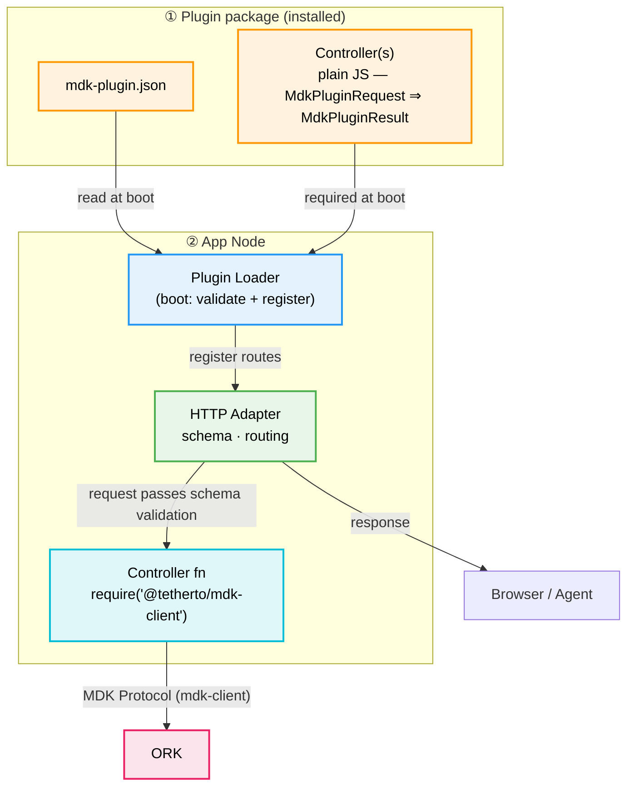
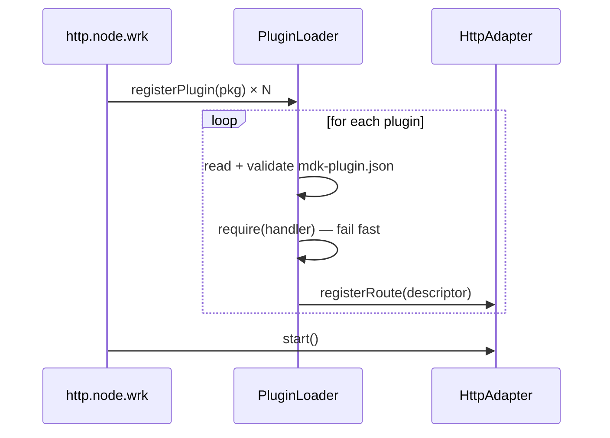

# MDK App Node — Plugin & Aggregation Layer (HLD)

> **Version:** 0.1.0  |  **Date:** 2026-05-22  |  **Status:** Draft

> A config‑driven, framework‑agnostic plugin system for the **MDK App Node** that lets third parties expose **aggregated, cross‑worker HTTP/WS endpoints** by writing plain JavaScript controllers and a single JSON manifest — no Fastify (or any framework) knowledge required, and with first‑class AI/agent metadata baked in.

## 1. Problem Statement & Motivation

The App Node's HTTP worker (`http.node.wrk.js`) today hard‑codes its route table in `workers/lib/server/index.js`. Every new endpoint requires editing core source, redeploying the worker, and writing Fastify‑specific handler code. Three concrete pain points follow:

- **Aggregation lives in core:** 
  - Most "interesting" endpoints (e.g. `/api/site/summary`) are **aggregations across multiple workers** — pulling telemetry from miner and other things worker. 
  - This aggregation logic currently lives inside the App Node.
  - Impossible for to ship a new aggregate without forking.
  - Infaltes the generic App-Node too much, increasing maintainance.
- **Framework lock‑in:** 
  - Routes are written directly against `@tetherto/svc-facs-httpd` (Fastify).
- **No machine‑readable contract:** 
  - Agents (LLM‑driven operators) have no way to discover what URLs exist, when to call them, their safety constraints, or example flows — the same gap `mdk-contract.json` filled for device workers.

### 1.1 Solution Summary

Introduce a **plugin loader** in the App Node that:

- Reads a **single JSON config** describing every route: HTTP method, path, controller file, OpenAPI schema, **and** rich AI/usage context.
- **Eagerly loads** all referenced controllers at boot. Each controller is a plain JS function — no framework imports.
- **Discovers each plugin's manifest at boot** — directly from the imported plugin package — and registers it, exactly the way ORK pulls a worker's `mdk-contract.json` during discovery. HTTP wiring and AI contract live in the **same single JSON** (§5); the contract half is a static boot‑time artifact.

**Out of scope (initially)**

- Hot reload of plugins at runtime (config change requires worker restart).
- Sandboxing/process isolation of plugin code (plugins run in‑process).

---

## 3. Architectural Overview

Read top‑to‑bottom: **inputs** (what's installed) → **loader** (boot) → **what it produces** → **who consumes it**.




At boot the loader reads `mdk-plugin.json` and registers routes on the HTTP Adapter. At runtime, the adapter validates the OpenAPI schema then calls the controller, which uses `@tetherto/mdk-client` to send MDK Protocol messages to ORK and return the aggregated result.

---

## 4. Design Principles

1. **Aggregation‑first.** The plugin context is shaped around the App Node's primary job: combining data from several workers into one response. Plugins should rarely talk to a single source.
2. **Framework neutrality.** Plugin code must never `require('fastify')` or touch a `reply` object. The adapter is the single seam.
3. **Plain JS contracts.** A plugin is a function. No classes, no decorators, no DI container.
4. **Declarative API + AI context.** OpenAPI-shaped `http` blocks and AI hints (`description`, `constraints`, `examples`) live in the same JSON — no per-route auth, permissions, or cache flags.
5. **One source of truth for humans and agents.** The same file that wires routes also documents them for LLMs.
6. **Fail fast at boot.** Missing modules, invalid schemas, duplicate IDs, or unresolvable paths abort startup with `ERR_`* codes.

---

## 5. Plugin Manifest (`mdk-plugin.json`)

One JSON file per plugin. No separate routes file, no separate contract file.

Three design influences:

- **Serverless Framework** — `handler` (file path) + `http` (trigger) separates *what runs* from *how it is exposed*.
- **OpenAPI 3.x** — `parameters`, `requestBody`, and `responses` inside `http` follow the OpenAPI operation object shape, so the loader can emit a spec-compliant OpenAPI document for free and any OpenAPI tooling (Swagger UI, Postman import, code-gen) works without translation.
- `**mdk-contract.json`** — `description`, `constraints`, `examples`, `errors` sit flat on the route, exactly as device commands declare their context.

See full annotated example: [mdk-plugin.example.json](./mdk-plugin.example.json)

### Field guide


| Field                                        | Purpose                                                                       |
| -------------------------------------------- | ----------------------------------------------------------------------------- |
| `handler`                                    | Path to the JS controller file. Loaded eagerly at boot.                       |
| `http.method`, `http.path`                   | HTTP wiring — consumed by Loader + Adapter. Path params use `{id}` notation.  |
| `http.parameters`                            | Path, query, and header params (`in`, `name`, `required`, `schema`).          |
| `http.requestBody`                           | Request body — `required` + `content` keyed by media type.                    |
| `http.responses`                             | Responses keyed by status code, each with `description` + `content`.          |
| `description`                                | Human + AI summary. Mirrors `mdk-contract.json` command descriptions.         |
| `constraints`                                | Hard rules for safe use. AI must respect these before calling the endpoint.   |
| `examples`                                   | Concrete call patterns with optional `preconditions` and `steps`.             |
| `errors`                                     | Known `ERR_`* codes and their meaning. Subset also reflected in `responses`.  |
| `safety` + `confirmationRequired`            | Agent safety flags — gates destructive calls behind explicit confirmation.    |
| `name`, `version`, `description` (top-level) | Plugin identity — surfaced in observability and the boot-registered contract. |


The loader validates the manifest against `mdk-plugin.schema.json` at boot; any violation raises `ERR_PLUGIN_MANIFEST_INVALID: <plugin>: <path>: <reason>` and aborts startup.

`mdk-plugin.schema.json` is shipped as part of the `@tetherto/mdk-client` package — the same way `mdk-contract.schema.json` is distributed — so IDEs and editors pick it up automatically for inline validation and autocomplete when authoring a manifest.

The boot-registered contract includes `pluginVersion` (read from the plugin package's `package.json`) per endpoint, so consumers and the Operator Agent can detect capability drift across deployments.

---

## 6. Plugin Contract

A plugin is a JS module exporting a single async function. Nothing else.

The adapter calls it with an `**MdkPluginRequest`** and expects an `**MdkPluginResult**` back:


| Type               | Shape                              | Description                                                                                           |
| ------------------ | ---------------------------------- | ----------------------------------------------------------------------------------------------------- |
| `MdkPluginRequest` | `{ params, query, body, headers }` | Inbound request — fields are schema-validated by the adapter before the controller runs.              |
| `MdkPluginResult`  | any serialisable value             | The plugin's business payload. The adapter wraps it into the outbound MDK Protocol response envelope. |


The plugin's downward path to ORK is `@tetherto/mdk-client` — used directly as an `import` / `require.` The App Node initializes the client once at boot; plugins retrieve the same shared instance through the package's module-level singleton (§6.4).

```js
// @my-org/mdk-plugin-site/summary.js
'use strict'

const { telemetryPull, statePull } = require('@tetherto/mdk-client')

module.exports = async function siteSummary (req) {
  const { siteId, deviceIds } = req.params

  const [roster, power, cooling] = await Promise.all([
    telemetryPull({ deviceIds, query: 'roster' }),
    telemetryPull({ deviceIds, query: 'power_draw' }),
    statePull    ({ deviceIds, scope: 'cooling' }),
  ])

  return {
    siteId,
    miners: { total: roster.payload.length, online: roster.payload.filter(m => m.online).length },
    power:   power.payload,
    cooling: cooling.payload,
  }
}
```

Notes on the example:

- `@tetherto/mdk-client` is the **single import** — MDK Protocol calls only. 
- The plugin never names a worker (`miner-worker`, `powermeter-worker`). Workers are addressed by `deviceId` only; ORK's Worker Registry resolves ownership (HLD §3.2, §4.1.1).
- The return value (`MdkPluginResult`) is the plugin's *business* payload. The adapter wraps it into the outbound MDK Protocol response envelope transparently.

### 6.2 Cross-worker aggregation

This is the **primary use case** for the plugin system. Plugins compose data via `mdk-client` protocol calls downward to ORK — `telemetryPull`, `statePull`, `dispatch`. Every call becomes an MDK Protocol envelope routed by ORK via `deviceId`. Plugins never address a worker by name and never access App Node–level state.

Typical skeleton — parallelize with `Promise.all`:

```js
const { telemetryPull } = require('@tetherto/mdk-client')

module.exports = async (req) => {
  const { deviceIds } = req.params

  const [roster, power] = await Promise.all([
    telemetryPull({ deviceIds, query: 'roster' }),
    telemetryPull({ deviceIds, query: 'power_draw' }),
  ])

  return shape({ roster, power })
}
```

### 6.3 Multi-site aggregation (Parallel ORKs)

The App Node may be wired to several ORK kernels (one per site). `mdk-client` exposes a per-site accessor so a single plugin can fan out across sites:

```js
const mdk = require('@tetherto/mdk-client')

const [tx, ic] = await Promise.allSettled([
  mdk.forSite('texas').telemetryPull({ deviceIds: txIds, query: 'power_draw' }),
  mdk.forSite('iceland').telemetryPull({ deviceIds: icIds, query: 'power_draw' })
])
```

`mdk.forSite(siteId)` returns the shared `MdkClient` API bound to that site's ORK connection. Partial failures are surfaced per site so the plugin can degrade gracefully (e.g. mark `iceland` as `unavailable` while `texas` returns data).

#### 6.3.1 Declared dependencies (`aggregates`)

The `aggregates` array in the manifest is **documentation, not enforcement** — it lets the boot‑registered contract declare which workers and protocol actions each endpoint depends on, drives observability dashboards, and helps the agent reason about partial failures (e.g. *"`powermeter` action set is degraded → `site.summary` will return cached power values"*).

All traffic across the plugin boundary — FE → App Node and App Node → ORK — uses **MDK Protocol envelopes**. See [HLD §3 (MDK Protocol)](./hld.md#3-mdk-protocol-v010--pull-based) for the canonical envelope schema, core action set, and Hyperschema governance rules.

The adapter unwraps incoming envelopes and re-wraps outgoing ones transparently (§6.5–6.6). Plugin controllers and the `mdk-plugin.json` manifest operate solely on the **business `payload`** — envelope fields are never described in the manifest. `http.parameters`, `http.requestBody`, and `http.responses` therefore describe the `payload` content only.

Errors whose message starts with `ERR_` are surfaced as `400` responses with the message preserved; all other errors are masked as `Bad Request` and logged.

### 6.4 `@tetherto/mdk-client` — App Node–owned singleton

The plugin's link to ORK is the `@tetherto/mdk-client` package itself. It is initialized **once** at App Node boot for each ORK (or site) and reused by every plugin through the package's module‑level singleton.

#### 6.4.4 Plugin-owned storage

Plugins may own self-contained storage (e.g. a local Hyperbee within the plugin package) but must never access App Node–level store or state. External data comes exclusively through `@tetherto/mdk-client` protocol calls through ORK.

#### 6.4.5 What plugins still must not do

Three rules, all lint‑enforced:


| #   | Forbidden                             | Reason                                                                                                                    |
| --- | ------------------------------------- | ------------------------------------------------------------------------------------------------------------------------- |
| 1   | `new MdkClient(...)` inside a plugin  | A second client would need its own HRPC key whitelisted by ORK (HLD §4.1.2). Bypasses identity, lifecycle, and policy.    |
| 2   | `MdkClient.init(...)` inside a plugin | Only the App Node owns initialization. A re‑init would replace the singleton mid‑flight and break in‑flight envelopes.    |
| 3   | Direct HRPC / hyperswarm imports      | The only sanctioned transport is `mdk-client`. Anything else bypasses Hyperschema validation (§6.5) and ORK whitelisting. |


Everything else the package exports — functions, classes for typing, error classes, action enums — is fair game.

> **In-process security:** third-party plugin code runs with the App Node worker's full privileges. Until sandboxing is in scope, plugin packages should be vendored and reviewed before deployment.
>
> **Sandboxing (deferred):** the recommended future solution is to run each plugin in a dedicated Node.js `worker_thread`, exposing only the `mdk-client` message-passing API across the thread boundary. This limits blast radius — a misbehaving plugin cannot access the App Node's memory, file handles, or other plugins. Implement after the core plugin system is stable.

Plugin authors thus never write envelope construction or payload validation. They write a pure aggregation function and inherit schema validation from the adapter and protocol checks from `mdk-client`.

---

## 7. Loader Lifecycle




### 7.0 Entry-point process file

The App Node is a **library**. The operator writes a thin process file that creates one `MdkClient` instance per ORK (one per site), registers plugins, and starts the node:

```js
// http.node.wrk.js  — the actual running process
'use strict'

const { AppNode }       = require('@tetherto/mdk-app-node')
const { MdkClient }     = require('@tetherto/mdk-client')
const pluginMiners      = require('@my-org/mdk-plugin-miners')
const pluginSiteSummary = require('@my-org/mdk-plugin-site-summary')

async function main () {
  // 1. Create one MdkClient per ORK — pass an array for multi-site deployments
  const clients = await Promise.all([
    MdkClient.init({ siteId: 'texas', orkKey: process.env.ORK_KEY_TEXAS }),
    MdkClient.init({ siteId: 'iceland', orkKey: process.env.ORK_KEY_ICELAND }),
  ])

  // 2. Create the App Node, passing the client array in
  const node = new AppNode({ clients })

  // 3. Register plugins — each plugin package ships its own mdk-plugin.json
  await node.registerPlugin(pluginMiners)
  await node.registerPlugin(pluginSiteSummary)

  // 4. Start — validates all manifests, registers routes, publishes contract, begins listening
  await node.start()
}

main().catch((err) => {
  console.error(err)
  process.exit(1)
})
```

What each step does:


| Step                       | What happens                                                                                                                           |
| -------------------------- | -------------------------------------------------------------------------------------------------------------------------------------- |
| `MdkClient.init(...)`      | Opens the HRPC connection to one ORK; tagged with a `siteId` for multi-site fan-out (§6.3).                                            |
| `new AppNode({ clients })` | Wires the App Node library with all client connections; no network activity yet.                                                       |
| `node.registerPlugin(pkg)` | Reads `mdk-plugin.json` from the package, validates it, eagerly `require()`s every handler. Aborts with `ERR_PLUGIN_*` on any problem. |
| `node.start()`             | Registers all routes with the HTTP adapter, publishes the assembled plugin contract to ORK (§10), and starts listening.                |


### 7.1 Eager loading guarantees

- Every controller is `require()`d before the HTTP server starts listening.
- Any failure (`MODULE_NOT_FOUND`, syntax error, non‑function export) aborts boot with a clear error and the offending route id.
- The result is a fully‑populated in‑memory route table and a derived **plugin contract** snapshot (registered upward at boot, §10).

> **Hot reload:** if feasible during development, implement reload on `SIGHUP` — re-run the loader, swap the route table, and re-publish the contract without restarting the process. Scope to development mode first; production restart remains the safe default.

### 7.2 Boot‑time contract registration

The contract is **discovered and assembled at boot**, not on demand. As each plugin is imported (§7), the loader reads the plugin's single JSON manifest and derives the contract from the `ai`/`summary`/`description` portions of its route entries, merging them into one in‑memory **plugin contract** — the same lifecycle moment as ORK pulling `mdk-contract.json` from a worker during discovery (HLD §4.4.2). See §10 for the discovery model.

The assembled contract is then **registered upward** (published to ORK / the agentic framework, and written to disk as a static artifact) so consumers read a pre‑built contract rather than triggering generation through an API call.

---

## 8. HTTP Adapter

The adapter is the **only** file that imports the active HTTP framework. Everything else — the loader, plugins, and the manifest — is framework-agnostic.

Responsibilities:

1. **OpenAPI validation** — translates `http.parameters`, `http.requestBody`, and `http.responses` into framework-native validators.
2. **Request normalization** — wraps the framework request into an `MdkPluginRequest` (`params`, `query`, `body`, `headers`) passed to the controller.
3. **Response materialization** — turns the controller's `MdkPluginResult` into framework response calls.
4. **Error masking** — errors starting with `ERR_` are returned as `400` with the message preserved; all others are masked as `500`.
5. **WebSocket bridging** — exposes a uniform `WsConnection` to plugins regardless of the underlying WS lib.
6. **Streaming / SSE** — the adapter handles both REST and WS as middleware, so plugins receive a uniform abstraction for streaming responses (SSE or WS) without knowing which transport is active.

---

## 10. AI Contract & MCP Tools

At boot the loader derives a contract from every discovered route's `description`, `constraints`, `examples`, and `errors` fields — the same vocabulary used in `mdk-contract.json` for device workers. The assembled document is published to ORK once and never regenerated on demand.

The App Node's MCP module then generates **one MCP tool per plugin route** from this contract, exactly as it does for worker commands:

| Source | MCP tools generated |
|---|---|
| Worker `mdk-contract.json` | One tool per telemetry channel + one per command |
| Plugin `mdk-plugin.json` | One tool per plugin route |

The Operator Agent calls aggregated endpoints — `get_miners_list`, `set_miner_power_limit`, `get_site_summary` — the same way it calls raw device commands, with `constraints`, `examples`, and `safety` guards from the manifest applied automatically:

```
Operator Agent
  └─ MCP tool: get_site_summary
       └─ App Node HTTP Adapter
            └─ Plugin controller (@my-org/mdk-plugin-site-summary)
                 └─ mdk-client → ORK → Workers (fan-out)
```

The agent never reaches past the plugin for aggregated data — the plugin owns the fan-out. See [Agentic Framework HLD §3.3](./hld-agentic-framework.md#33-mcp-endpoint--architecture) for how the MCP module builds and refreshes the tool list.


