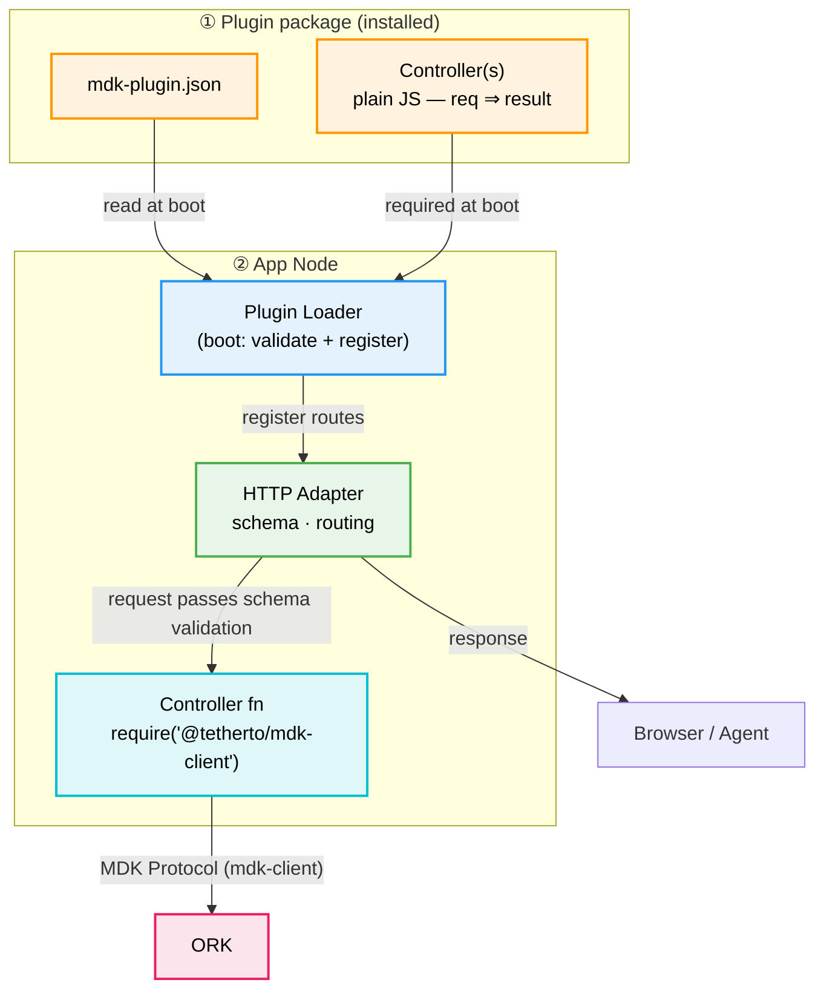
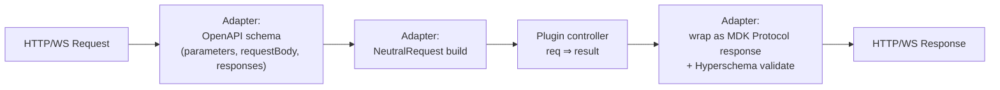
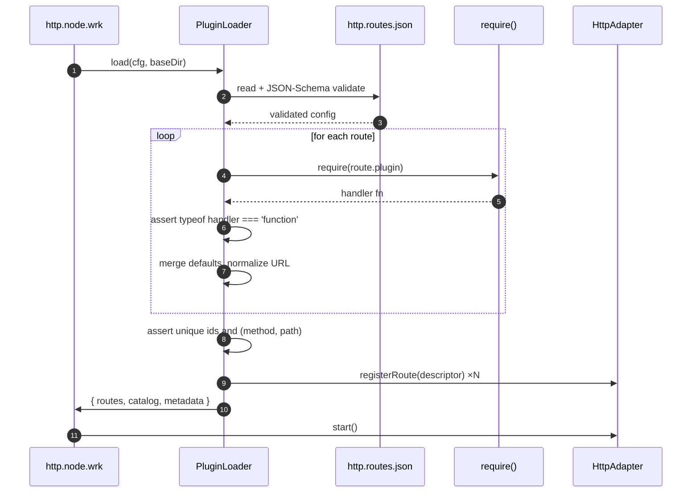
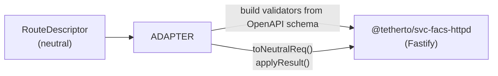
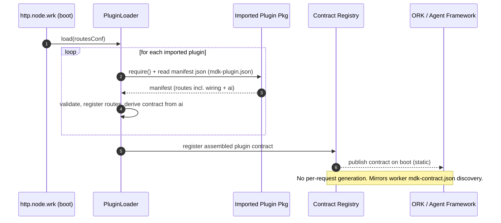

# MDK App Node — Plugin & Aggregation Layer (HLD)

> **Version:** 0.1.0  |  **Date:** 2026-05-22  |  **Status:** Draft

> A config‑driven, framework‑agnostic plugin system for the **MDK App Node** that lets third parties expose **aggregated, cross‑worker HTTP/WS endpoints** by writing plain JavaScript controllers and a single JSON manifest — no Fastify (or any framework) knowledge required, and with first‑class AI/agent metadata baked in.

## 1. Problem Statement & Motivation

The App Node's HTTP worker (`http.node.wrk.js`) today hard‑codes its route table in `workers/lib/server/index.js`. Every new endpoint requires editing core source, redeploying the worker, and writing Fastify‑specific handler code. Three concrete pain points follow:

- **Aggregation lives in core:** 
  - Most "interesting" endpoints (e.g. `/api/site/summary`) are **aggregations across multiple workers** — pulling telemetry from miner and other things worker. 
  - This aggregation logic currently lives inside the App Node.
  - Impossible for to ship a new aggregate without forking.
  - Infaltes the generic App-Node too much, increasing maintainance.
- **Framework lock‑in:** 
  - Routes are written directly against `@tetherto/svc-facs-httpd` (Fastify).
- **No machine‑readable contract:** 
  - Agents (LLM‑driven operators) have no way to discover what URLs exist, when to call them, their safety constraints, or example flows — the same gap `mdk-contract.json` filled for device workers.

### 1.1 Solution Summary

Introduce a **plugin loader** in the App Node that:

- Reads a **single JSON config** describing every route: HTTP method, path, controller file, OpenAPI schema, **and** rich AI/usage context.
- **Eagerly loads** all referenced controllers at boot. Each controller is a plain JS function — no framework imports.
- **Discovers each plugin's manifest at boot** — directly from the imported plugin package — and registers it, exactly the way ORK pulls a worker's `mdk-contract.json` during discovery. HTTP wiring and AI contract live in the **same single JSON** (§5); the contract half is a static boot‑time artifact.

**Out of scope (initially)**

- Hot reload of plugins at runtime (config change requires worker restart).
- Sandboxing/process isolation of plugin code (plugins run in‑process).

---

## 3. Architectural Overview

Read top‑to‑bottom: **inputs** (what's installed) → **loader** (boot) → **what it produces** → **who consumes it**.




At boot the loader reads `mdk-plugin.json` and registers routes on the HTTP Adapter. At runtime, the adapter validates the OpenAPI schema then calls the controller, which uses `@tetherto/mdk-client` to send MDK Protocol messages to ORK and return the aggregated result.

---

## 4. Design Principles

1. **Aggregation‑first.** The plugin context is shaped around the App Node's primary job: combining data from several workers into one response. Plugins should rarely talk to a single source.
2. **Framework neutrality.** Plugin code must never `require('fastify')` or touch a `reply` object. The adapter is the single seam.
3. **Plain JS contracts.** A plugin is a function. No classes, no decorators, no DI container.
4. **Declarative API + AI context.** OpenAPI-shaped `http` blocks and AI hints (`description`, `constraints`, `examples`) live in the same JSON — no per-route auth, permissions, or cache flags.
5. **One source of truth for humans and agents.** The same file that wires routes also documents them for LLMs.
6. **Fail fast at boot.** Missing modules, invalid schemas, duplicate IDs, or unresolvable paths abort startup with `ERR_`* codes.

---

## 5. Plugin Manifest (`mdk-plugin.json`)

One JSON file per plugin. No separate routes file, no separate contract file.

Three design influences:

- **Serverless Framework** — `handler` (file path) + `http` (trigger) separates *what runs* from *how it is exposed*.
- **OpenAPI 3.x** — `parameters`, `requestBody`, and `responses` inside `http` follow the OpenAPI operation object shape, so the loader can emit a spec-compliant OpenAPI document for free and any OpenAPI tooling (Swagger UI, Postman import, code-gen) works without translation.
- `**mdk-contract.json`** — `description`, `constraints`, `examples`, `errors` sit flat on the route, exactly as device commands declare their context.

```json
{
  "$schema": "./mdk-plugin.schema.json",
  "name": "@my-org/mdk-plugin-miners",
  "version": "1.0.0",
  "description": "Aggregated miner management endpoints — combines data across miner and power-meter workers.",

  "routes": [
    {
      "handler": "src/list.js",
      "http": {
        "method": "GET",
        "path": "/api/miners",
        "parameters": [
          {
            "in": "query",
            "name": "siteId",
            "required": false,
            "description": "Filter miners by site identifier.",
            "schema": { "type": "string" }
          }
        ],
        "responses": {
          "200": {
            "description": "Array of miners with last-known telemetry.",
            "content": {
              "application/json": {
                "schema": { "$ref": "./schemas/miners.list.json" }
              }
            }
          }
        }
      },
      "description": "List miners on a site with last-known telemetry and health state.",
      "constraints": ["Returns cached data up to 15s old."],
      "examples": [
        {
          "intent": "Get all miners for site SITE-001",
          "request": { "method": "GET", "url": "/api/miners?siteId=SITE-001" }
        }
      ]
    },

    {
      "handler": "src/setPowerLimit.js",
      "http": {
        "method": "POST",
        "path": "/api/miners/{id}/power-limit",
        "parameters": [
          {
            "in": "path",
            "name": "id",
            "required": true,
            "description": "Miner device identifier.",
            "schema": { "type": "string" }
          }
        ],
        "requestBody": {
          "required": true,
          "content": {
            "application/json": {
              "schema": {
                "type": "object",
                "required": ["watts"],
                "properties": {
                  "watts": {
                    "type": "number",
                    "minimum": 2000,
                    "maximum": 4000,
                    "description": "Target PSU power ceiling in watts."
                  }
                }
              }
            }
          }
        },
        "responses": {
          "200": {
            "description": "Power limit applied.",
            "content": {
              "application/json": {
                "schema": {
                  "type": "object",
                  "properties": {
                    "id":    { "type": "string" },
                    "watts": { "type": "number" },
                    "ok":    { "type": "boolean" }
                  }
                }
              }
            }
          },
          "400": {
            "description": "Validation error or safe-error from controller (ERR_* message preserved)."
          }
        }
      },
      "description": "Adjusts the PSU power limit for a single miner. Affects physical hardware.",
      "safety": "physical-impact",
      "confirmationRequired": true,
      "constraints": [
        "Never set below 2000W or hashboards may fail to initialize.",
        "Max is model-dependent (typically 3500–4000W).",
        "Wait at least 60s before re-issuing to the same miner."
      ],
      "examples": [
        {
          "intent": "Throttle miner during a hot day",
          "preconditions": ["temperature_out > 75"],
          "steps": [
            "Read GET /api/miners/{id} to confirm temperature_out.",
            "POST /api/miners/{id}/power-limit with { watts: 2800 }.",
            "Wait 60s and verify power_draw stabilized."
          ]
        }
      ],
      "errors": {
        "ERR_MINER_OFFLINE": "Target miner not reachable; do not retry blindly.",
        "ERR_WATTS_OUT_OF_RANGE": "watts outside the safe min/max."
      }
    }
  ]
}
```

### Field guide


| Field                                        | Purpose                                                                       |
| -------------------------------------------- | ----------------------------------------------------------------------------- |
| `handler`                                    | Path to the JS controller file. Loaded eagerly at boot.                       |
| `http.method`, `http.path`                   | HTTP wiring — consumed by Loader + Adapter. Path params use `{id}` notation.  |
| `http.parameters`                            | Path, query, and header params (`in`, `name`, `required`, `schema`).          |
| `http.requestBody`                           | Request body — `required` + `content` keyed by media type.                    |
| `http.responses`                             | Responses keyed by status code, each with `description` + `content`.          |
| `description`                                | Human + AI summary. Mirrors `mdk-contract.json` command descriptions.         |
| `constraints`                                | Hard rules for safe use. AI must respect these before calling the endpoint.   |
| `examples`                                   | Concrete call patterns with optional `preconditions` and `steps`.             |
| `errors`                                     | Known `ERR_*` codes and their meaning. Subset also reflected in `responses`.  |
| `safety` + `confirmationRequired`            | Agent safety flags — gates destructive calls behind explicit confirmation.    |
| `name`, `version`, `description` (top-level) | Plugin identity — surfaced in observability and the boot-registered contract. |


The loader validates the manifest against `mdk-plugin.schema.json` at boot; any violation raises `ERR_PLUGIN_MANIFEST_INVALID: <plugin>: <path>: <reason>` and aborts startup.

---

## 6. Plugin Contract

A plugin is a JS module exporting a single async function. Nothing else.

The plugin's downward path to ORK is `@tetherto/mdk-client` — used directly as an `import` / `require.` The App Node initializes the client once at boot; plugins retrieve the same shared instance through the package's module-level singleton (§6.4).

```js
// @my-org/mdk-plugin-site/summary.js
'use strict'

const { telemetryPull, statePull, services, dataProxy } = require('@tetherto/mdk-client')

module.exports = async function siteSummary (req) {
  const { siteId }  = req.params
  const deviceIds   = await services.site.listDeviceIds(siteId)

  const [roster, power, cooling, alerts] = await Promise.all([
    telemetryPull({ deviceIds, query: 'roster' }),
    telemetryPull({ deviceIds, query: 'power_draw' }),
    statePull    ({ deviceIds, scope: 'cooling' }),
    dataProxy.alerts.activeForSite(siteId)
  ])

  return {
    siteId,
    miners: { total: roster.payload.length, online: roster.payload.filter(m => m.online).length },
    power:   power.payload,
    cooling: cooling.payload,
    alerts
  }
}
```

Notes on the example:

- `@tetherto/mdk-client` is the **single import** for everything — MDK Protocol calls and App Node–local service accessors alike. No `ctx`, no second package.
- The plugin never names a worker (`miner-worker`, `powermeter-worker`). Workers are addressed by `deviceId` only; ORK's Worker Registry resolves ownership (HLD §3.2, §4.1.1).
- `sender`, `user`, and `requestId` are filled automatically from the current request's `AsyncLocalStorage` scope (§6.4.3) — the plugin author never threads them.
- The return value is the plugin's *business* payload. The adapter wraps it into the outbound MDK Protocol response envelope transparently.

### 6.1 Request / result / error shapes

All traffic across the plugin boundary — FE → App Node and App Node → ORK — uses **MDK Protocol envelopes**. See [HLD §3 (MDK Protocol)](./hld.md#3-mdk-protocol-v010--pull-based) for the canonical envelope schema, core action set, and Hyperschema governance rules.

The adapter unwraps incoming envelopes and re-wraps outgoing ones transparently (§6.5–6.6). Plugin controllers and the `mdk-plugin.json` manifest operate solely on the **business `payload`** — envelope fields are never described in the manifest. `http.parameters`, `http.requestBody`, and `http.responses` therefore describe the `payload` content only.

Errors whose message starts with `ERR_` are surfaced as `400` responses with the message preserved; all other errors are masked as `Bad Request` and logged.

### 6.4 `@tetherto/mdk-client` — App Node–owned singleton

The plugin's link to ORK is the `@tetherto/mdk-client` package itself. It is initialized **once** at App Node boot for each ORK (or site) and reused by every plugin through the package's module‑level singleton.

#### 6.4.3 Per‑request context via `AsyncLocalStorage` (no plumbing)

The MDK Protocol `sender`, current `user`, and request `id` should accompany every downward call. To keep plugin code clean, the App Node's HTTP adapter wraps each request in an `AsyncLocalStorage` scope; `mdk-client` reads that scope when assembling the envelope.

```js
// HTTP adapter — runs once per incoming request, before the controller
const { runWithRequestScope } = require('@tetherto/mdk-client')

await runWithRequestScope(
  {
    requestId: req.id,
    user:      req.user,
    sender:    `app-node:plugin:${route.pluginId}`,
    site:      req.headers['x-mdk-site'] || null
  },
  async () => controller(neutralReq)
)
```

Inside the plugin, `mdk.telemetryPull(...)` automatically attaches `sender`, `user`, and `requestId` to the outgoing envelope — the author writes none of that. This is the same idea as `cls-hooked` / Express `req.context`, expressed via Node's built-in `AsyncLocalStorage`.

#### 6.4.4 App Node–local accessors via `mdk-client`

There is no `ctx`. App Node–local services are exported directly from `@tetherto/mdk-client` alongside the protocol methods — boot-time singletons initialized once by the App Node and accessible anywhere via import:

| Export | What it provides |
|---|---|
| `conf` | Read-only App Node config slice |
| `log()` | Request-scoped child logger (reads from `AsyncLocalStorage`) |
| `dataProxy` | Read-optimized local accessors (Hyperbee/store) |
| `services` | App Node–level service helpers (`miners`, `alerts`, `users`, `globalData`, …) |
| `store` | Raw store access (`getBee`, …) |

Pure protocol plugins need no additional imports at all:

```js
const { telemetryPull } = require('@tetherto/mdk-client')

module.exports = async (req) => telemetryPull({
  deviceId: req.params.id,
  query:    'power_draw'
})
```

#### 6.4.5 What plugins still must not do

Three rules, all lint‑enforced:


| #   | Forbidden                             | Reason                                                                                                                    |
| --- | ------------------------------------- | ------------------------------------------------------------------------------------------------------------------------- |
| 1   | `new MdkClient(...)` inside a plugin  | A second client would need its own HRPC key whitelisted by ORK (HLD §4.1.2). Bypasses identity, lifecycle, and policy.    |
| 2   | `MdkClient.init(...)` inside a plugin | Only the App Node owns initialization. A re‑init would replace the singleton mid‑flight and break in‑flight envelopes.    |
| 3   | Direct HRPC / hyperswarm imports      | The only sanctioned transport is `mdk-client`. Anything else bypasses Hyperschema validation (§6.5) and ORK whitelisting. |


Everything else the package exports — functions, classes for typing, error classes, action enums — is fair game.


### 6.6 Inbound validation inherited from the App Node

Validation is **inherited**, not re‑implemented per plugin. Order of checks before a controller runs:




Concretely:

- **At ingress** (caller → plugin):
  - Route-level OpenAPI schema (`parameters`, `requestBody`) is applied by the adapter before the controller runs.
  - The plugin receives a `NeutralRequest` whose `params`, `query`, and `body` are schema-validated.
  - App Node JWT/RBAC (HLD §4.1.2), when enabled, is enforced globally by the App Node — not declared per route in `mdk-plugin.json`.
- **At downward calls** (plugin → ORK):
  - `mdk-client` constructs the envelope and Hyperschema‑validates the payload against the action's schema before HRPC dispatch.
  - ORK validates the envelope again on receipt (defense in depth) per §3.4.
- **At egress** (plugin → caller):
  - The controller returns a `NeutralResult`.
  - The adapter wraps it into an MDK Protocol **response envelope** (`type: "response"`, same `id` lineage as the originating request where applicable) and validates against the response schema declared in `route.schema.response` and/or the registered Hyperschema for the action.
  - Failure to validate raises an `ERR_PROTOCOL_RESPONSE_INVALID` and the caller receives a sanitized 500 (same masking rules as §6.3).

Plugin authors thus never write envelope construction or payload validation. They write a pure aggregation function and inherit schema validation from the adapter and protocol checks from `mdk-client`.

---

## 7. Loader Lifecycle




### 7.1 Eager loading guarantees

- Every controller is `require()`d before the HTTP server starts listening.
- Any failure (`MODULE_NOT_FOUND`, syntax error, non‑function export) aborts boot with a clear error and the offending route id.
- The result is a fully‑populated in‑memory route table and a derived **plugin contract** snapshot (registered upward at boot, §10).

### 7.2 Boot‑time contract registration

The contract is **discovered and assembled at boot**, not on demand. As each plugin is imported (§7), the loader reads the plugin's single JSON manifest and derives the contract from the `ai`/`summary`/`description` portions of its route entries, merging them into one in‑memory **plugin contract** — the same lifecycle moment as ORK pulling `mdk-contract.json` from a worker during discovery (HLD §4.4.2). See §10 for the discovery model.

The assembled contract is then **registered upward** (published to ORK / the agentic framework, and written to disk as a static artifact) so consumers read a pre‑built contract rather than triggering generation through an API call.

### 7.3 Built‑in diagnostic route injected by the loader


| Route                   | Purpose                                             |
| ----------------------- | --------------------------------------------------- |
| `GET /api/_meta/health` | Plugin‑system health, plugin count, last load time. |


Declared in a baseline `http.routes.core.json` that the loader merges with the user config. Note there is **no** `GET /_meta/contract` generation endpoint — the contract is a boot artifact (§10), so any read path simply serves the already‑registered static document.

---

## 8. HTTP Adapter

The adapter is the **only** file allowed to import the active HTTP framework.




Responsibilities:

1. **OpenAPI validation** — translates `http.parameters`, `http.requestBody`, and `http.responses` into framework-native validators.
2. **Request normalization** — wraps framework request as `NeutralRequest`.
3. **Response materialization** — turns `NeutralResult` into framework response calls (`reply.status().send()`, `reply.redirect()`, stream piping).
4. **Error envelope** — preserves the existing `ERR_`* masking behavior.
5. **WebSocket bridging** — exposes a unified `WsConnection` to plugins regardless of underlying lib (`@fastify/websocket` today).

Swapping frameworks is a one‑file change: implement a new adapter and switch `conf.adapter` from `"fastify"` to e.g. `"express"`. Plugins and config are untouched.

---

## 9. Cross‑Worker Aggregation Model

This is the **primary use case** for the plugin system. Aggregation plugins compose two primitives, in this order of preference:

1. **`mdk-client` protocol calls** (downward to ORK) — `telemetryPull`, `statePull`, `dispatch`. Every call becomes an MDK Protocol envelope routed by ORK via `deviceId`. Parallelize with `Promise.all`. Plugins never address a worker by name.
2. **`mdk-client` local accessors** — `dataProxy.<domain>.<query>(...)`. Read-optimized accessors over App Node–local state (e.g. `dataProxy.alerts`, `dataProxy.miners`). Use when the data is already projected locally — no need to round-trip to ORK.

### 9.1 Typical aggregator skeleton

```js
const { telemetryPull, services, dataProxy } = require('@tetherto/mdk-client')

module.exports = async (req) => {
  const { siteId } = req.params
  const deviceIds  = await services.site.listDeviceIds(siteId)

  const [roster, power, alerts] = await Promise.all([
    telemetryPull({ deviceIds, query: 'roster' }),
    telemetryPull({ deviceIds, query: 'power_draw' }),
    dataProxy.alerts.activeForSite(siteId)
  ])

  return shape({ roster, power, alerts })
}
```

### 9.2 Multi‑site aggregation (Parallel ORKs)

Per HLD §7.2, the App Node may be wired to several ORK kernels (one per site). `mdk-client` exposes a per‑site view of the singleton so a single plugin can fan out across sites:

```js
const mdk = require('@tetherto/mdk-client')

const [tx, ic] = await Promise.allSettled([
  mdk.forSite('texas').telemetryPull({ deviceIds: txIds, query: 'power_draw' }),
  mdk.forSite('iceland').telemetryPull({ deviceIds: icIds, query: 'power_draw' })
])
```

`mdk.forSite(siteId)` returns the same shared `MdkClient` API bound to that site's ORK connection. Partial failures are surfaced per site so the plugin can degrade gracefully (e.g. mark `iceland` as `unavailable` while `texas` returns data).

### 9.3 Declared dependencies (`aggregates`)

The `aggregates` array in the config is **documentation, not enforcement** — it lets the boot‑registered contract declare which workers and protocol actions each endpoint depends on, drives observability dashboards, and helps the agent reason about partial failures (e.g. *"`powermeter` action set is degraded → `site.summary` will return cached power values"*).

---

## 10. AI Contract — Boot‑Time Discovery

The plugin contract is modeled on the worker contract (HLD §4.4.2): a static JSON document that is **discovered when the component is loaded**, not produced on a runtime request. For workers, ORK pulls `mdk-contract.json` during the discovery handshake. For App Node plugins, the loader collects the `ai` half of each plugin's single manifest at boot — the same file that defines the routes.

### 10.0 Discovery model

Each plugin package **ships one JSON manifest** (§5) — the same file that defines its routes. There is no separate contract document: the `ai` block lives inside each route entry alongside its wiring. The manifest is discoverable by convention from the imported package — e.g. a `mdk-plugin.json` at the package root, or a `mdk.plugin` field in its `package.json` pointing at the file. At boot the loader reads this one file and derives the contract from the `ai`/`summary`/`description` portions of each route.




Key consequences:

- **Install‑time = capability‑time.** What an agent can call is fully determined by which plugins are installed/imported at boot. Adding a capability means installing a plugin and restarting — exactly like adding a new worker to ORK.
- **No lazy assembly.** The contract exists before the first request. Read paths serve the already‑registered document; they never trigger generation.
- **Single registration point.** The assembled contract is published once at boot to ORK / the agentic framework, the same channel and timing as worker capability registration.

### 10.1 Contract assembly

For every discovered route entry the loader emits a contract record:

```json
{
  "method": "GET",
  "url": "/api/site/{siteId}/summary",
  "description": "...",
  "schema": { /* OpenAPI parameters / requestBody / responses */ },
  "constraints": [ /* verbatim from manifest */ ],
  "examples": [ /* verbatim from manifest */ ]
}
```

The assembled boot artifact is:

```json
{ "metadata": { /* service-wide */ }, "endpoints": [ /* one per discovered route */ ] }
```

This document is built once at boot and registered upward (§10.0). It is identical in spirit to the payload a worker returns for `capability.request`.

### 10.2 Parity with `mdk-contract.json`

The `ai` block intentionally mirrors the vocabulary used by device contracts (`intent`, `constraints`, `examples` with `preconditions`/`steps`, `errors`). Because both the plugin contract and the worker contract are **boot‑discovered static documents** with the same shape, an agent that already understands device contracts ingests the plugin contract with no schema changes — and obtains both through the same registration channel rather than a bespoke API.

## 11. Security & Safety

- **Schema validation** at the adapter layer means controllers can trust validated `req.params`, `req.query`, and `req.body` from the OpenAPI manifest.
- App Node JWT/RBAC (HLD §4.1.2), when enabled, applies globally — not per route in `mdk-plugin.json`.
- **MDK Protocol validation is inherited.** Plugins cannot bypass it: `@tetherto/mdk-client` is the only sanctioned transport.
- `**require('@tetherto/mdk-client')` in plugins is encouraged; `new MdkClient(...)` and `MdkClient.init(...)` are not.** Plugins consume the App Node–initialized singleton; they never instantiate or re‑initialize transport. See §6.4.5 for the three forbidden patterns. Lint‑enforced.
- **In‑process plugins**: third‑party code runs with the worker's privileges. Until sandboxing is in scope, plugin sources should be vendored and reviewed.
- **AI safety hints**: `ai.safety` (e.g. `"physical-impact"`) and `ai.confirmationRequired` propagate from config into the boot‑registered contract so agents can gate destructive calls behind explicit confirmation.

---

## 13. Open Questions

1. **Plugin versioning** — should the boot contract include `pluginVersion` per route (read from the plugin package's `package.json`), so consumers can detect capability drift across deployments?
2. **Schema reuse** — collocate JSON schemas with plugins, or centralize under `config/schemas/`?
3. **Streaming responses** — formalize a neutral stream/event abstraction for SSE alongside WS?
4. **Hot reload** — defer indefinitely, or scope a "reload on SIGHUP" first iteration?
5. **Sandboxing** — is there appetite for running untrusted plugins in worker threads?

---

