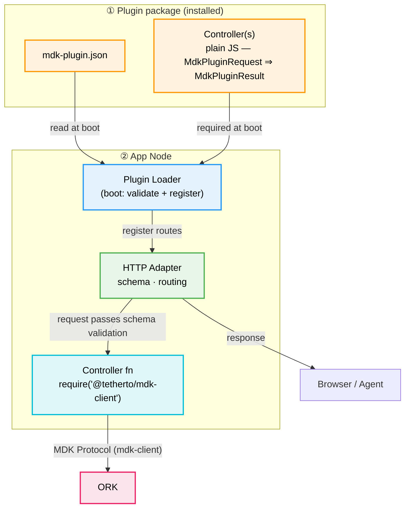
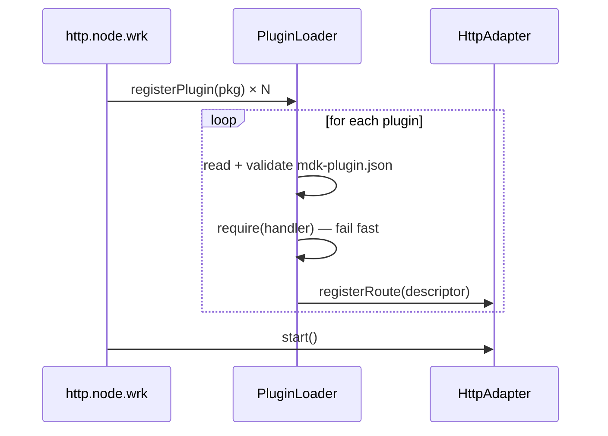

# MDK App Node — Plugin & Aggregation Layer (HLD)

> **Version:** 0.1.0  |  **Date:** 2026-05-22  |  **Status:** Draft

> A config‑driven, framework‑agnostic plugin system for the **MDK App Node** that lets third parties expose **aggregated, cross‑worker HTTP/WS endpoints** by writing plain JavaScript controllers and a single JSON manifest — no Fastify (or any framework) knowledge required, and with first‑class AI/agent metadata baked in.

## 1. Problem Statement & Motivation

The goal is to let **third parties ship aggregated, cross-worker HTTP/WS endpoints** without touching App Node core — and to make those endpoints machine-readable so AI agents can discover and call them just like they call device commands. Today, neither is possible:

- **No extension point for aggregations.** The most valuable endpoints (e.g. `/api/site/summary`) combine data from multiple workers — miners, power meters, and others. That logic lives hard-coded inside the App Node today. Adding a new aggregate requires forking core, which inflates the generic App Node and makes it harder to maintain.
- **Framework lock-in.** Routes are written directly against `@tetherto/svc-facs-httpd` (Fastify), so contributors must know the framework internals.
- **No machine-readable contract.** Agents (LLM-driven operators) have no way to discover what URLs exist, when to call them, their safety constraints, or example flows — the same gap `mdk-contract.json` filled for device workers.

### 1.1 Solution

Introduce a **plugin loader** in the App Node that:

- Reads a **single JSON manifest** per plugin (`mdk-plugin.json`) describing every route: HTTP method, path, controller file, OpenAPI schema, **and** AI/usage context.
- **Eagerly loads** all controllers at boot. Each controller is a plain JS function — no framework imports.
- **Discovers each plugin's manifest at boot** and registers it — exactly the way ORK pulls a worker's `mdk-contract.json` during discovery. HTTP wiring and AI contract live in the **same file** (§3); the contract is a static boot-time artifact.

The plugin system is built on six principles:

- **Aggregation-first** — combining worker data is the primary job.
- **Framework neutrality** — plugins never touch Fastify or any HTTP framework.
- **Plain JS** — a plugin is a function, nothing more.
- **Declarative API + AI context** — OpenAPI schema and AI hints live in the same file.
- **One source of truth** — the manifest wires routes and documents them for LLMs.
- **Fail fast at boot** — invalid manifests, missing modules, or duplicate IDs abort startup with `ERR_`* codes.

**Deferred (not in the first iteration):** hot reload (§6.1) and plugin sandboxing (§5.4.2). Both have a planned approach but ship later.

---

## 2. Architectural Overview

Read top‑to‑bottom: **inputs** (what's installed) → **loader** (boot) → **what it produces** → **who consumes it**.




At boot the loader reads each `mdk-plugin.json` and registers its routes on the HTTP Adapter. At runtime the adapter validates the request against the OpenAPI schema, then calls the controller, which uses `@tetherto/mdk-client` to send MDK Protocol messages to ORK and returns the aggregated result.

---

## 3. Plugin Manifest (`mdk-plugin.json`)

One JSON file per plugin — no separate routes file, no separate contract file. Its shape draws on three influences:

- **[Serverless Framework](https://www.serverless.com/framework/docs/providers/aws/guide/functions)** — the `handler` (file path) + `events.http` (trigger) pattern separates *what runs* from *how it is exposed*. `mdk-plugin.json` uses the same idea: `handler` points at the controller file; the `http` block declares the HTTP trigger.
- **OpenAPI 3.x** — `parameters`, `requestBody`, and `responses` follow the OpenAPI operation shape, so the loader can emit a spec-compliant OpenAPI document for free and standard tooling (Swagger UI, Postman, code-gen) works without translation.
- `**mdk-contract.json`** — `description`, `constraints`, `examples`, `errors` sit flat on each route, exactly as device commands declare their context.

See the full annotated example: [mdk-plugin.example.json](./mdk-plugin.example.json).

### 3.1 Field guide


| Field                                        | Purpose                                                                       |
| -------------------------------------------- | ----------------------------------------------------------------------------- |
| `handler`                                    | Path to the JS controller file. Loaded eagerly at boot.                       |
| `http.method`, `http.path`                   | HTTP wiring — consumed by Loader + Adapter. Path params use `{id}` notation.  |
| `http.parameters`                            | Path, query, and header params (`in`, `name`, `required`, `schema`).          |
| `http.requestBody`                           | Request body — `required` + `content` keyed by media type.                    |
| `http.responses`                             | Responses keyed by status code, each with `description` + `content`.          |
| `description`                                | Human + AI summary. Mirrors `mdk-contract.json` command descriptions.         |
| `constraints`                                | Hard rules for safe use. AI must respect these before calling the endpoint.   |
| `examples`                                   | Concrete call patterns with optional `preconditions` and `steps`.             |
| `errors`                                     | Known `ERR_*` codes and their meaning. Subset also reflected in `responses`.  |
| `safety` + `confirmationRequired`            | Agent safety flags — gates destructive calls behind explicit confirmation.    |
| `name`, `version`, `description` (top-level) | Plugin identity — surfaced in observability and the boot-registered contract. |


### 3.2 Validation & distribution

The loader validates each manifest against `mdk-plugin.schema.json` at boot; any violation raises `ERR_PLUGIN_MANIFEST_INVALID: <plugin>: <path>: <reason>` and aborts startup.

`mdk-plugin.schema.json` ships inside `@tetherto/mdk-client` — the same way `mdk-contract.schema.json` is distributed — so editors pick it up automatically for inline validation and autocomplete while authoring a manifest.

The boot‑registered contract also records `pluginVersion` per endpoint (read from the plugin package's `package.json`) so consumers and the Operator Agent can detect capability drift across deployments.

---

## 5. Plugin Contract

A plugin is a JS module exporting a single async function. The adapter calls it with an `**MdkPluginRequest`** and expects an `**MdkPluginResult**` back:


| Type               | Shape                              | Description                                                                                           |
| ------------------ | ---------------------------------- | ----------------------------------------------------------------------------------------------------- |
| `MdkPluginRequest` | `{ params, query, body, headers }` | Inbound request — fields are schema‑validated by the adapter before the controller runs.              |
| `MdkPluginResult`  | any serialisable value             | The plugin's business payload. The adapter wraps it into the outbound MDK Protocol response envelope. |


- `@tetherto/mdk-client` is the plugin's only link to ORK — initialized once per ORK at App Node boot and shared by every plugin (§5.4). Workers are addressed by `deviceId` only; ORK's Worker Registry resolves ownership (HLD §3.2). 

- The adapter handles all MDK Protocol envelope wrapping (see [HLD §3](./hld.md#3-mdk-protocol-v010--pull-based)) — controllers deal only with the business `payload` and inherit all validation. 

- Errors starting with `ERR_` return `400` with the message preserved; all others are masked as `Bad Request`.

### 5.2 Cross-worker aggregation

This is the **primary use case**. Plugins compose data via `mdk-client` calls to ORK — `telemetryPull`, `dispatch` — each routed to a worker by `deviceId`. Never address a worker by name and never access App Node state. Parallelize with `Promise.all`:

```js
// @my-org/mdk-plugin-site/summary.js
'use strict'

const { telemetryPull } = require('@tetherto/mdk-client')

module.exports = async function siteSummary (req) {
  const { siteId, deviceIds } = req.params

  const [power, cooling] = await Promise.all([
    telemetryPull({ deviceIds, query: 'power_draw' }),
    telemetryPull({ deviceIds, query: 'cooling' }),
  ])

  return {
    siteId,
    power:   power.payload,
    cooling: cooling.payload,
  }
}
```

### 5.3 Multi-site aggregation (parallel ORKs)

The App Node may be wired to several ORK kernels (one per site). `mdk-client` exposes a per‑site accessor so a single plugin can fan out across sites:

```js
// @my-org/mdk-plugin-fleet/src/powerSummary.js
'use strict'

const mdk = require('@tetherto/mdk-client')

module.exports = async (req) => {
  // mdk-client exposes the list of connected sites — the plugin never hard-codes them
  const sites = mdk.getSites()

  const results = await Promise.allSettled(
    sites.map((siteId) =>
      mdk.forSite(siteId).telemetryPull({ query: 'power_draw' })
    )
  )

  return sites.map((siteId, i) => ({
    siteId,
    status:    results[i].status,
    powerDraw: results[i].status === 'fulfilled' ? results[i].value.payload : null,
  }))
}
```


### 5.4 Constraints & isolation

- **Storage** — plugins may own self‑contained storage (e.g. a local Hyperbee) but must never access App Node–level store or state. External data comes through `mdk-client` only.
- `**new MdkClient(...)` forbidden** — a second client requires its own HRPC key whitelisted by ORK; bypasses identity and policy. Lint‑enforced.
- `**MdkClient.init(...)` forbidden** — only the App Node owns initialization; a re‑init replaces the singleton mid‑flight. Lint‑enforced.
- **Direct HRPC / hyperswarm imports forbidden** — the only sanctioned transport is `mdk-client`; anything else bypasses Hyperschema validation and ORK whitelisting. Lint‑enforced.

Everything else the package exports — functions, typing classes, error classes, action enums — is fair game.

> **In-process security:** plugin code runs with the App Node worker's full privileges. Until sandboxing lands, plugin packages should be vendored and reviewed before deployment.
>
> **Sandboxing (deferred):** the planned solution is to run each plugin in a dedicated Node.js `worker_thread`, exposing only the `mdk-client` message‑passing API across the thread boundary. This limits blast radius — a misbehaving plugin cannot reach the App Node's memory, file handles, or other plugins. Implement after the core plugin system is stable.

---

## 6. Loader Lifecycle

The App Node ships as a **library**. The operator writes a thin process file that creates one `MdkClient` per ORK, registers the plugin packages, and starts the node:

```js
// http.node.wrk.js  — the actual running process
'use strict'

const { AppNode }       = require('@tetherto/mdk-app-node')
const { MdkClient }     = require('@tetherto/mdk-client')
const pluginMiners      = require('@my-org/mdk-plugin-miners')
const pluginSiteSummary = require('@my-org/mdk-plugin-site-summary')

async function main () {
  // 1. Create one MdkClient per ORK — pass an array for multi-site deployments
  const clients = await Promise.all([
    MdkClient.init({ siteId: 'texas', orkKey: process.env.ORK_KEY_TEXAS }),
    MdkClient.init({ siteId: 'iceland', orkKey: process.env.ORK_KEY_ICELAND }),
  ])

  // 2. Create the App Node, passing the client array in
  const node = new AppNode({ clients })

  // 3. Register plugins — each plugin package ships its own mdk-plugin.json
  await node.registerPlugin(pluginMiners)
  await node.registerPlugin(pluginSiteSummary)

  // 4. Start — validates all manifests, registers routes, publishes contract, begins listening
  await node.start()
}

main().catch((err) => {
  console.error(err)
  process.exit(1)
})
```

What each step does:


| Step                       | What happens                                                                                                                           |
| -------------------------- | -------------------------------------------------------------------------------------------------------------------------------------- |
| `MdkClient.init(...)`      | Opens the HRPC connection to one ORK; tagged with a `siteId` for multi-site fan-out (§5.3).                                            |
| `new AppNode({ clients })` | Wires the App Node library with all client connections; no network activity yet.                                                       |
| `node.registerPlugin(pkg)` | Reads `mdk-plugin.json` from the package, validates it, eagerly `require()`s every handler. Aborts with `ERR_PLUGIN_*` on any problem. |
| `node.start()`             | Registers all routes with the HTTP adapter, publishes the assembled plugin contract to ORK (§8), and starts listening.                 |





### 6.1 Eager loading guarantees

- Every controller is `require()`d before the HTTP server starts listening.
- Any failure (`MODULE_NOT_FOUND`, syntax error, non‑function export) aborts boot with a clear error and the offending route id.
- The result is a fully‑populated in‑memory route table plus the assembled AI contract, registered to ORK at boot (§8).

> **Hot reload (deferred):** if feasible during development, implement reload on `SIGHUP` — re‑run the loader, swap the route table, and re‑publish the contract without restarting the process. Scope to development mode first; production restart remains the safe default.

---

## 7. HTTP Adapter

The adapter is the **only** file that imports the active HTTP framework. Everything else — the loader, plugins, and the manifest — is framework‑agnostic.

Responsibilities:

1. **OpenAPI validation** — translates `http.parameters`, `http.requestBody`, and `http.responses` into framework‑native validators.
2. **Request normalization** — wraps the framework request into an `MdkPluginRequest` (`params`, `query`, `body`, `headers`) passed to the controller.
3. **Response materialization** — turns the controller's `MdkPluginResult` into framework response calls.
4. **Error masking** — `ERR_`* errors return `400` with the message preserved; all others are masked as `500`.
5. **WebSocket & streaming** — runs as middleware for both REST and WS, giving plugins one uniform abstraction for streaming responses (SSE or WS) without knowing which transport is active.

Validation is applied at three points and inherited by every plugin: **ingress** (OpenAPI schema on the request), **downward calls** (`mdk-client` Hyperschema‑validates before HRPC; ORK re‑validates on receipt), and **egress** (the response is checked against the declared schema, else `ERR_PROTOCOL_RESPONSE_INVALID`).

---

## 8. AI Contract & MCP Tools

At boot the loader derives a contract from every route's `description`, `constraints`, `examples`, and `errors` — the same vocabulary `mdk-contract.json` uses for device workers. The assembled document is published to ORK once and never regenerated on demand.

The App Node's MCP module then generates **one MCP tool per plugin route**, exactly as it does for worker commands:


| Source                     | MCP tools generated                              |
| -------------------------- | ------------------------------------------------ |
| Worker `mdk-contract.json` | One tool per telemetry channel + one per command |
| Plugin `mdk-plugin.json`   | One tool per plugin route                        |


The Operator Agent calls aggregated endpoints — `get_miners_list`, `set_miner_power_limit`, `get_site_summary` — the same way it calls raw device commands, with the manifest's `constraints`, `examples`, and `safety` guards applied automatically:

```
Operator Agent
  └─ MCP tool: get_site_summary
       └─ App Node HTTP Adapter
            └─ Plugin controller (@my-org/mdk-plugin-site-summary)
                 └─ mdk-client → ORK → Workers (fan-out)
```

The agent never reaches past the plugin for aggregated data — the plugin owns the fan-out. See [Agentic Framework HLD §3.3](./hld-agentic-framework.md#33-mcp-endpoint--architecture) for how the MCP module builds and refreshes the tool list.