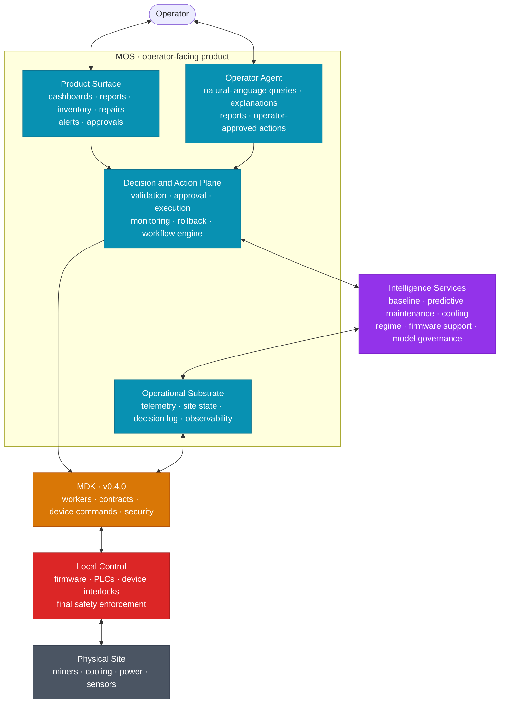
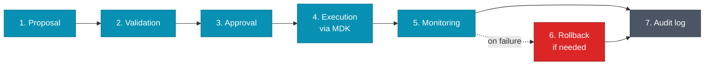
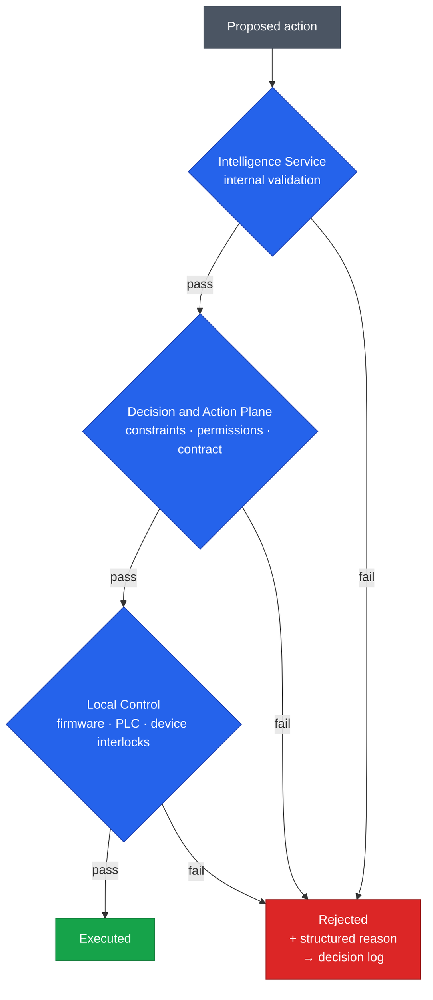
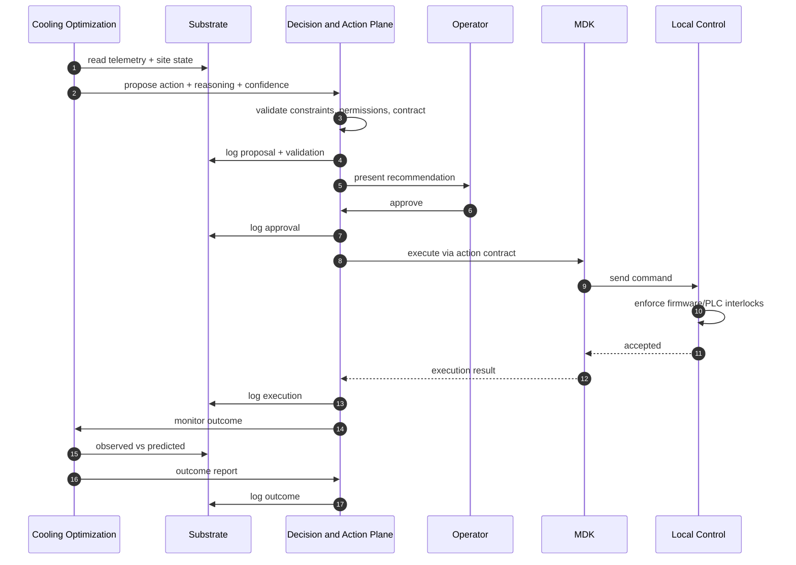
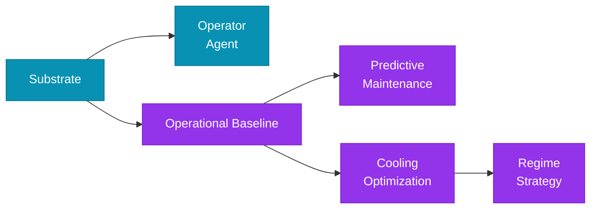

# HLD — Intelligent MOS on MDK

| | |
|---|---|
| **Version** | 0.5.0 proposed |
| **Status** | Draft for review |
| **Extends** | v0.4.0 by Ankit |
| **Author note** | This is a response to v0.4.0. The foundation Ankit defined is preserved. This document extends it with the operator-facing intelligent layer above it. |

---

## What's preserved from v0.4.0

Ankit's v0.4.0 defines the foundation this document builds on. Everything below is kept as-is:

| From v0.4.0 | What it does | Used in v0.5 by |
|---|---|---|
| **App Node** | Single runtime for all server-side capability | The whole MOS stack lives here |
| **MDK + workers + contracts** | Integration substrate between MOS and physical site | Section 4 (architecture), Section 7 (execution) |
| **MCP module** | Auto-generated tool surface for LLM interactions | Section 4 (Operator Agent) |
| **LLM provider abstraction** | OpenAI-compatible API, swappable | Operator Agent and operator-facing explanations |
| **QVAC** | Local model serving | Per-component model selection |
| **JWT/RBAC security model** | Single trust boundary, no back-channels | Every component, including new ones |
| **MDK Developer Skill** | Build-time grounding for coding agents | Unchanged — separate from operator-facing MOS |

**What this proposal adds on top:** the intelligent operator-facing layer (MOS), the Intelligence Services that produce recommendations, the Decision and Action Plane that turns recommendations into safe actions, and the per-service autonomy model.

The **Operator Agent** from v0.4.0 is preserved by name and concept, with its role inside the larger MOS architecture made explicit. It sits alongside the Product Surface as the natural-language entry point to the system.

---

## 1. Purpose

Define the high-level architecture for the next evolution of MOS: an intelligent mining operations system built on MDK.

The goal is to reduce the normalized cost of producing one bitcoin by improving site-level efficiency, reducing maintenance losses, automating recurring workflows, and enabling safer operating regime decisions.

The principle: build the substrate as if the long-term goal is autonomous mining operations, but ship the first deliverables as practical tools that create operator value in months.

LLMs are used for interaction, translation, explanation, reporting, and operator assistance. They do **not** own optimization, anomaly detection, safety validation, or autonomous execution.

---

## 2. Optimization Objective

The North Star metric is the **normalized cost of producing one bitcoin**.

It captures the combined effect of site efficiency, uptime, maintenance cost, cooling performance, automation, and regime decisions. Because the system does not control BTC price, network difficulty, or hashprice, production cost must be normalized against external conditions when used to evaluate performance.

The engineering objective beneath the North Star is to reduce **controllable operational losses**: wasted energy, avoidable downtime, inefficient cooling, delayed maintenance, replacement CAPEX, suboptimal regimes, slow operator response, and repetitive workflows.

### Initial five-year targets

- Improve wall-level fleet efficiency by **1–5%**
- Reduce annual replacement and repair-related CAPEX from approximately **8% toward 3–4%**
- Automate approximately **90%** of clearly defined recurring operator workflows
- Materially reduce normalized cost per BTC

KPI families: production cost, fleet efficiency, energy and cooling, uptime and availability, maintenance, automation, regime quality. Exact KPI definitions are deferred to design phase.

---

## 3. Architecture

### Who is who

| Component | Role |
|---|---|
| **Operator** | Monitors, approves actions, sets intent, overrides automation |
| **MOS** | The operator-facing product. Contains four parts (below) |
| ↳ Product Surface | The visible UX: dashboards, reports, inventory, repairs, alerts, approvals |
| ↳ Operator Agent | LLM-based natural-language interface for queries, explanations, reports, operator-approved actions. From v0.4.0, scope clarified |
| ↳ Decision and Action Plane | Turns recommendations into safe, audited actions. Hosts the workflow engine |
| ↳ Operational Substrate | Telemetry, site state, decision log, observability — the data foundation |
| **Intelligence Services** | Specialized recommendation and analysis services. Produce proposals; never execute directly |
| **MDK** | Integration substrate. Only path to the physical site. Preserved from v0.4.0 |
| **Local Control** | Firmware, PLCs, device-level interlocks. Final safety enforcement. Exists today, unchanged |
| **Physical Site** | Miners, cooling, power, sensors |

### Key principles

- **MOS is the product.** Everything operator-facing lives inside it.
- **Intelligence Services produce, MOS executes.** Services never bypass the Decision and Action Plane.
- **MDK is the only path to physical actions.** Preserved from v0.4.0.
- **Local control has the last word on safety.** Even if everything above approves an action, firmware and PLCs can refuse.

---

## 4. Operational Substrate

The foundation of MOS. Built first. Without it, nothing above works.

| Component | Purpose |
|---|---|
| **Telemetry + historical store** | Schema-enforced ingestion of every sensor reading, event, state change, alarm, operator action, and command outcome. Time-stamped, replay-capable, queryable across sites. |
| **Site State Model** | Canonical representation of assets, topology, relationships, constraints, ownership, and operating status. Not a digital twin. The structure that lets every other component reason about the site. |
| **Decision Log + audit** | Structured record of every recommendation, approval, rejection, override, command, rollback, and outcome. Required for auditability, operator trust, model improvement, and autonomy graduation. |
| **Observability** | Pipeline health, data gaps, model drift, failed commands, rejected actions, safety violations — all visible and measurable. |

Schema and storage details are deferred to design phase.

---

## 5. Intelligence Services

MOS is built through independent intelligence services. Each delivers value standalone. Each matures through the autonomy ladder (Section 7) on its own timeline.

| Service | What it does |
|---|---|
| **Operational Baseline + Loss Detection** | Establishes what "normal" looks like per asset and per site. Detects controllable losses (under-performing miners, thermal outliers, slow operator response, avoidable downtime). Produces visibility. |
| **Predictive Maintenance** | Detects degradation, predicts failures, prioritizes repairs. Classical ML and statistical models for detection. LLMs only for explaining findings to operators. |
| **Cooling Optimization** | Improves thermal performance and reduces cooling waste. MPC-style control with forward models. Starts in recommendation mode. |
| **Regime Strategy** | Decides overclock / underclock / normal / curtailment based on energy cost, hash economics, equipment health, and operating limits. Economically high-impact, advances later than safer services. |
| **Firmware Optimization Support** | Does not move ASIC control out of firmware. Supports firmware from above: telemetry collection, cross-fleet pattern detection, governed improvement of firmware-level models. |
| **Model Governance** | Tooling and process for model validation, rollout, monitoring, rollback, audit. Serves every other service and firmware ML. |

> **Workflow automation is not in this list.** It is infrastructure inside the Decision and Action Plane (Section 6.3), not a service.

---

## 6. Decision and Action Plane

The part of MOS that turns recommendations into safe, audited actions.

It does not optimize. It receives proposals from Intelligence Services or operators, validates them, routes them through approval, executes them through MDK, monitors outcomes, and logs the full lifecycle.

> **Intelligence Services recommend. The Decision and Action Plane validates and executes. Local control enforces final safety.**

### 6.1 Action Lifecycle

Approval is required or skipped depending on the service's current autonomy level (Section 7).

### 6.2 Action Contracts

Every action that can affect the physical site is represented by an explicit action contract: target, allowed command, constraints, required permissions, approval rules, expected response, rollback behavior, audit fields.

Action contracts are the bridge between recommendations and safe execution.

> **MCP serves the Operator Agent. Action contracts serve control-grade execution.**

Schema is deferred to design phase.

### 6.3 Workflow Automation Engine

Cross-cutting infrastructure inside the Decision and Action Plane. Defines and runs the operational workflows that the Product Surface exposes to operators: report generation, alert triage, approval routing, inventory updates, repair dispatch, escalations, scheduled tasks.

Workflows are how MOS coordinates work. They are not a recommendation service.

---

## 7. Autonomy and Safety

### 7.1 Autonomy Ladder

Each Intelligence Service progresses independently through six levels. There is no system-wide autonomy state.

| Level | Description |
|---|---|
| **L0 Observe** | Collects data, monitors state, builds baselines |
| **L1 Explain** | Explains what is happening, does not recommend actions |
| **L2 Recommend** | Suggests actions, cannot execute them |
| **L3 Approve-to-execute** | Proposes actions, executes only after operator approval |
| **L4 Bounded autonomy** | Executes approved action types inside predefined safety limits |
| **L5 Exception-based** | Operates autonomously inside an approved envelope; humans handle exceptions |

A service moves up only on measurable evidence: safety, accuracy, operator trust, operational benefit. Predictive maintenance can be at L4 while regime strategy is at L2, and that is normal.

### 7.2 Constraints

| Type | Examples | Mutability |
|---|---|---|
| **Hard** | Critical temperature, transformer limits, grid limits, fire suppression | Changed only by authorized engineers, fully audited. Never optimized away. |
| **Soft** | Target temperatures, preferred utilization, spending limits | Adjustable by operators within allowed limits |

### 7.3 Defense in Depth

Three independent enforcement layers. Any can reject.

Every rejection produces a structured reason and is logged. Operators can pause, override, or roll back automation at any time. The system always fails back to a known-safe operating mode.

---

## 8. Worked Example

A single trace, to make the architecture concrete.

**Scenario.** Cooling Optimization (at autonomy level **L3**) detects that cluster B can reduce energy use by adjusting two cooling setpoints.

**If the service were at L4:** operator approval is skipped for action types inside the approved envelope. Operator sees a notification, not a request.

**If any safety layer had rejected:** action does not execute, structured reason enters the decision log, operator is notified.

---

## 9. Roadmap

Two independent dimensions.

### 9.1 Introduction order — what gets built when

| Step | Why this point |
|---|---|
| 1. Substrate | Nothing works without telemetry, site state, decision log, observability |
| 2. Operator Agent | First user-facing value; validates the substrate end-to-end |
| 3. Operational Baseline | First service. Establishes the reference data every other service needs |
| 4. Predictive Maintenance | Builds on baseline. Lowest safety risk. Generates training data for higher-risk services |
| 5. Cooling Optimization | Needs baseline + maintenance data. DeepMind-style MPC pattern |
| 6. Regime Strategy | Needs cooling and maintenance to be mature. Affects profitability, so trust bar is higher |

**Firmware Optimization Support** and **Model Governance** develop alongside in parallel once the substrate is in place.

### 9.2 Per-service progression — autonomy is earned

Each service has its own current level and its own advancement criteria. Advancement is granted by action type, component, site, and risk level — never as a blanket promotion.

### 9.3 Timeline expectations

> DeepMind's data center cooling system took roughly two years from launch as a recommendation system to autonomous control. The end-to-end roadmap should be expected to span **multiple years**. Calibration against precedent, not pessimism.

---

## 10. Digital Twin

A digital twin is a long-term capability, **not** a foundational requirement.

The system should first build the foundations that make a useful twin possible: telemetry, replay, site state model, forward models (built inside Cooling for its own needs), failure catalogs (built inside Predictive Maintenance for its own needs), and outcome logs.

These accumulate over time and may evolve into a unified simulation environment for testing new strategies, operator training, what-if analysis, and validation of autonomous behavior.

**The twin emerges from operational data and validated models — not from an upfront simulator project.**

---

## 11. Open Questions and Risks

### Open Questions

To define in design phase:

- Normalized production cost formula and external normalization method
- Exact KPI definitions
- Site State Model schema and ownership
- Decision Log schema
- Action Contract schema
- Telemetry quality requirements
- First workflows to automate
- First site or asset class for pilot deployment
- Per-service advancement criteria
- Team composition for control engineering, applied ML, operations

### Main Risks

| Risk | Mitigation |
|---|---|
| Poor data quality | Treat telemetry and observability as the first thing built |
| Unclear objective function | Define normalized production cost and KPIs before optimization work |
| Unsafe automation | Require action contracts, hard constraints, approval workflows, local interlocks |
| Overuse of LLMs | Keep LLMs in interface, explanation, reporting, assistance roles only |
| Premature digital twin | Build replay, state, per-service forward models first; let the twin emerge |
| Low operator trust | Visibility and recommendations first; graduate autonomy only on evidence |
| Site-specific complexity | Design for per-site baselines and controlled rollout from the start |
| Synchronization fallacy | Each service progresses on its own merit; no forced system-wide autonomy phases |

---

## Changelog from v0.4.0

| Status | Area | Notes |
|---|---|---|
| Preserved | MDK + workers + contracts | Integration substrate, unchanged |
| Preserved | App Node, MCP, LLM abstraction, QVAC, security | Foundation, unchanged |
| Preserved | Developer Skill | Separate from operator-facing MOS, unchanged |
| Preserved | Operator Agent | Name and concept kept from v0.4.0; positioned inside MOS alongside Product Surface |
| Added | MOS as umbrella product | Contains Product Surface, Operator Agent, Decision and Action Plane, Substrate |
| Added | Operational Substrate | Telemetry, site state, decision log, observability as first-class |
| Added | Intelligence Services | Six independent services: baseline, predictive maintenance, cooling, regime, firmware support, model governance |
| Added | Decision and Action Plane | Validation, approval, execution, monitoring, rollback. Hosts Workflow Automation Engine |
| Added | Action Contracts | Distinct from MCP. Control-grade execution |
| Added | Autonomy Ladder L0–L5 | Per-service maturity, evolves independently |
| Added | Defense in depth | Three independent enforcement layers |
| Added | North Star metric and KPIs | Normalized cost per BTC, with KPI families and five-year targets |
| Added | Roadmap | Introduction order + per-service progression |
