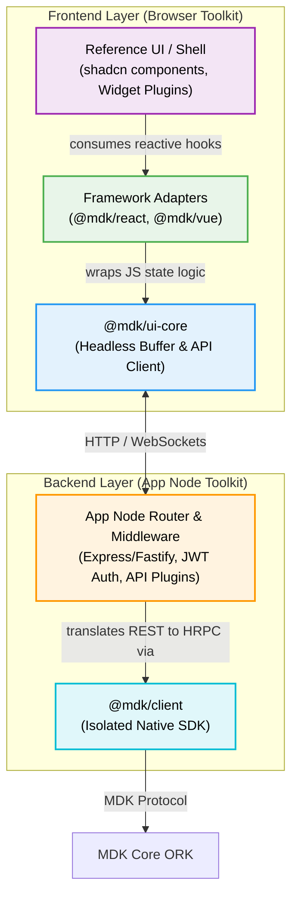

# MDK App Toolkit — High-Level Design

> **The MDK App Toolkit** is an open-source, reusable package consisting of UI primitives, framework adapters, and a plug-and-play architecture for building applications on top of the MDK.

While the core MDK orchestration engine (ORK) is entirely un-opinionated and generic (see [`hld.md`](./hld.md)), the **MDK App Toolkit** provides a "batteries-included" application layer. 

It is designed to be extracted as a reusable open-source package that developers can plug into their own Node.js + Fastify + React stacks (leveraging the low-level **`@mdk/client`** for ORK connectivity) to get a dashboard running immediately.

## 1. Problem Statement & Motivation

Building an application on top of hardware infrastructure historically forces developers to face three massive friction points:
1. **The Repeated Logic Problem:** Every frontend developer integrating with backend APIs ends up reinventing the exact same boilerplate: throttling fast-moving telemetry streams, managing optimistic UI state transitions, and detecting silent communication timeouts. 

2. **The UI Rigidity Trap:** Platforms try to solve Problem #1 by shipping a "UI component library." However, UI is inherently subjective. When external developers are forced to use generic components, they inevitably get locked out of customizing the CSS to match their brand, leading to abandoned toolkits and identical dashboards.

3. **The Extension Bottleneck:** If an external manufacturer builds a brand new miner/device, how do they inject a custom "Dashboard Widget" and "Custom Aggregator" into an existing MDK deployment. 

### The Solution: A Layered Toolkit

The MDK App Toolkit solves these problems by decoupling logic from styling, and providing an explicit plug-and-play extension architecture:

1. It extracts all complex API state and caching logic (e.g., handling server disconnects and buffering data from the App Node Gateway) into a purely **Headless Layer** (`@mdk/ui-core`).

2. It embraces the *shadcn/ui* pattern by providing reference UI components that developers can copy and paste, giving them full control over CSS and layout while still leveraging the underlying data hooks. Alternatively, it can also be installed via NPM.

3. It provides the **MDK-App Plugin Architecture** — an out-of-the-box, extensible shell framework where 3rd-party frontend widgets and backend routes can be injected dynamically at runtime.
## 2. The Frontend Toolkit (`@mdk/ui-core` & Adapters)

Rather than enforcing a monolithic UI framework, the frontend toolkit decomposes the UI SDK into three distinct layers, ensuring that business logic is never reinvented while leaving UI styling entirely under developer control.

### 2.1 Headless Core (`@mdk/ui-core`)
The headless brain connects to the developer's **App Node API**. It manages stateful logic that every UI needs but renders nothing.

- **Subscriptions:** Buffers rapid backend telemetry streams (e.g., max 2 renders/sec).
- **Stale Detection:** Emits stale events if WebSockets drop for 30s.
- **History:** Maintains an internal ring buffer tailored for sparkline charts.
- **Optimistic UI:** Manages command states (`pending`, `confirmed`, `failed`, `timeout`) locally before the server responds.

> **Why headless:** The same subscription logic needs to work in React, Vue, Svelte, and plain JS. By keeping the core framework-agnostic, all framework adapters share the same battle-tested implementation. A bug fix in stale detection benefits every framework simultaneously.

### 2.2 Framework Adapters
The `@mdk/ui-core` generates raw JavaScript state objects, which do not automatically trigger UI re-renders. To bridge this gap, the toolkit provides thin framework adapters that seamlessly translate the headless state machine into framework-native reactive lifecycles (e.g., React `useState`, Vue `ref`, Svelte stores). 

By calling standardized hooks like `useTelemetry(deviceId)` or `useCommand`, a UI component automatically receives perfectly buffered, reactive data, without the developer ever touching a WebSocket or connection manager.

**Available Adapters:** `@mdk/react`, `@mdk/vue`, `@mdk/svelte`, `@mdk/wc` (Web Components).

### 2.3 Reference UI (shadcn-style)
The toolkit optionally ships styled reference components (e.g., `<DeviceTile />`). Rather than `npm install`, these follow the **shadcn/ui** pattern: they are copy-pasted into the developer's source tree. Developers own the styling completely.

### 2.4 Developer Entry Points Matrix
| Option | Entry Point | You Control |
|---|---|---|
| **A — Convenient** | Reference UI | Very little. Copy-paste standard tiles and wire up data. |
| **B — Hooks** | Framework Adapters | Your rendering. Use MDK hooks for complex state but write your own layout. |
| **C — Headless** | `@mdk/ui-core` | Complete state integration. Wire logic into Zustand, Redux, Pinia, etc. |
| **D — Raw SDK** | `@mdk/client` | Everything. Bypass the App Toolkit entirely and connect your own custom UI directly to your backend Node's `@mdk/client`. |

---

## 3. The Backend Toolkit (App Node Middleware)

The App Node acts as the mandatory boundary between the web UI and the ORK kernel (managing JWT authentication, rate limits, and custom REST routes). 

To ensure developers do not have to write this boiler-plate App Node from scratch, the toolkit ships with **Backend Node Middleware** that drops directly into Fastify or Express.

### 3.1 Generic App Node Router
This pre-built middleware handles:
- Exposing standard `/auth` endpoints.
- Validating incoming user JWTs.
- Proxying commands securely down to ORK over HRPC using the `@mdk/client`.

### 3.2 Route Extension Aggregation
The middleware provides hooks allowing developers to easily bind new REST or WebSocket endpoints (e.g., `POST /mining/stats`) that perform complex aggregations using ORK capabilities via **`@mdk/client`**.

---

## 4. Full-Stack Plugins (The "MDK-App" Architecture)

For developers looking for an absolute out-of-the-box solution, the toolkit pairs the Frontend and Backend into the **MDK-App Plugin Architecture** — an extensible, multi-tenant shell.

### 4.1 The Pre-Built Shell
Instead of building a custom React layout and a custom Fastify server, developers spin up the **MDK UI Shell** and **MDK Generic App Node**. These are ready-to-use binaries fully wired together.

### 4.2 Writing a Plugin
External developers then write "Plugins" consisting of two tightly-coupled pieces of code that register dynamically into the shell at runtime:
1. **MDK-App Server:** A package of business logic that registers custom backend routes (e.g., `/mining/stats`) into the Backend Toolkit's middleware hooks. These server plugins securely interface with ORK by utilizing the **`@mdk/client`** SDK under the hood for all HRPC calls.
2. **MDK-App Widget:** A custom frontend React component that mounts into the MDK UI Shell's grid layout and natively queries `/mining/stats`.

**Plug-and-Play Reusability:** This explicit convention ensures that an external company can build a completely new dashboard widget and backend aggregator for a new device type, publish it as a single NPM package, and allow any user to drop it into their existing MDK deployment without modifying core source code.

---

## 5. Full-Stack Architecture Overview

