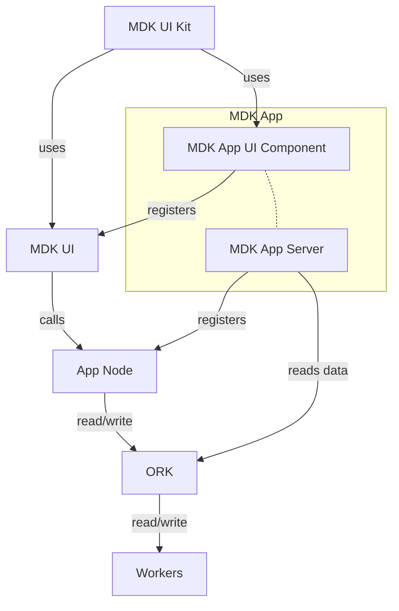

# MDK App — High-Level Design

## 1. Purpose & Context

This document defines the **MDK App** layer — the developer-facing application framework that sits on top of the MDK infrastructure stack.

The MDK backend (`mdk-be`) is intentionally generic. It provides the protocol, routing, and hardware integration plumbing, but it deliberately ships **no business logic**. The **MDK App** is the structured extension point where product-specific logic lives.

A developer building a mining dashboard, energy management system, or any hardware-facing application only needs to build:

1. **MDK App Server** — Business logic, aggregation, auth, and ORK interfacing.
2. **MDK App UI Component** — Domain-specific UI built using the MDK UI Kit.

Everything else (ORK, Workers, MDK UI shell, App Node infrastructure) is provided by MDK as a pre-built, pre-wired foundation.

---

## 2. Design Rationale

> *MDK should be a platform, not a product.* The framework ships an "empty box" pre-equipped with standard infrastructure — auth, ORK communication, frontend/agent communication channels, and extension points. Developers fill the box.

This model prevents two common failure modes:

- **Pushing business logic into ORK:** ORK must remain a pure kernel — routing, concurrency, lifecycle. The moment product-specific aggregation logic bleeds into ORK, the kernel becomes tightly coupled to one application.
- **Forcing developers to rebuild aggregation layers:** Without a blessed extension point in the Node layer, every developer reinvents HTTP wrappers, ORK connectors, and auth middleware. The MDK App layer absorbs this complexity once, generically.

---

## 3. Full Stack Overview

The dashed **MDK App** boundary is what the developer owns and ships. Everything outside it is generic MDK infrastructure.

---

## 4. Layer Definitions

### 4.1 MDK UI Kit *(Provided by MDK)*

A component library and design system that all MDK-compatible frontends consume. It provides standard UI primitives but intentionally contains no application-specific logic.

### 4.2 MDK UI *(Provided by MDK — Extension Point)*

The generic MDK shell application — a thin, pre-built frontend that connects to the App Node. It uses the MDK UI Kit and is ready to use out of the box. Suitable for loading MDK Apps for buisness logic.

### 4.3 MDK App UI Component *(Developer-Built)*

A custom UI component or full frontend application built by the developer using the **MDK UI Kit**. This is where domain-specific screens, dashboards, and interaction flows are implemented.

It registers itself with the **MDK UI** to render UI component for buisness logic.

### 4.4 App Node *(Provided by MDK — Extension Point)*

The app-facing API layer provided by MDK. It is pre-wired with:

- **Authentication & Authorization [TBD]** — token validation, session management.
- **ORK Communication** — HRPC session management to one or more ORK instances.
- **Frontend APIs** — HTTP/WebSocket endpoints for the MDK UI.
- **Extension Points** — clearly defined hooks where the developer's **MDK App Server** registers business logic handlers.

The App Node ships as an "empty box" — structurally complete, but containing no application-specific routes or aggregation by default.

### 4.5 MDK App Server *(Developer-Built)*

The business logic core of the developer's application. It plugs into the App Node extension points and implements:

- **Cross-ORK data aggregation** — pulling telemetry from multiple ORK instances and computing application-level metrics (e.g., site-wide hashrate, fleet-level efficiency).
- **Business rules** — alert thresholds, rebalancing strategies, SLA enforcement.
- **Custom API routes** — domain-specific endpoints exposed through the App Node to the UI or agents.
- **Scheduler logic** — periodic tasks like reporting, anomaly detection, or predictive maintenance triggers.

It reads data directly from ORK instances and writes commands back through the App Node's dispatch interface.

### 4.6 ORK *(Provided by MDK)*

The hardware orchestration kernel. Manages routing, worker lifecycle, command dispatch, and telemetry collection. Entirely generic — has no awareness of the application built on top.

See [`hld.md`](./hld.md) for the full ORK specification.

### 4.7 Workers *(Device-Specific — Provided by MDK / Community)*

Runtime hardware integration modules. Each worker implements the `mdk-contract.json` for a specific device family.

---

## 5. Developer Responsibilities

Under this model, a developer building a mining application needs to provide:

| Component | Owner | What to build |
|---|---|---|
| MDK App UI Component | Developer | Domain-specific dashboards, screens, UX flows using MDK UI Kit |
| MDK App Server | Developer | Business logic, aggregation, custom API routes, schedulers |
| MDK UI Kit | MDK (provided) | — |
| MDK UI | MDK (provided) | — |
| App Node | MDK (provided) | Register routes and logic via extension hooks only |
| ORK | MDK (provided) | — |
| Workers | MDK / Community | Implement `mdk-contract.json` for new device types only |

---

## 6. Extension Points (App Node & MDK App UI Hooks)

The specific interfaces for registering business logic into the App Node (e.g., route registration API, ORK data subscription API, aggregation pipeline hooks) & MDK App UI are to be defined.
