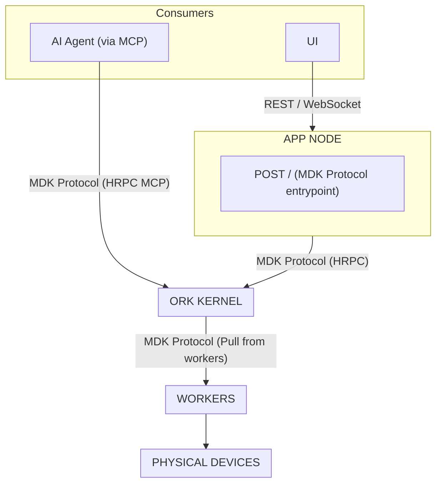

# MDK — High-Level Design (HLD)

> **Version:** 0.2.0 &nbsp;|&nbsp; **Date:** 2026-04-02 &nbsp;|&nbsp; **Status:** Draft
>
> Derived from the [MDK Architecture Proposal] by Gio.

---

## 1. Introduction

### 1.1 Purpose

This document translates the MDK architecture proposal into a **developer-facing High-Level Design** considering the discussion with Chetas, Gio, Hemant & Parag.

## 2. System Architecture

### 2.1 Layer overview



### 2.2 Storage layer

**Hyperbee** stays core to all storage requirements including in Ork, Worker or App Node for Command WAL, telemetry streams, state snapshots, and worker registry persistence.


## 3. MDK Protocol (v0.1.0 — Pull-Based)

### 3.1 Design principles

- **Transport-agnostic** — identical messages over in-process calls or HRPC or API Calls
- **Mostly Unidirectional Communication** — The *only* worker-initiated operations toward ORK are `identity.register`, `capability.declare`, and `deregister` (see §3.3). All operational comms (telemetry, state, commands) are strictly pulled downwards from ORK to worker.
- **Generic Interface** — The interface accepted is defined dynamically at the worker level via capabilities and `skill.md`.

### 3.2 Message envelope

```json
{
  "id":            "uuid-v4",
  "version":       "0.1.0",
  "type":          "request | response | event",
  "action":        "<protocol action>",
  "sender":        "<component:type:instance>",
  "target":        "<component:type:instance>",
  "deviceId":      "string | null",
  "correlationId": "uuid-v4 | null",
  "timestamp":     1711640000000,
  "payload":       {}
}
```

### 3.3 Core actions

| Action | Type | Direction | Purpose |
|---|---|---|---|
| `identity.register` | request | Worker → ORK | Worker presents identity; ORK acknowledges before schema is sent |
| `capability.declare` | request | Worker → ORK | Worker declares devices, capability schema, metadata, and embedded `skill.md` |
| `deregister` | request | Worker → ORK | Worker announces graceful shutdown |
| `state.pull` | request | ORK → Worker | ORK queries managed devices mapping to this worker |
| `telemetry.pull` | request | ORK → Worker | ORK pulls metrics and event history |
| `command.request` | request | ORK → Worker | ORK sends a command to execute on a device |
| `health.ping` | request | ORK → Worker | Liveness probe |

### 3.4 Protocol Governance

To maintain structural integrity and contract stability across disparate components (ORK, App Node, Workers), the MDK Protocol is governed using **Protocol Buffers (Protobuf)**, comparable schema definition tools, or strictly versioned, shared code modules. This ensures that every message and event strictly adheres to a predefined structural schema.

### 3.5 Base Command Set

MDK standardizes a set of **Base Commands** that are supported by all workers, minimizing the need for ad-hoc, device-specific capabilities:

- `getConfig`: Retrieve current device configuration.
- `setConfig`: Update device configuration parameters.
- `health`: Fetch detailed diagnostic health status from the device.


#### Protocol message flows

```mermaid
sequenceDiagram
    participant W as Worker
    participant O as ORK
    participant N as Node/AI Agent/CLI

    rect rgb(40, 40, 60)
    Note over W,O: Registration & Discovery
    W->>O: identity.register
    O-->>W: identity.register.ack
    W->>O: capability.declare (devices, capabilities, skill.md)
    O-->>W: capability.declare.ack
    end

    rect rgb(40, 60, 40)
    Note over O,W: Telemetry (ORK Pull Loop)
    O->>W: telemetry.pull
    W-->>O: metrics & pending commands
    end

    rect rgb(60, 40, 40)
    Note over N,W: Command execution
    N->>O: POST /things
    O->>W: command.execute
    W-->>O: command.result
    O-->>N: result
    end
```



---

## 4. Component Design

### 4.1 App Node — Optional Generic API Gateway

**Responsibility:** Provides customized auth and generic HTTP routes for UI. 

**Decoupled from Thing Type & ID:** 
The App Node has NO hardcoded routes per device type (e.g., no `/wm` route prefixing), and there is no need to pass a `thing_id` in a path parameter, because the payload protocol implicitly contains the target thing's ID.

| URL | Direction |
|---|---|
| `POST /` | Single generic endpoint to communicate via the MDK Protocol. Accepts commands, telemetry reads, and capability/skill queries directly via the generic payload wrapper. |


#### 4.1.1 Endpoint: `POST /`

**Request:**
- **Method:** `POST`
- **Path:** `/`
- **Body Content:** The full MDK Protocol message envelope.
```json
{
  "id": "msg-101",
  "version": "0.1.0",
  "type": "request",
  "action": "command.request",
  "sender": "appnode:generic:01",
  "target": "worker:whatsminer-m56s:rack-04",
  "deviceId": "WM001",
  "payload": {
    "command": "reboot",
    "params": {}
  }
}
```

**Response:**
- **Status:** `200 OK` (if action dispatched successfully)
- **Body Content:** A correlated response message.
```json
{
  "id": "msg-102",
  "correlationId": "msg-101",
  "version": "0.1.0",
  "type": "response",
  "sender": "worker:whatsminer-m56s:rack-04",
  "target": "appnode:generic:01",
  "payload": {
    "status": "ok",
    "data": { "rebooting": true },
    "error": null
  }
}
```

**Auth:** 
Consumers requiring standard authorization will use the App Node to intercept and authenticate requests before bridging to ORK via HRPC.

### 4.2 HRPC-Based MCP (Model Context Protocol)

**Responsibility:** AI/Agent connectivity into the orchestration layer.

Instead of navigating the HTTP API, agents and specialized clients can interact with ORK directly using HRPC based MCP.
- Workers provide their own `skill.md` mapping specialized actions, data structures, and nuanced operation insights.
- The ORK kernel aggregates these `skill.md` assets and exposes them to the agent via MCP.
- Agents use this to contextualize capabilities and dispatch complex command suites.

### 4.3 ORK Kernel — Orchestration Engine

**Responsibility:** Trusted coordination kernel. 

ORK is characterized by split internal modules utilizing multiple state machines to track different domains without coupling, operating exclusively.

#### 4.3.1 High level Modules

| Module | Core Responsibility |
|---|---|
| **Local Index / Registry** | Holds an in-memory mapped local index of workers and managed devices, populated *strictly* by pulling data periodically from dynamically discovered worker nodes (via Service Discovery mechanisms). |
| **State Machines** | Multiple decoupled state machines running parallel. This shall be directly refered from the proposal & improved upon it |
| **MCP Handler** | Direct HRPC listener exposing localized `skill.md` contexts to agents. |
| **Concurrency Manager** | Per-device locks, global queue depth. |
| **Fault Supervisor** | Evaluates failed pulls, operates circuit breakers. |


### 4.4 Workers — Device Integration Handlers

**Responsibility:** Wraps device library and exposes via MDK protocol

- **Register / Deregister Only:** The *only* operations initiated by a worker to ORK are `identity.register`, `capability.declare`, and `deregister` (transport is HRPC or equivalent).
- **Two-step registration:** Identity is acknowledged first; the capability schema (including `skill.md`) is declared second. This lets ORK validate each layer independently and supports re-declaring capabilities after a change without a full worker restart.
- **Capability and skill context:** The full device list, capability schema, metadata, and embedded `skill.md` are carried in `capability.declare` (not in `identity.register`).

##### `identity.register` — payload (illustrative)
```json
{
  "workerType": "whatsminer-worker",
  "protocolVersion": "0.1.0",
  "processId": "pid-12345",
  "startedAt": 1711640000000
}
```

##### `capability.declare` — payload (illustrative)
```json
{
  "devices": [
    { "deviceId": "WM001", "ip": "192.168.1.100", "port": 8080 }
  ],
  "capabilities": {
    "telemetry": [{ "name": "hashrate", "unit": "TH/s", "type": "number" }],
    "commands": [
      { "name": "getConfig", "params": [] },
      { "name": "setConfig", "params": [{ "name": "limit", "type": "number" }] },
      { "name": "health", "params": [] }
    ],
    "events": ["alert.overheat"],
    "health": true
  },
  "metadata": { "brand": "Whatsminer", "model": "M56S", "deviceType": "miner" },
  "skill": "# Whatsminer Control Skill\nAllows rebooting and hashrate monitoring..."
}
```

- **Top-Down Pull for Everything Else:** For all operations & telemetry, workers wait for ORK to pull data or issue commands.
- **Generic Interface Mapping:** Actions are processed using a generic MDK Protocol format containing metadata specific to the device while sharing capabilities declared in `capability.declare`.
- Every worker must implement the contract mentioned in 3.5 regardless the type of device or how worker is called. 
- WorkerBaseClass will be extended to provide all protocol boilerplate so that device workers only need to implement the device-specific parts:
- The capability declaration includes a devices array listing all devices managed by this worker instance. ORK uses this to route commands to the correct worker based on deviceId.
- ORK treats the Worker as the Source of Truth for the hardware, and ORK itself is just a Cache of that truth.


---

## 5. Data Flow — End-to-End Example

**Scenario:** User clicks "Reboot" on device `WM001` in the UI.

```mermaid
sequenceDiagram
    actor User
    participant UI as React UI
    participant Node as App Node
    participant ORK as ORK
    participant Worker as Generic Worker

    User->>UI: Click "Reboot" on WM001
    UI->>Node: POST / { target: "WM001", action: "reboot", payload: {...} }

    rect rgb(40, 50, 70)
    Note over Node,ORK: Delegation
    Node->>ORK: dispatch generic protocol message
    ORK->>ORK: Verify against generic capabilities ✓
    ORK->>ORK: Local index lookup ✓
    end

    rect rgb(40, 60, 50)
    Note over ORK,Worker: execution
    ORK->>Worker: command.execute (HRPC)
    Worker-->>ORK: Ack start
    Worker->>Worker: Hardware specific translation
    Worker-->>ORK: command.result
    end

    ORK-->>Node: result OK
    Node-->>UI: HTTP 200

    rect rgb(50, 50, 40)
    Note over Worker,ORK: State reflection
    ORK->>Worker: telemetry.pull (tick)
    Worker-->>ORK: Updated status (rebooting)
    end
```



---

## 6. External Integration Model

Integrators build **one single generic worker package**. Because App Nodes no longer map specific router plugins, developers only manage the localized worker definitions.

```text
@acme-corp/mdk-worker-acmeminer
├── lib/               ← Hardware integration logic
├── worker.js          ← Standalone HRPC worker exposing capabilities
├── skill.md           ← Definitions for the MCP ORK connection
└── package.json
```

**Workflow:**
1. Developer writes worker translation.
2. Supplies `skill.md` with action context.
3. Worker initiates registration to ORK with `identity.register` then `capability.declare` (see §3.3 and §4.4).

---