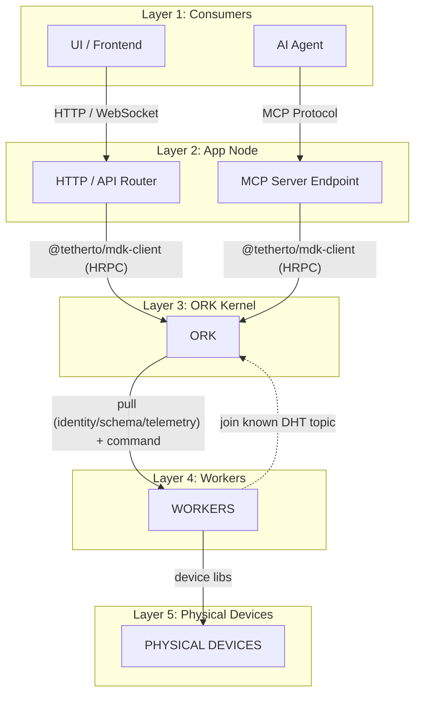
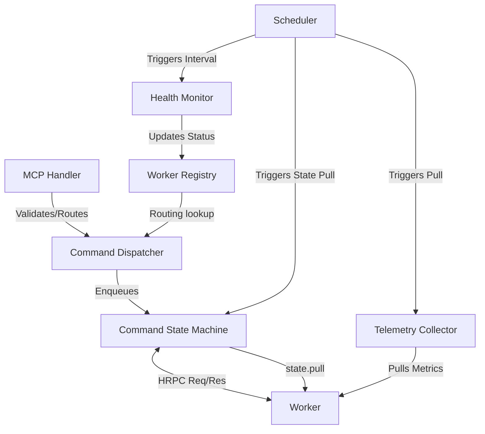
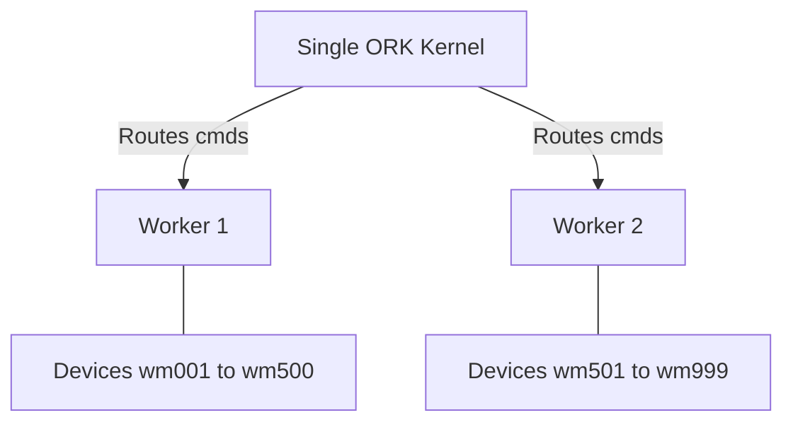
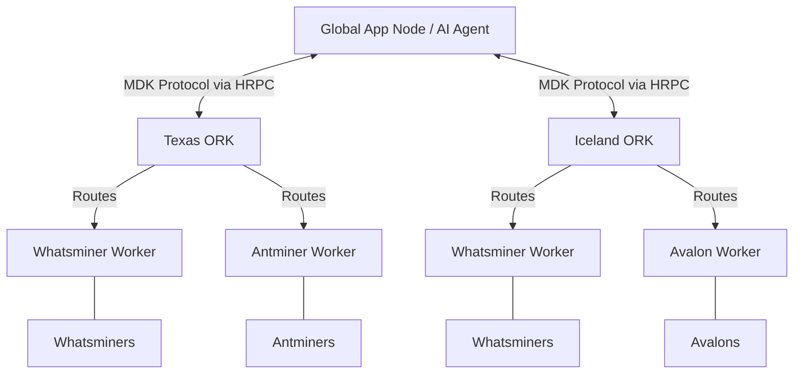

# MDK — High-Level Design (HLD)

> **Version:** 0.4.0 &nbsp;|&nbsp; **Date:** 2026-04-18 &nbsp;|&nbsp; **Status:** In Review
>
> Derived from the MDK Architecture Proposal by Gio.

---

## 1. Introduction

### 1.1 Design Rationale: Flexibility vs. Rigidity

**“Make the common case easy, and the rare case possible — not equally easy.”**

To prevent unbound flexibility from manifesting as system rigidity, the architecture draws a hard line between what is standardized and what is delegated.

**Opinionated where needed:** strict transport envelopes, unified JSON schema, unidirectional flows
**Flexible where it matters:** isolated Workers handle translation logic, enabling integrations without polluting the core infrastructure.

## 2. System Architecture

### 2.1 Layer overview




### 2.2 Storage layer

It is recommended to use **Hypercore-backed stores** (like Hyperbee) to satisfy all storage requirements across the ORK, Worker, and App Node layers. This inherently avoids issues with traditional centralized database.


## 3. MDK Protocol (v0.1.0 — Pull-Based)

### 3.1 Design principles

- **Transport-agnostic** — identical messages over in-process calls or HRPC or API Calls
- **Strictly Unidirectional Communication** — Workers never initiate RPC calls to ORK. They simply join a known DHT topic; ORK discovers their presence passively and initiates all subsequent communication downwards (identity, capabilities, telemetry, commands).
- **Generic Interface** — The interface accepted is defined dynamically at the worker level via a self-describing capabilities schema containing both structure and semantic context for AI agents.

### 3.2 Message envelope

```json
{
  "id":            "uuid-v4",
  "version":       "0.1.0",
  "type":          "request | response | event",
  "action":        "<protocol action>",
  "sender":        "<component:type:instance>",
  "target":        "<component:type:instance> | null",
  "deviceId":      "string | null",
  "timestamp":     1711640000000,
  "payload":       {}
}
```
*Note: External consumers (UI/AI agents) only provide `deviceId`; the `target` worker identity is internally resolved by ORK.*

### 3.3 Core actions

| Action | Type | Direction | Purpose |
|---|---|---|---|
| *(DHT presence)* | passive | Worker → DHT Topic | Worker joins a known Hyperswarm topic; ORK detects its peer connection automatically |
| `identity.request` | request | ORK → Worker | ORK requests the worker's identity and managed devices |
| `capability.request` | request | ORK → Worker | ORK asks the worker to declare its full capability schema |
| `state.pull` | request | ORK → Worker | Worker returns a snapshot of worker state-machine status (Low cadence tick, e.g., 60s) |
| `telemetry.pull` | request | ORK → Worker | Worker returns device metrics plus historic metrics (Medium cadence tick, e.g., 10s) |
| `command.request` | request | ORK → Worker | ORK resolves the worker by `deviceId` and dispatches the command for execution |
| `health.ping` | request | ORK → Worker | Liveness probe (High cadence tick, e.g., 5s) |

### 3.4 Protocol Governance

To maintain structural integrity and contract stability across disparate components (ORK, App Node, Workers), the MDK Protocol messages are governed and strictly validated using **Hyperschema** (https://github.com/holepunchto/hyperschema). Hyperschema also aligns natively with the system's underlying Hyperbee storage. 

### 3.5 Base Command Set

MDK standardizes a set of **Base Commands** that are supported by all workers:

- `getConfig`: Retrieve current device configuration.
- `setConfig`: Update device configuration parameters.
- `health`: Fetch detailed diagnostic health status from the device.


#### Protocol message flows

```mermaid
sequenceDiagram
    participant W as Worker
    participant DHT as DHT Topic (Hyperswarm)
    participant O as ORK
    participant G as Gateway (App Node / MCP)

    rect rgb(40, 40, 60)
    Note over W,O: Worker Discovery & Registration
    W->>DHT: Joins known topic
    O-->>DHT: Detects new peer connection
    O->>W: identity.request
    W-->>O: identity.response (devices)
    O->>O: Save Worker to Registry
    O->>W: capability.request
    W-->>O: capability.response (schema)
    end

    rect rgb(40, 60, 40)
    Note over O,W: Telemetry (ORK Pull Loop)
    O->>W: telemetry.pull
    W-->>O: metrics & pending commands
    end

    rect rgb(60, 40, 40)
    Note over G,W: Command execution
    G->>O: MDK Protocol HRPC Envelope
    O->>W: command.request (routed by deviceId)
    W-->>O: command.result
    O-->>G: result
    end
```



---

## 4. Component Design

### 4.1 App Node — The Developer-Owned API Boundary

**Responsibility:** The mandatory boundary between the client-facing world and the ORK kernel.

The UI never connects to ORK directly; an App Node must act as the gateway. Developers have two paths:
- **Direct:** Write business logic, aggregation routes, and auth directly in the App Node using `@tetherto/mdk-client` in any language (Node.js, Go, Python, etc.).
- **MDK-App Plugins:** Use the **[MDK App Toolkit](./hld-mdk-app.md)** for a drop-in Node/Fastify shell where domain-specific logic is packaged as plug-and-play MDK-App modules.

Both approaches are fully supported; the choice depends on the team's preference for control vs. convention.

App Node handles:
- **Fleet aggregation:** Computes site hashrate, avg temperature, cross-rack efficiency.
- **Auth / RBAC:** Guards all access to ORK with JWTs and session management.
- **API Surface:** Exposes REST or GraphQL to the UI.

#### 4.1.1 Routing Contract

UI/AI agents should only provide `deviceId`; the App Node (via `@tetherto/mdk-client`) passes this down. ORK resolves the owning worker internally and dispatches the `command.request`.

#### 4.1.2 Authentication

**JWT (Bearer Token)** is at the core of the App Node authentication loop. The App Node validates the JWT (signature, expiry, claims) before proxying any traffic into the ORK layer.

**ORK Whitelisting:** The ORK kernel does not perform user-level authentication. Instead, ORK maintains a strict whitelist of approved App Node/Client connections. Once whitelisted securely (e.g., via HRPC keys), ORK implicitly trusts the origin of the HRPC messages.

### 4.2 MCP Server & AI Agent Integration

**Responsibility:** Secure AI/Agent connectivity into the orchestration layer.

An AI Agent communicates with the MDK stack exclusively through the **App Node's MCP Endpoint**. An AI agent is treated as just another authenticated client.

**Under no circumstances do AI agents connect directly to ORK.** 
Because ORK lacks authentication, direct connections bypass all security limits. By binding the AI agent to the App Node via MCP, the agent needs to go through the same JWT validation, rate limits, RBAC as a human API consumer.

#### 4.2.1 MCP Tool Derivation

The tools exposed to the AI Agent (e.g., `get_device_telemetry`, `reboot_device`) are not hardcoded. They are discovered dynamically at runtime, parsed directly from the declared capabilities (`mdk-contract.json`) of the registered workers.

**Context Format Contract:** Semantic AI context is injected directly as keys within the strict JSON capabilities schema. This ensures the programmatic bounds and the AI reasoning rules are tightly bound together.


### 4.3 ORK Kernel — Orchestration Engine

> [!NOTE]
> **Package Naming Convention:** The orchestration layer is explicitly distributed as **`@tetherto/mdk-ork`** rather than `@tetherto/mdk-core`. The term "core" is highly ambiguous in monorepos and can be confused with shared utilities, transport SDKs, or frontend UI components. By using `@tetherto/mdk-ork`, the package maps 1:1 with the architectural diagrams, making it instantly clear to developers that this is the standalone Orchestration Kernel daemon.


**Responsibility:** Trusted coordination kernel. 

ORK is characterized by split internal modules utilizing multiple state machines to track different domains without coupling, operating exclusively.

#### 4.3.1 High-level Modules

To ensure clear boundaries and horizontal scalability, ORK is decomposed into distinct, single-responsibility modules. 

The ORK design is inspired by Kubernetes architecture, heavily leveraging a **pull-only model** to bound the pace of execution without being overwhelmed.



For each core module, we define strict boundaries for business logic, interfaces, recovery, and scale:

##### 1. Command Dispatcher
*   **Business Logic / Responsibility:** Validates incoming commands against the generic MDK schema, checks permissions, and resolves the correct worker based on the `deviceId`. 
    *   *Example:* When an App Node sends a `reboot` command for `wm001`, the Dispatcher verifies that `wm001` exists, that `reboot` is a valid capability for it, and then passes the request to the State Machine.
*   **Interfaces:** 
    *   *Input:* Receives generic commands via HRPC/MDK Protocol from App Node or MCP Handler.
    *   *Output:* Hands off validated commands to the Command State Machine.
    *   *Functions:* `dispatchCommand(deviceId, action, payload)`
*   **State Machine:**
    ```mermaid
    stateDiagram-v2
        [*] --> Validating
        Validating --> RoutingAction : Valid
        Validating --> Rejected : Invalid
        RoutingAction --> Enqueued
        Enqueued --> [*]
    ```
*   **Crash Recovery:** None needed. In-flight requests will fail and must be retried by the client.
*   **Scalability:** Extracted easily; can run independently to offload validation.

##### 2. Command State Machine
*   **Business Logic / Responsibility:** Tracks the execution lifecycle of every single command in the system. It receives execution results directly via the synchronous HRPC response. If the connection drops or a response is delayed, it relies on the Scheduler to fetch the latest status via `state.pull` to ensure commands aren't hung.
    *   *Example:* Once the `reboot` command is dispatched, it transitions to `EXECUTING`. If the HRPC response returns OK, it transitions to `SUCCESS`. If the response hangs, the next `state.pull` fetches the true status from the worker.
*   **Interfaces:**
    *   *Input:* Receives validated commands from Dispatcher. Status updates from HRPC responses or Scheduler ticks.
    *   *Output:* Invokes worker HRPC execution layer; emits terminal state results to the caller.
    *   *Functions:* `enqueue(command)`, `syncState(commandId)`, `cancel(commandId)`
*   **State Machine:**
    ```mermaid
    stateDiagram-v2
        [*] --> QUEUED
        QUEUED --> DISPATCHED
        DISPATCHED --> EXECUTING : HRPC Sent
        EXECUTING --> SUCCESS : state.pull (response)
        EXECUTING --> FAILED : state.pull (error)
        EXECUTING --> TIMEOUT
        TIMEOUT --> QUEUED : Retry allowed
        TIMEOUT --> FAILED : Max retries
        SUCCESS --> [*]
        FAILED --> [*]
    ```
*   **Crash Recovery:** On startup, performs a recovery sweep of pending commands: `DISPATCHED` / `EXECUTING` are forced to `TIMEOUT` (re-queued if retries available); `QUEUED` are left untouched.
*   **Scalability:** Scaling requires state sharding (e.g., sharding by device/rack).

##### 3. Worker Registry
*   **Business Logic / Responsibility:** Acts as the phonebook for the entire ORK ecosystem. It maps which physical device IDs belong to which connected worker channels and stores their declared capabilities. 
    *   *Example:* A `whatsminer-worker` connects and declares it manages `wm001` and `wm002`. The Registry saves this topology so the Dispatcher knows exactly where to route a command for `wm001`.
*   **Interfaces:**
    *   *Input:* `identity.register` requests from workers.
    *   *Output:* Internal events triggering full state lifecycle binding.
    *   *Functions:* `resolveWorkerState(target)`
*   **State Machine:**
    ```mermaid
    stateDiagram-v2
        [*] --> Unregistered
        Unregistered --> Discovered : DHT Peer Detected
        Discovered --> IdentitySaved : ORK pulls Identity
        IdentitySaved --> Ready : ORK pulls Capabilities
        Ready --> Terminated : eviction
        Terminated --> [*]
    ```
*   **Crash Recovery:** Rebuilt from state, which serves as a baseline to detect workers that were registered but failed to reconnect.
*   **Scalability:** Can be read-heavy and extracted into a read-replica architecture or partitioned by region/rack.

##### 4. Telemetry Collector
*   **Business Logic / Responsibility:** Acts as a lightweight proxy and routing layer between the upper system (UI/AI) and the downstream workers. Rather than ORK performing heavy time-series aggregations, the *Worker* is responsible for storing and aggregating data for the specific devices it controls. The ORK Collector simply provides an interface to query this data and proxies the response up to the UI (via App Node) or the AI Agent.
*   **Worker Data Handling (Telemetry Context):**
    *   **Compaction:** The worker handles the compaction of metrics over large time frames.
    *   **Local Storage:** It is recommended that workers save this telemetry data in a local hyper DB.
    *   **As-Requested Serving:** The worker serves the data strictly when ORK asks for it, precisely as dictated by the telemetry schemas in `mdk-contract.json`.
    *   **Internal Scheduling:** To achieve this without blocking ORK, the worker may run its own internal scheduler for internal device polling.
*   **Interfaces:**
    *   *Input:* Client or AI telemetry queries (e.g., "fetch metrics for device wm001").
    *   *Output:* Normalized telemetry payloads passed straight through from the Worker to the requesting layer.
    *   *Functions:* `proxyTelemetryFetch(deviceId, queryArgs)`
*   **State Machine:**
    ```mermaid
    stateDiagram-v2
        [*] --> Idle
        Idle --> Proxying : Request received from UI/AI
        Proxying --> RoutingToClient : Worker returns aggregated data
        Proxying --> Timeout : Worker unresponsive
        RoutingToClient --> Idle
    ```
*   **Scalability:** Because the heavy lifting of data storage and aggregation is pushed down into the isolated worker processes, the ORK Telemetry Collector remains stateless and highly scalable as a pure asynchronous router.

##### 5. Scheduler
*   **Business Logic / Responsibility:** The system metronome. It triggers repetitive tasks without holding any domain-specific logic itself.
    *   *Example:* Emits an internal `tick` event every 5 seconds which the Health Monitor listens to, prompting it to ping all workers.
*   **Interfaces:**
    *   *Input:* System clock and configured task intervals.
    *   *Output:* Injects intents (e.g., `telemetry.pull`, `health.ping`) into the Dispatcher/Collector.
    *   *Functions:* `addJob(interval, intent)`, `removeJob(jobId)`
*   **State Machine:**
    ```mermaid
    stateDiagram-v2
        [*] --> Waiting
        Waiting --> Triggered : Interval Elapsed
        Triggered --> Waiting
    ```
*   **Crash Recovery:** Timers re-initialize from zero on startup. Tasks are strictly idempotent.
*   **Scalability:** Scales trivially. Requires basic distributed locking to avoid duplicate ticks in multi-process ORK deployments.

##### 6. Health Monitor
*   **Business Logic / Responsibility:** Continuously evaluates the liveness and readiness of every registered worker to prevent routing messages to dead nodes.
    *   *Example:* If the `health.ping` to a worker fails three times in a row, the Health Monitor marks the worker's status as `SICK` and tells the Registry to halt routing new commands there.
*   **Interfaces:**
    *   *Input:* Executes `health.ping` sequentially based on Scheduler ticks.
    *   *Output:* Pushes status updates to the Registry;
    *   *Functions:* `pingWorker(workerId)`, `getHealth(workerId)`
*   **State Machine:**
    ```mermaid
    stateDiagram-v2
        [*] --> UNKNOWN
        UNKNOWN --> HEALTHY : Ping Success
        HEALTHY --> SICK : Ping Failed (1)
        SICK --> DEAD : Ping Failed (Threshold)
        SICK --> HEALTHY : Ping Success
        DEAD --> HEALTHY : Reconnected
    ```
*   **Crash Recovery:** Blank slate on startup; re-evaluates all known workers immediately via ping.
*   **Scalability:** Operates locally per ORK kernel or via independent lightweight ping agents.

##### 7. Fault Supervisor *(Deferred for v1)*
*   **Idea:** Implements circuit-breaker patterns to protect the overall system from cascading failures caused by bad hardware or software bugs (e.g., rejecting commands during a cooling period upon repeated errors).
*   **Status:** For the first cut, to keep the core orchestrator simple, we are going to skip the dedicated Fault Supervisor. Later on, if the use-case arises (such as complex retry backoffs or cluster destabilization), we will reintroduce it.

##### 8. Concurrency Manager *(Deferred for v1)*
*   **Idea:** Provides guaranteed lock management and queue limits to ensure mutually exclusive commands do not overlap on physical devices.
*   **Status:** For the first cut, to keep the system simple, we are skipping the centralized Concurrency Manager module and relying solely on the basic command queue. Later on, if the use-case arises for explicit global locks or backpressure limits, we will build out this module.

#### 4.3.2 System Recovery Overview

On a full system crash and restart, ORK modules orchestrate recovery without user intervention:
1. **Registry:** Loads last known worker and device states from Hyperbee.
2. **State Machine:** Sweeps the WAL for stranded `EXECUTING` tasks and forces them to timeout/retry.
3. **Health Monitor:** Begins firing immediate pings to verify which workers are still active.
4. **Connections:** Network layer awaits incoming HRPC reconnect storms from persistent workers.

### 4.4 Workers — Device Integration Handlers

**Responsibility:** Wraps device library and exposes via MDK protocol

#### 4.4.1 Worker Discovery Model


1. **DHT Presence:** The Worker joins a known Hyperswarm DHT topic. It does not send any RPC messages; it simply becomes a reachable peer.
2. **Peer Detection:** ORK continuously listens on the same DHT topic and detects the new peer connection automatically.
3. **Identity Request:** ORK initiates the first RPC call, requesting the worker's identity and managed devices.
4. **Registration:** After receiving the identity, ORK saves the worker and its RPC keys into its registry.
5. **Capability Declaration:** ORK then explicitly queries the worker to declare its full capabilities (`mdk-contract.json`).

> **Note:** Communication is **strictly unidirectional** — ORK initiates every RPC call. Workers only ever respond.

#### 4.4.2 Worker Responsibilities

##### `capability.response` & Unified Contract Schema ([`mdk-contract.json`](./mdk-contract.json))

When ORK requests capabilities, the payload is built via the direct application of the device's `mdk-contract.json`. 

The `mdk-contract.json` is the canonical source of truth for the worker's programmatic capabilities and AI context. MDK deliberately merges formal validations and semantic AI guidelines into this single JSON contract.

- **Unified Intelligence:** Prompt-injections (like thermal safety warnings) are woven organically into standard machine fields rather than isolated in separate documents.
  - `description` handles both human UI labeling and AI edge-case rules (e.g., *"Outlet temperature > 85C requires intervention"*).
  - `constraints` inherently governs orchestration limits.
  - `troubleshooting` provides if/then recovery behaviors directly alongside the payload it evaluates.

*The exhaustive JSON Validation Schema detailing exactly how this contract must be built currently exists at:* **[`mdk-contract.schema.json`](./mdk-contract.schema.json)**

- **Generic Interface Mapping:** Actions are processed using a generic MDK Protocol format, translating from the strict JSON Schema boundaries into specific hardware signals.
- **Subclassing `@tetherto/mdk-worker-base`:** Built by subclassing `@tetherto/mdk-worker-base` and implementing two methods: `onTelemetryPull` and `onCommand` — all HRPC plumbing is inherited.
- **Source of Truth:** ORK treats the Worker as the unyielding Source of Truth for the hardware; ORK itself operates purely as a synchronized state machine or cache of that truth.

### 4.5 `@tetherto/mdk-client` SDK — The Universal Interface

The `@tetherto/mdk-client` SDK is the transport abstraction layer used to connect to ORK's gateways safely and reliably. It provides the essential glue between ORK and whatever consumer layer developers choose to build on top.

**Responsibility:** Connects the MDK Protocol over native transports (HRPC or IPC) seamlessly.

- **Transport Abstraction:** It handles MDK Protocol message construction and reconnection logic with exponential backoff.
- **Transport Auto-Selection:** The SDK auto-selects the transport mechanism based entirely on the URL scheme provided by the developer:
  - `hrpc://` connects over encrypted Hyperswarm streams for remote server-to-server production.
  - `ipc://` connects via direct local sockets for extremely low-latency local testing.
- **Major Languages Support:** `@tetherto/mdk-client` will be built for all major languages (Node.js, Python, Go, etc.), allowing developers to dispatch commands, subscribe to live streams, or pull status snapshots from any stack.

---

## 5. Data Flow — End-to-End Examples

### Scenario A: Human UI via App Node
**Scenario:** User clicks "Reboot" on device `wm001` in the UI.

```mermaid
sequenceDiagram
    actor User
    participant UI as React UI
    participant Node as App Node
    participant ORK as ORK
    participant Worker as Generic Worker

    User->>UI: Click "Reboot" on wm001
    UI->>Node: POST / { deviceId: "wm001", action: "reboot", payload: {...} }

    rect rgb(40, 50, 70)
    Note over Node,ORK: Delegation
    Node->>ORK: dispatch generic protocol message
    ORK->>ORK: Verify against generic capabilities ✓
    ORK->>ORK: Resolve worker for deviceId (local index lookup) ✓
    end

    rect rgb(40, 60, 50)
    Note over ORK,Worker: execution
    ORK->>Worker: command.request (HRPC, routed by deviceId)
    Worker-->>ORK: Ack start
    Worker->>Worker: Hardware specific translation
    Worker-->>ORK: command.result
    end

    ORK-->>Node: result OK
    Node-->>UI: HTTP 200

    rect rgb(50, 50, 40)
    Note over Worker,ORK: State reflection
    ORK->>Worker: telemetry.pull (tick)
    Worker-->>ORK: Updated status (rebooting)
    end
```



### Scenario B: AI Agent via App Node MCP
**Scenario:** User prompts AI Agent: "Are there any miners overheating? If so, reboot them."

```mermaid
sequenceDiagram
    actor User
    participant AI as AI Agent (Claude)
    participant Node as App Node (MCP)
    participant ORK as ORK
    participant Worker as Generic Worker

    User->>AI: "Are there any miners overheating? If so, reboot them."
    
    rect rgb(70, 50, 40)
    Note over AI,ORK: Step 1: Fleet Discovery (Read)
    AI->>Node: Call MCP tool `get_fleet_alerts` (Token Auth)
    Node->>Node: Validate Agent Token & RBAC
    Node->>ORK: HRPC Query (via @tetherto/mdk-client)
    ORK-->>Node: [Metrics]
    Node-->>AI: Tool Result (wm002 is overheating)
    end
    
    rect rgb(40, 50, 70)
    Note over AI,ORK: Step 2: Execution (Write)
    AI->>Node: Call MCP tool `reboot_device` (deviceId: wm002)
    Node->>Node: Validate Agent Token & 'device:write' RBAC
    Node->>ORK: dispatch generic protocol message
    ORK->>ORK: Resolve deviceId ✓
    ORK->>Worker: command.request (HRPC)
    Worker-->>ORK: command.result
    ORK-->>Node: result OK
    Node-->>AI: Tool Result (Success)
    end
    
    AI-->>User: "wm002 was overheating and has been rebooted."
```



---

## 6. External Integration Model

To build extensibility that is genuinely straightforward, MDK defines a **strict Device-Lib Contract**. External developers integrate new hardware by building a generic worker package conforming to this template.

### 6.1 The Device-Lib Template

External integrators build a standard worker package that wraps their device's specific interaction protocols, exposing a unified interface via the `mdk-contract.json` capability schema.

### 6.2 Integration Workflow
1. Integrator references [`mdk-contract.schema.json`](./mdk-contract.schema.json) to author the [`mdk-contract.json`](./mdk-contract.json), validating strict data schemas while injecting explanations, constraints, and troubleshooting directly into the relevant nodes.
2. Integrator implements the `src/hardware.js` translation logic.
3. The worker instance boots, connects to `devices`, and joins the known DHT topic. ORK detects the peer and pulls its identity and capabilities (see §3.3 and §4.4).

---

## 7. Scaling Model

As MDK deployments scale to large mining sites (e.g., 5,000+ devices), the system must explicitly manage parallel workers and parallel ORK instances. ORK is strictly an execution kernel; it does not perform application-level aggregation or cross-regional business logic.

### 7.1 Routing and Ownership (Parallel Workers)

**Scenario:** Multiple workers of the same type (e.g., `whatsminer-worker`) are active concurrently and connected to the same ORK kernel.



**Device-Level Routing & Ownership:** Workers never share devices. When a worker connects, its `identity.register` payload explicitly lists the `deviceId`s it exclusively manages. ORK's `Worker Registry` maintains this strict mapping and deterministically routes arriving commands to the designated worker.

### 7.2 Multi-Site Centralization (Parallel ORKs)

**Scenario:** A deployment requires managing multiple massive physical boundaries (e.g., a Texas Site and an Iceland Site). Each location runs its own dedicated site-level ORK kernel, but all are overseen globally by a **single App Node and/or AI Agent**.

#### Architecture Flow



The single App Node and AI Agent connect globally to all distributed ORK kernels via the native HRPC mesh (`Hyperswarm`). Parallel ORK instances remain entirely isolated from one another — they do not federate registries, share queues, or synchronize state. A crash at one site has zero impact on any other.

Cross-site aggregation is handled purely at the App Node layer, where routes query multiple workers via ORK and merge the responses before returning them to the UI or Agent.

---

## 8. Extensibility & Business Logic Plugins

To keep ORK as a pure execution kernel, all domain-specific business logic lives in the App Node layer. Developers can either write this logic directly using `@tetherto/mdk-client`, or leverage the **MDK-App Plugin** pattern for a structured, plug-and-play extension model.

> **Full Spec:** Refer to the **[MDK App Toolkit HLD](./hld-mdk-app.md)** for the complete MDK-Apps architecture, frontend toolkit, and backend middleware design.
