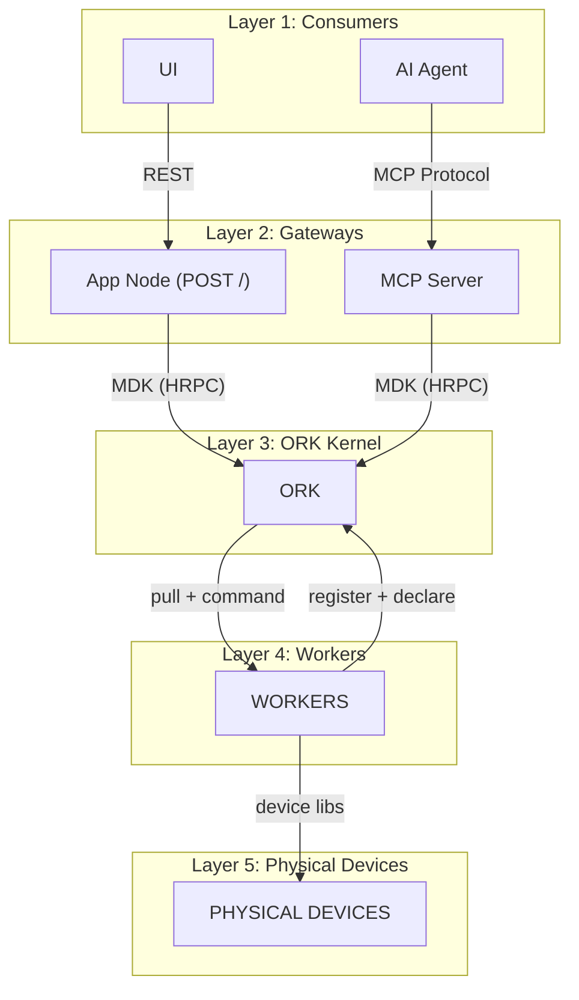

# MDK — High-Level Design (HLD)

> **Version:** 0.2.0 &nbsp;|&nbsp; **Date:** 2026-04-02 &nbsp;|&nbsp; **Status:** Draft
>
> Derived from the [MDK Architecture Proposal] by Gio.

---

## 1. Introduction

### 1.1 Purpose

This document translates the MDK architecture proposal into a **developer-facing High-Level Design** considering the discussion with Chetas, Gio, Hemant & Parag.

## 2. System Architecture

### 2.1 Layer overview



### 2.2 Storage layer

**Hyperbee** stays core to all storage requirements including in Ork, Worker or App Node for Command WAL, telemetry streams, state snapshots, and worker registry persistence.


## 3. MDK Protocol (v0.1.0 — Pull-Based)

### 3.1 Design principles

- **Transport-agnostic** — identical messages over in-process calls or HRPC or API Calls
- **Mostly Unidirectional Communication** — The *only* worker-initiated operations toward ORK are `identity.register`, `capability.declare`, and `deregister` (see §3.3). All operational comms (telemetry, state, commands) are strictly pulled downwards from ORK to worker.
- **Generic Interface** — The interface accepted is defined dynamically at the worker level via capabilities and `skill.md`.

### 3.2 Message envelope

```json
{
  "id":            "uuid-v4",
  "version":       "0.1.0",
  "type":          "request | response | event",
  "action":        "<protocol action>",
  "sender":        "<component:type:instance>",
  "target":        "<component:type:instance> | null",
  "deviceId":      "string | null",
  "correlationId": "uuid-v4 | null",
  "timestamp":     1711640000000,
  "payload":       {}
}
```
*Note: External consumers (UI/AI agents) only provide `deviceId`; the `target` worker identity is internally resolved by ORK.*

### 3.3 Core actions

| Action | Type | Direction | Purpose |
|---|---|---|---|
| `identity.register` | request | Worker → ORK | Worker presents identity; ORK acknowledges |
| `capability.declare` | request | Worker → ORK | Worker declares devices, capability schema, metadata, and embedded `skill.md` |
| `deregister` | request | Worker → ORK | Worker announces graceful shutdown |
| `state.pull` | request | ORK → Worker | Worker returns a snapshot of worker state-machine status (Low cadence tick, e.g., 60s) |
| `telemetry.pull` | request | ORK → Worker | Worker returns device metrics plus historic metrics (Medium cadence tick, e.g., 10s) |
| `command.request` | request | ORK → Worker | ORK resolves the worker by `deviceId` and dispatches the command for execution |
| `health.ping` | request | ORK → Worker | Liveness probe |

### 3.4 Protocol Governance

To maintain structural integrity and contract stability across disparate components (ORK, App Node, Workers), the MDK Protocol messages are governed and validated using **Hyperschema** (https://github.com/holepunchto/hyperschema). Hyperschema aligns natively with the system's underlying Hyperbee storage, providing strict, binary-compact schema validation for every protocol message and event without the heavyweight toolchain overhead of Protobuf or gRPC.

### 3.5 Base Command Set

MDK standardizes a set of **Base Commands** that are supported by all workers::

- `getConfig`: Retrieve current device configuration.
- `setConfig`: Update device configuration parameters.
- `health`: Fetch detailed diagnostic health status from the device.


#### Protocol message flows

```mermaid
sequenceDiagram
    participant W as Worker
    participant O as ORK
    participant G as Gateway (App Node / MCP)

    rect rgb(40, 40, 60)
    Note over W,O: Registration & Discovery
    W->>O: identity.register
    O-->>W: identity.register.ack
    W->>O: capability.declare (devices, capabilities, skill.md)
    O-->>W: capability.declare.ack
    end

    rect rgb(40, 60, 40)
    Note over O,W: Telemetry (ORK Pull Loop)
    O->>W: telemetry.pull
    W-->>O: metrics & pending commands
    end

    rect rgb(60, 40, 40)
    Note over G,W: Command execution
    G->>O: MDK Protocol HRPC Envelope
    O->>W: command.request (routed by deviceId)
    W-->>O: command.result
    O-->>G: result
    end
```



---

## 4. Component Design

### 4.1 App Node — Optional Generic API Gateway

**Responsibility:** Provides user auth and generic HTTP routes for UI. 

**Decoupled from Thing Type & ID:** 
The App Node has NO hardcoded routes per device type without `thing_id` in a path parameter, because the payload protocol implicitly contains the target thing's ID.

| URL | Direction |
|---|---|
| `POST /` | Single generic endpoint to communicate via the MDK Protocol. Accepts commands, telemetry reads, and capability/skill queries directly via the generic payload wrapper. |


#### 4.1.1 Endpoint: `POST /`

**Request:**
- **Method:** `POST`
- **Path:** `/`
- **Body Content:** The full MDK Protocol message envelope.
```json
{
  "id": "msg-101",
  "version": "0.1.0",
  "type": "request",
  "action": "command.request",
  "sender": "appnode:generic:01",
  "target": "ork",
  "deviceId": "wm001",
  "payload": {
    "command": "reboot",
    "params": {}
  }
}
```

**Response:**
- **Status:** `200 OK` (if action dispatched successfully)
- **Body Content:** A correlated response message.
```json
{
  "id": "msg-102",
  "correlationId": "msg-101",
  "version": "0.1.0",
  "type": "response",
  "sender": "ork",
  "target": "appnode:generic:01",
  "payload": {
    "status": "ok",
    "data": { "rebooting": true },
    "error": null
  }
}
```

**Auth:** 
Consumers requiring standard authorization (like JWT) will use the App Node to authenticate requests before sending them to ORK via HRPC.

**Routing contract:** UI/AI agents should only provide `deviceId`; ORK resolves the owning worker internally and dispatches the `command.request` without requiring consumers to know (or leak) any worker identity.

### 4.2 HRPC-Based MCP (Model Context Protocol)

**Responsibility:** AI/Agent connectivity into the orchestration layer.

The **App Node** is truly optional—only needed for human-facing UIs that require REST routers and traditional auth middleware. 

Agent-first deployments may not need it at all. 

The data flow architecture guarantees parity:
- **Human UI → App Node → ORK**
- **AI Agent → MCP Server → ORK** 

Agents interact with ORK using the MCP Server interface. ORK exposes a tool surface to the MCP Server:

| Tool/Method | Operation | Purpose |
|---|---|---|
| `list_workers` | Read | Read all registered workers and their current health status |
| `list_capabilities` | Read | Read what each worker/device can dynamically do |
| `get_device_state` | Read | Read the current state metric snapshot of a device |
| `get_skill` | Read | Fetch the `skill.md` context for a specific worker type |
| `execute_command` | Write | Dispatch a command (e.g., `reboot`, `setConfig`) through the full ORK queue pipeline |
| `get_command_status` | Read | Poll a command's lifecycle state (QUEUED, EXECUTING, SUCCESS) |

**Skill Format Contract:** The format of `skill.md` is intentionally **unstructured, free-form Markdown** for v1. It serves as an operational narrative and prompt injection for LLMs (e.g., Supported Commands, Constraints, Examples). It avoids strict schemas to give developers maximal flexibility for context generation. Examples shall be provided for developers to reference.

**Auth (required):** The MCP endpoint must be protected following the same whitelisting pattern used for the App Node. 

### 4.3 ORK Kernel — Orchestration Engine

**Responsibility:** Trusted coordination kernel. 

ORK is characterized by split internal modules utilizing multiple state machines to track different domains without coupling, operating exclusively.

#### 4.3.1 High level Modules

| Module | Core Responsibility |
|---|---|
| **Local Index / Registry** | Holds the active registry of workers and managed devices, **persisted directly in Hyperbee** to ensure durability across ORK restarts. Populated by workers **self-registering** via `identity.register` upon startup. |
| **State Machines** | Multiple decoupled state machines running parallel. This shall be directly refered from the proposal & improved upon it |
| **MCP Handler** | Direct HRPC listener exposing localized `skill.md` contexts to the MCP Server. |
| **Concurrency Manager** | Per-device locks, global queue depth. |
| **Fault Supervisor** | Evaluates failed pulls, operates circuit breakers. |

#### 4.3.2 Recovery

Upon restart, the **Scheduler** executes a recovery sweep:
1. Load the worker registry state previously persisted in Hyperbee into memory.
2. Re-establish HRPC connections to the known worker endpoints.
3. Fire `state.pull` / `health.ping` to all known targets to verify current liveness.

### 4.4 Workers — Device Integration Handlers

**Responsibility:** Wraps device library and exposes via MDK protocol

- **Register / Deregister Only:** The *only* operations initiated by a worker to ORK are `identity.register`, `capability.declare`, and `deregister` (transport is HRPC or equivalent).
- **Two-step registration:** Identity is acknowledged first; the capability schema (including `skill.md`) is declared second. This lets ORK validate each layer independently and supports re-declaring capabilities after a change without a full worker restart.
- **Capability and skill context:** The full device list, capability schema, metadata, and embedded `skill.md` are carried in `capability.declare` (not in `identity.register`).

##### `identity.register` — payload (illustrative)
```json
{
  "workerType": "whatsminer-worker",
  "protocolVersion": "0.1.0",
  "processId": "pid-12345",
  "startedAt": 1711640000000
}
```

##### `capability.declare` — payload (illustrative)
```json
{
  "devices": [
    { "deviceId": "wm001", "ip": "192.168.1.100", "port": 8080 }
  ],
  "capabilities": {
    "telemetry": [{ "name": "hashrate", "unit": "TH/s", "type": "number" }],
    "commands": [
      { "name": "getConfig", "params": [] },
      { "name": "setConfig", "params": [{ "name": "limit", "type": "number" }] },
      { "name": "health", "params": [] }
    ],
    "events": ["alert.overheat"],
    "health": true
  },
  "metadata": { "brand": "Whatsminer", "model": "M56S", "deviceType": "miner" },
  "skill": "# Whatsminer Control Skill\nAllows rebooting and hashrate monitoring..."
}
```

- **Top-Down Pull for Everything Else:** For all operations & telemetry, workers wait for ORK to pull data or issue commands.
- **Generic Interface Mapping:** Actions are processed using a generic MDK Protocol format containing metadata specific to the device.
- Every worker must implement the contract mentioned in 3.5 regardless the type of device or how worker is called. 
- WorkerBaseClass will be extended to provide all protocol boilerplate so that device workers only need to implement the device-specific parts:
- The capability declaration includes a devices array listing all devices managed by this worker instance. ORK uses this to route commands to the correct worker based on deviceId.
- ORK treats the Worker as the Source of Truth for the hardware, and ORK itself is just a Cache of that truth.

---

## 5. Data Flow — End-to-End Examples

### Scenario A: Human UI via App Node
**Scenario:** User clicks "Reboot" on device `wm001` in the UI.

```mermaid
sequenceDiagram
    actor User
    participant UI as React UI
    participant Node as App Node
    participant ORK as ORK
    participant Worker as Generic Worker

    User->>UI: Click "Reboot" on wm001
    UI->>Node: POST / { deviceId: "wm001", action: "reboot", payload: {...} }

    rect rgb(40, 50, 70)
    Note over Node,ORK: Delegation
    Node->>ORK: dispatch generic protocol message
    ORK->>ORK: Verify against generic capabilities ✓
    ORK->>ORK: Resolve worker for deviceId (local index lookup) ✓
    end

    rect rgb(40, 60, 50)
    Note over ORK,Worker: execution
    ORK->>Worker: command.request (HRPC, routed by deviceId)
    Worker-->>ORK: Ack start
    Worker->>Worker: Hardware specific translation
    Worker-->>ORK: command.result
    end

    ORK-->>Node: result OK
    Node-->>UI: HTTP 200

    rect rgb(50, 50, 40)
    Note over Worker,ORK: State reflection
    ORK->>Worker: telemetry.pull (tick)
    Worker-->>ORK: Updated status (rebooting)
    end
```



### Scenario B: AI Agent via MCP Server
**Scenario:** User prompts AI Agent: "Are there any miners overheating? If so, reboot them."

```mermaid
sequenceDiagram
    actor User
    participant AI as AI Agent (Claude)
    participant MCP as MCP Server
    participant ORK as ORK
    participant Worker as Generic Worker

    User->>AI: "Are there any miners overheating? If so, reboot them."
    
    rect rgb(70, 50, 40)
    Note over AI,ORK: Step 1: Health Discovery (Read)
    AI->>MCP: Call tool `list_workers`
    MCP->>ORK: HRPC Query
    ORK-->>MCP: [Worker List + Health States + Type]
    MCP-->>AI: Tool Result (wm002 is overheating, type: whatsminer)
    end
    
    rect rgb(40, 60, 70)
    Note over AI,ORK: Step 2: Skill/Context Discovery (Read)
    AI->>MCP: Call tool `get_skill` (type: whatsminer)
    MCP->>ORK: HRPC Query
    ORK-->>MCP: [skill.md parsed context]
    MCP-->>AI: Tool Result (Provides the JSON schema context for 'reboot' command)
    end
    
    rect rgb(40, 50, 70)
    Note over AI,ORK: Step 3: Execution (Write)
    AI->>MCP: Call tool `execute_command` (deviceId: wm002, command: reboot)
    MCP->>ORK: dispatch generic protocol message
    ORK->>ORK: Validate credentials & resolve deviceId ✓
    ORK->>Worker: command.request (HRPC)
    Worker-->>ORK: command.result
    ORK-->>MCP: result OK
    MCP-->>AI: Tool Result (Success)
    end
    
    AI-->>User: "wm002 was overheating and has been rebooted."
```



---

## 6. External Integration Model

Integrators build **one single generic worker package** only with the worker definitions.

```text
@acme-corp/mdk-worker-acmeminer
├── lib/               ← Hardware integration logic
├── worker.js          ← Standalone HRPC worker exposing capabilities
├── skill.md           ← Unstructured Markdown context for AI Agents
└── package.json
```

**Workflow:**
1. Developer writes worker translation.
2. Supplies `skill.md` with action context.
3. Worker initiates registration to ORK with `identity.register` then `capability.declare` (see §3.3 and §4.4).

---
