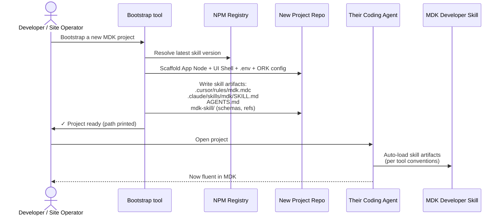
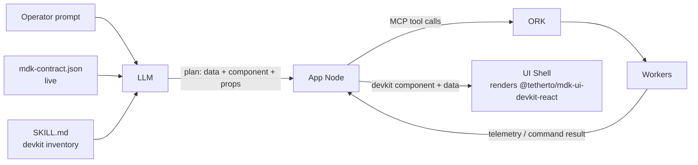
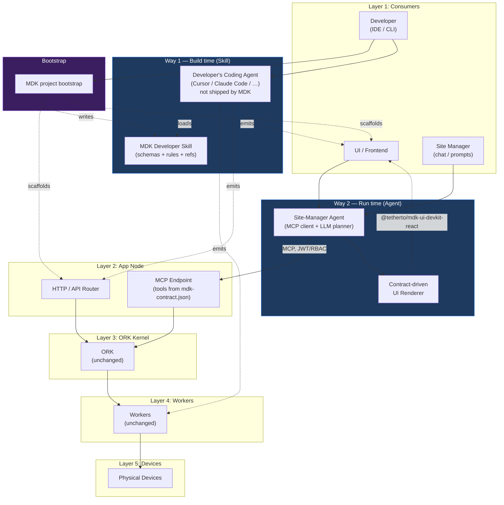

# Agentic Framework on MDK — High-Level Design

> **Version:** 0.3.0  |  **Date:** 2026-05-15  |  **Status:** In Review
>
> Companion to `[hld.md](./hld.md)` and `[hld-mdk-app.md](./hld-mdk-app.md)`. Defines two distinct ways AI integrates with the MDK platform: **build-time** (the *MDK Developer Skill* — a knowledge bundle that grounds any general-purpose coding agent in MDK conventions) and **run-time** (the *Site-Manager Agent* — a true autonomous agent that turns natural-language prompts into telemetry queries, fleet actions, and contract-driven UI). A working proof-of-concept for the run-time agent lives under `[mdk-be/poc/](../poc/)`.

---

## 1. Introduction

MDK already treats the AI Agent as a first-class consumer of the platform: it shares the same App Node boundary as the UI, gets its tools auto-derived from each worker's `mdk-contract.json`, and is governed by the same JWT/RBAC pipeline (see `[hld.md` §4.2](./hld.md)).

This document goes one step further. It defines **two distinct, complementary surfaces** the platform should support, with separate artifacts, owners, security models, and roadmaps:

|                  | **Way 1 — MDK Developer Skill** (build-time)                                                                                                 | **Way 2 — Site-Manager Agent** (run-time)                                                 |
| ---------------- | -------------------------------------------------------------------------------------------------------------------------------------------- | ----------------------------------------------------------------------------------------- |
| **What it is**   | A *skill* — static knowledge bundle (rules + schemas + reference code) loaded into a general-purpose coding agent                            | A true *agent* — autonomous runtime loop with its own LLM, tool calls, and side effects   |
| **Audience**     | Platform developers, device integrators, site operators bootstrapping a deployment                                                           | Site managers, operators, executives                                                      |
| **Runs in**      | The developer's coding agent (Cursor / Claude Code / Cline / Codex CLI) inside their IDE or CI                                               | Browser (Agent Studio) or operator's chat client, server-side LLM via App Node (optional) |
| **Inputs**       | MDK packages, schemas, reference contracts, idiomatic examples                                                                               | Live `mdk-contract.json` capabilities + telemetry                                         |
| **Outputs**      | Source code (worker package, App-Node routes, React widgets, deployment configs)                                                             | Telemetry visualization + dispatched commands                                             |
| **Distribution** | Shipped at project bootstrap — the bootstrap step writes the skill into the developer's repo so their coding agent picks it up automatically | An optional plugin enabled on the App Node + UI Shell at deploy time                      |

**Why this distinction matters.** Way 1 is *not* a separate agent to build, host, and secure — it is **context** given to whatever coding agent the developer already uses. The agent (Cursor, Claude Code, Cline, etc.) is supplied by the developer; MDK supplies the *skill* that makes that agent fluent in MDK conventions. Way 2, by contrast, is a true agent: a runtime loop with its own LLM, MCP tool calls, and side effects on physical hardware.

---

## 2. Way 1 — The MDK Developer Skill

### 2.1 Motivation

MDK ships a deliberately layered stack (`[mdk-libraries.md](./mdk-libraries.md)`). To deliver a new device integration or stand up an operator-facing app, a developer must touch at least four packages:

1. `**@tetherto/mdk-worker-base`** — subclass it, implement `onTelemetryPull` and `onCommand`.
2. `**mdk-contract.json`** — declare telemetry channels, command surface, constraints, troubleshooting, semantic AI hints; validate against `[mdk-contract.schema.json](./mdk-contract.schema.json)`.
3. `**@tetherto/mdk-app-node**` — wire any custom aggregation / RBAC route that isn't covered by the default MCP-tool surface.
4. `**@tetherto/mdk-ui-devkit-react**` — compose `<DeviceTile />`, `<TelemetryChart />`, `<CommandButton />` into a dashboard widget for that device.

Each layer is mechanical and well-specified — and therefore a perfect target for an AI-assisted workflow. But **MDK should not ship its own coding agent.** Every team already has one (Cursor, Claude Code, Cline, Codex CLI, Continue, Aider, …) and forcing them to swap it would be a non-starter. 

Instead, MDK ships a **skill** — a portable knowledge bundle that any general-purpose coding agent can load as context.

> **Goal:** *Any coding agent the developer already uses becomes instantly fluent in MDK conventions — package vocabulary, contract schema, devkit components, deployment topology — the moment the project is bootstrapped, with zero per-project setup.*

### 2.2 What the skill is, concretely

A **skill** in this context is a curated bundle of plain-text, schema, and code artifacts that any modern coding agent reads as part of its grounding context. Concretely the MDK Developer Skill is the following content:

| Artifact                                  | Format           | What it teaches the agent                                                                                      |
| ----------------------------------------- | ---------------- | -------------------------------------------------------------------------------------------------------------- |
| `SKILL.md` (entry-point)                  | Markdown         | When and how to apply MDK conventions; lists the three jobs in §2.3 and routes the agent to the right artifact |
| `mdk-contract.schema.json`                | JSON Schema      | The authoritative shape every worker contract must satisfy                                                     |
| Reference `mdk-contract.json` files       | JSON             | Canonical examples (miner, powermeter, temperature sensor, container) — the agent uses them as templates       |
| Reference worker source                   | `.mjs`           | `hardware.mjs`, `mapping.mjs`, `index.mjs` from working workers; the agent mimics the patterns                 |
| `@tetherto/mdk-ui-devkit-react` inventory | Markdown + types | Catalogue of every devkit component, its props, and its CSS-variable knobs                                     |
| App-Node route / Plugin templates         | `.mjs` / `.ts`   | Idiomatic Fastify route and MDK-App Plugin skeletons                                                           |
| RBAC scope catalogue                      | Markdown         | The published list of allowed JWT scopes and what they each permit                                             |

The skill is **passive context**, not executable code. It is consumed *by* an agent; it does not itself run a loop or call tools.

<!-- ### 2.3 The three jobs the skill teaches

The skill instructs the coding agent (whichever the developer is using) on three distinct task families, each scoped to one MDK package boundary:

#### 2.3.1 Job A — Scaffold a new Worker (Device-Lib Contract author)

**Trigger:** *"Integrate the Avalon A1366 miner."*

Skill-guided steps the coding agent performs:

1. Read `[mdk-contract.schema.json](./mdk-contract.schema.json)` and a reference contract (e.g. the Whatsminer one shipped in the skill).
2. Read vendor documentation (datasheet, native protocol reference) supplied by the developer.
3. Emit a new package under `packages/workers/miners/avalon-a1366/`:
  - `mdk-contract.json` — fully validated capability schema with `description`, `constraints`, and `troubleshooting` written for AI-context consumption.
  - `src/hardware.mjs` — vendor-protocol translation skeleton.
  - `src/mapping.mjs` — `translateTelemetry` + `computeHealth` per the contract's telemetry fields.
  - `src/index.mjs` — subclasses `@tetherto/mdk-worker-base`, implements `onInit`, `onTelemetryPull`, `onCommand`.
  - `package.json` — correct `@tetherto/mdk-worker-`* name + dependency versions.
4. Run the schema validation pass before handing off; flag any contract field the developer must fill in by hand.

Reference templates already in the monorepo: `[mdk-be/poc/workers/miner-worker/](../poc/workers/miner-worker/)` and `[mdk-be/poc/workers/powermeter-worker/](../poc/workers/powermeter-worker/)`.

#### 2.3.2 Job B — Scaffold App-Node business logic

**Trigger:** *"Add a cross-site revenue endpoint that aggregates hashrate × pool price per rack."*

Skill-guided steps:

1. Read the relevant `mdk-contract.json` files to know which telemetry fields exist.
2. Pick the right extension model per `[hld.md` §8](./hld.md) — either:
  - **Direct route** in the App Node using `@tetherto/mdk-client` HRPC calls, or
  - **MDK-App Plugin** per `[hld-mdk-app.md` §3](./hld-mdk-app.md) — emit a paired `MDK-App Server` (Fastify route module) + `MDK-App Widget` (React component).
3. Emit the JWT/RBAC scope declaration, the route handler, the unit test stub, and the TypeScript types.
4. Never bypass the App Node → ORK → Worker call chain — the skill explicitly forbids generating code that talks to ORK or workers directly. This mirrors the human rule in `[hld.md` §4.2](./hld.md).

#### 2.3.3 Job C — Generate a UI widget

**Trigger:** *"Scaffold a dashboard widget for the Avalon A1366."*

The skill teaches the coding agent to operate as a **deterministic compiler** from `mdk-contract.json` fields to JSX using `@tetherto/mdk-ui-devkit-react`:

| Contract field                               | Source of truth     | Generated primitive                            | Notes                                                                                    |
| -------------------------------------------- | ------------------- | ---------------------------------------------- | ---------------------------------------------------------------------------------------- |
| `telemetry.<channel>` (numeric, time-series) | `mdk-contract.json` | `<TelemetryChart deviceId metric={channel} />` | Sparkline / line chart from the devkit                                                   |
| `telemetry.<channel>` (scalar / status)      | `mdk-contract.json` | `<DeviceTile />` metric slot                   | Single-value readout                                                                     |
| `commands.<action>`                          | `mdk-contract.json` | `<CommandButton action={action} />`            | One button per safe action                                                               |
| `constraints.<rule>`                         | `mdk-contract.json` | `disabled` prop + tooltip                      | E.g. *"reboot blocked while curtailed"*                                                  |
| `description` / `troubleshooting`            | `mdk-contract.json` | `aria-label`, tooltip, empty-state copy        | Reuses the same AI-context prose as labels                                               |
| Brand / theme                                | Host app CSS vars   | Untouched (`--mdk-color-`*)                    | Host always wins per `@layer mdk` rule (see `[hld-mdk-app.md` §2.3.2](./hld-mdk-app.md)) |

Two delivery modes are supported:

- **Mode A — Scaffold-time:** the coding agent generates a static `.tsx` file checked into the repo. Auditable diff, full type-checking, no runtime risk. Requires a redeploy on contract change. Best for net-new device bring-up.
- **Mode B — Runtime:** the coding agent emits a JSON *widget descriptor*; a small `<AgentWidget descriptor={...} />` renderer in the host (likely living in `@tetherto/mdk-react-adapter`) walks the descriptor and instantiates the devkit components. Zero redeploy on contract change. Best for multi-tenant App Shells.

> **Why this works:** `@tetherto/mdk-ui-devkit-react` already enforces a strict, finite vocabulary of components, props, and CSS variables. The coding agent's "creativity" is bounded by the skill's published vocabulary, so generated UI is always on-brand and stylistically consistent with handwritten widgets. -->

### 2.4 Distribution at bootstrap

The skill is shipped to developers as **part of the project bootstrap step**, not as a separate install. When a site operator or platform engineer scaffolds a new MDK deployment, the bootstrap tool writes the skill artifacts directly into their repo so whatever coding agent they open it with automatically picks the skill up.
<!-- 
#### Bootstrap flow

#### What bootstrap writes

The bootstrap step lays down both the runtime scaffolding **and** the skill in standard, tool-specific locations so each coding agent finds it without configuration:

| Path written at bootstrap            | Purpose                                                                                                         |
| ------------------------------------ | --------------------------------------------------------------------------------------------------------------- |
| `apps/app-node/`                     | App Node Fastify project pre-wired with `@tetherto/mdk-app-node` middleware (JWT, RBAC, MCP)                    |
| `apps/ui-shell/`                     | Pre-built `@tetherto/mdk-ui-shell` React dashboard ready for plugins                                            |
| `.env.example`                       | All required env vars (`ORK_URL`, JWT signing key, LLM keys for the site-manager agent if enabled, …)           |
| `docker-compose.yml` / `Dockerfile`s | Site-local deployment topology                                                                                  |
| `.cursor/rules/mdk.mdc`              | Cursor-native rule file referencing the skill                                                                   |
| `.claude/skills/mdk/SKILL.md`        | Claude Code skill entry-point                                                                                   |
| `AGENTS.md` (root)                   | Generic agent-readable index (Cline, Continue, Codex CLI) pointing to the skill                                 |
| `mdk-skill/`                         | The full skill bundle (schemas, reference contracts, reference worker source, devkit inventory, RBAC catalogue) |
| `package.json`                       | `@tetherto/mdk-skill` listed as a `devDependency` so CI pipelines and remote agents can also load it            |

The skill is **versioned** alongside the MDK packages it documents. Re-bootstrapping (or pulling a fresh skill release into the project) refreshes the artifacts in lock-step with the package versions so the coding agent's knowledge never drifts from the runtime libraries.

> **Why ship it at bootstrap (not as a global install)?**
>
> 1. **Zero per-project setup** — the skill is already present the first time the developer opens the repo.
> 2. **Version-pinned** — the skill matches the exact MDK package versions the project uses; no "skill says X, library does Y" mismatches.
> 3. **Multi-agent compatible** — the same bootstrap writes the skill in every recognised location (`.cursor/`, `.claude/`, `AGENTS.md`, `mdk-skill/`) so the developer's choice of coding agent doesn't matter.
> 4. **Auditable** — the skill is checked into the team's repo; any team member can read exactly what context their coding agent is using.

#### What the operator gets

A site operator who wants to deploy MDK at a new site runs the bootstrap with a short manifest (worker set, site id, whether to enable the Way 2 site-manager agent). Bootstrap produces a complete, deployable repo. When the operator opens it in Cursor or asks Claude Code *"add a custom curtailment route that pauses miners when grid price > $X"*, the coding agent already knows the App-Node middleware, the JWT scopes available, the worker contract shape, and the devkit components — because the skill is sitting in the repo waiting to be read.

### 2.5 Flow (the skill in action)

```mermaid
sequenceDiagram
    actor Dev as Developer
    participant IDE as Coding Agent (Cursor / Claude Code / …)
    participant Skill as MDK Developer Skill
    participant Repo as MDK Project Repo

    Dev->>IDE: "Integrate Avalon A1366"

    rect rgb(70, 50, 40)
    Note over IDE,Skill: Phase 1 — Load skill (passive context)
    IDE->>Skill: Read SKILL.md
    IDE->>Skill: Read mdk-contract.schema.json
    IDE->>Skill: Read reference worker source
    IDE->>Skill: Read mdk-ui-devkit-react inventory
    end

    rect rgb(40, 60, 50)
    Note over IDE: Phase 2 — Plan (per skill rules)
    IDE->>IDE: Map vendor capabilities → contract schema
    IDE->>IDE: Pick worker template, App-Node extension model, UI mode
    IDE->>Dev: Show plan + open questions
    end

    rect rgb(40, 50, 70)
    Note over IDE,Repo: Phase 3 — Emit
    IDE->>Repo: Write mdk-contract.json
    IDE->>Repo: Write src/{hardware,mapping,index}.mjs
    IDE->>Repo: Write App-Node route / MDK-App Plugin
    IDE->>Repo: Write React widget (.tsx) — Mode A
    IDE->>Skill: Validate generated contract against schema ✓
    end

    rect rgb(50, 50, 40)
    Note over Dev,Repo: Phase 4 — Human review
    Dev->>Repo: Diff review, run tests, ship
    end
```

Notice how the coding agent is *not* part of MDK — it's the developer's own tool. The skill is the only MDK-supplied artifact in the loop.

### 2.6 Boundaries

- **The skill is passive context only.** It has no runtime loop, no tool calls, no network access, and no credentials. It cannot do anything by itself.
- **The coding agent (whichever one the developer uses) never connects to a live ORK or a live worker.** It operates purely on source code and the static artifacts in the skill bundle.
- **The skill never authorises new MDK primitives.** It documents only the published vocabulary: `@tetherto/mdk-worker-base`, `@tetherto/mdk-client`, `@tetherto/mdk-app-node`, `@tetherto/mdk-ui-`*, and the `mdk-contract.schema.json` shape. Anything outside that shape must be explicitly added to the skill via a new versioned release.
- **Source-of-truth direction:** for hardware behaviour, code emitted under the skill's guidance is the *first draft*; the worker's `mdk-contract.json` and `src/hardware.mjs` remain the ultimate source of truth once shipped (consistent with `[hld.md` §4.4.2](./hld.md)).
- **No changes to ORK, the MDK Protocol, or `mdk-contract.schema.json` are required to ship the skill.** It is purely a developer-experience artifact. -->

---

## 3. Way 2 — The Site-Manager Agent

### 3.1 Motivation

A site manager opens a chat panel and types: *"Show the power factor across all racks"*, *"Generate me a report I can send to the boss"*, or *"Throttle the overheating miners to 2800W"*. The agent must:

1. Understand the intent against the **live** set of capabilities declared by all currently-registered workers.
2. Plan one or more MCP tool calls (`get_worker_capabilities`, `get_fleet_telemetry`, `execute_device_command`) and execute them through the App Node's MCP endpoint under the same JWT/RBAC governance as a human API consumer (`[hld.md` §4.2](./hld.md)).
3. **Pick the right UI component** for the result — guided by the same `SKILL.md` shipped in §2 (specifically the `@tetherto/mdk-ui-devkit-react` inventory) — and render the live data into that component, so the operator gets a real dashboard panel, not a chat-only string.

This collapses the gap between *"natural-language operations"* and *"a dashboard a human would have hand-built"* — every fleet question becomes a one-shot, contract-grounded, executable workflow.

### 3.1.1 Why MCP, not a CLI

A natural alternative would be to give the agent shell access and let it run `mdk telemetry pull --window 24h --worker miner` style CLI commands. The platform deliberately rejects this design:

| Aspect                  | CLI invocation                                                                | MCP tool call (chosen)                                                                                     |
| ----------------------- | ----------------------------------------------------------------------------- | ---------------------------------------------------------------------------------------------------------- |
| **Tool surface**        | Hand-written CLI commands; drifts from the contract over time                 | Auto-derived from `mdk-contract.json` — every new capability is *immediately* an agent tool, no extra code |
| **Auth model**          | Agent would need a shell + local file-system credentials                      | Standard JWT/RBAC issued by the App Node — same identity story as the UI                                   |
| **Transport**           | Local process spawn — not reachable from a hosted LLM or a browser-side agent | HTTP + JSON-RPC — works for server-side *and* browser-side agents, local *and* remote LLMs                 |
| **Discoverability**     | The LLM must be taught CLI flags out-of-band                                  | MCP exposes a machine-readable `list_tools` manifest; the LLM grounds itself dynamically                   |
| **Argument validation** | CLI parsers, often loose                                                      | JSON-Schema-validated against `mdk-contract.json` *before* the App Node forwards to ORK                    |
| **Audit**               | Shell history at best                                                         | Structured per-call audit log at the App Node (proposed Hyperbee log, see §5)                              |
| **Sandbox**             | Whatever the shell can reach                                                  | Hard-bounded by the published MCP tool list; the agent cannot invent calls outside it                      |

In short: MCP is the **standard protocol** for "give an LLM typed, auth'd, discoverable tools over the network". Wiring it up natively means we never write or maintain an agent-specific façade — the same contract that drives ORK validation, dashboard rendering, and the developer skill *also* drives the agent's tool surface. A CLI would just be a worse copy of the same surface.

### 3.1.2 The MCP endpoint is part of the App Node

There is no separate "MCP server" process. The MCP endpoint is a **mounted module inside the App Node** (`@tetherto/mdk-app-node`), sitting next to the App Node's normal HTTP routes and sharing the same Fastify instance, JWT middleware, RBAC middleware, and request-logging plane (see `[hld.md` §4.2](./hld.md)). At a high level the App-Node-hosted MCP module does four things:

1. **Builds the tool list at boot.** It reads each worker's registered `mdk-contract.json` (via ORK's `/capabilities` endpoint) and synthesises one MCP tool per telemetry channel and per command. Tool names, descriptions, and JSON-Schema arg validators come straight out of the contract — no hand-written tool definitions.
2. **Refreshes on registry changes.** When a new worker registers with ORK (or a contract version changes), the App Node receives the new registration and regenerates the tool list. Agents reconnecting after that see the new tools immediately.
3. **Authenticates and authorises every call.** Each MCP request carries the agent's JWT; the App Node validates the signature, resolves the RBAC scopes, and rejects any tool call the scopes don't permit *before* the call reaches ORK. The agent is just another authenticated client of the App Node.
4. **Dispatches through ORK.** Authorised calls are translated into the existing `App Node → ORK → Worker` chain — the same chain a human-triggered API call uses. ORK still performs generic-schema validation, the worker still performs the final hardware-specific check (`[hld.md` §4.4.2](./hld.md)), and the response flows back to the agent unchanged.

Co-locating MCP inside the App Node is what makes the architecture safe by construction: there is exactly one trust boundary between any consumer (UI, human API client, AI agent) and the rest of the platform, and the agent gets no special channel that bypasses it.

### 3.2 Reference implementation — the POC

A complete working implementation of this flow lives at `[mdk-be/poc/](../poc/)`, exercising the full real `Agent → MCP → App Node → ORK → Worker → Device` chain in a single-process bootstrap:

- **App Node + Agent Studio UI** — `poc/agentic-studio/server.mjs` (Fastify; serves the chat UI and the MCP endpoint).
- **ORK Kernel** — `poc/ork/src/index.mjs` (HTTP-simulated MDK Protocol; Registry / Health Monitor / Telemetry Collector / Command Dispatcher / Scheduler per `[hld.md` §4.3.1](./hld.md)).
- **Workers** — `poc/workers/miner-worker/` (10 simulated miners) and `poc/workers/powermeter-worker/` (10 simulated power meters), both subclassing a `MDKWorkerBase` that mirrors `@tetherto/mdk-worker-base`.
- **LLM intent resolution** — `poc/lib/llm-interpreter.mjs` (OpenAI / Anthropic / OpenRouter-compatible; the full `mdk-contract.json` is passed as context).
- **Contract-driven UI renderer** — `poc/lib/ui-renderer.mjs` (emits HTML widgets per visualization plan).

The POC validates that **no change to the existing MDK Protocol, ORK, or worker contract is required** to host the site-manager agent — it is purely additive on the App Node + UI side.

### 3.3 Runtime pipeline

```mermaid
sequenceDiagram
    actor Op as Site Manager
    participant UI as Agent Studio UI
    participant AN as App Node (MCP)
    participant LLM as LLM Provider
    participant ORK as ORK Kernel
    participant W1 as Miner Worker
    participant W2 as Powermeter Worker

    Op->>UI: "What is the power factor across all racks?"
    UI->>AN: POST /api/v1/agent/run { prompt }

    rect rgb(70, 50, 40)
    Note over AN,W2: Phase 1 — Discover capabilities
    AN->>ORK: GET /capabilities
    ORK-->>AN: merged registrations from all workers
    end

    rect rgb(40, 50, 70)
    Note over AN,LLM: Phase 2 — Resolve intent
    AN->>LLM: prompt + full mdk-contract.json as context
    LLM-->>AN: { visualization, filter, focus_fields, command? }
    end

    rect rgb(40, 60, 50)
    Note over AN,W2: Phase 3 — Fetch data
    AN->>ORK: GET /telemetry
    par
        ORK->>W1: telemetry.pull
    and
        ORK->>W2: telemetry.pull
    end
    ORK-->>AN: fleet telemetry snapshot
    end

    rect rgb(50, 50, 40)
    Note over AN,Op: Phase 4 — (Optional) Act + Render
    alt action intent
        AN->>ORK: POST /command { deviceId, command, params }
        ORK->>W1: command.request
        W1-->>ORK: command.result
        ORK-->>AN: result
    end
    AN->>AN: Render HTML using contract telemetry schema
    AN-->>UI: { html, narrative, trace[], llm, intent }
    UI-->>Op: Renders contract-driven visualization
    end
```

### 3.4 Use cases

The POC implements both halves of the agent's value — pulling/synthesizing data, and pushing/executing actions.

#### 3.4.1 Use-case A — *"Generate a report I want to send to the boss"*

**Read-only path.** The agent calls `list_devices` and `get_fleet_telemetry(window: 24h)`, aggregates fleet-wide metrics (hashrate, uptime, anomalies, hottest device), narrates trends, and renders a printable HTML artifact.

- Stresses aggregation, not control — validates that the `App Node → ORK → Worker` pull path scales under agent-initiated fan-out.
- Zero risk to live hardware; ideal first milestone.
- High operator-visible value: an executive-ready artifact is a tangible deliverable.

#### 3.4.2 Use-case B — *"Take action"*

**Write path with verification.** The agent detects an anomaly (e.g. outlet temp > 85 °C on `wm005`), matches it to the contract's `troubleshooting` rule, dispatches `setPowerLimit` via MCP, then re-queries telemetry to confirm the temperature is dropping before reporting back to the operator.

#### 3.4.3 Use-case C — *"Show / answer / query"*

**Ad-hoc operator queries** — the most common case. *"What's the total fleet hashrate?"*, *"Which racks are over their power threshold?"*, *"Show voltage and grid status for all power meters"*. The LLM picks a visualization (`thermal_grid`, `metric_focus`, `health_status`, `full_table`, `fleet_summary`, `action_result`) and a focus-field set; the renderer materializes the answer as a dashboard panel — not a chat string.

### 3.5 Contract-driven UI rendering — *how the API decides which component to use*

The site-manager agent's output is **not a chat string and not free-form HTML**. It is a real `@tetherto/mdk-ui-devkit-react` component, picked by the App Node at request time, hydrated with the data the MCP tools just returned, and shipped back to the UI Shell for direct mounting.

The decision flow:

1. **The App Node already has `SKILL.md*`* (the same skill from §2, available at runtime as a `devDependency` of the App Node). The relevant section is the `@tetherto/mdk-ui-devkit-react` *inventory* — the catalogue of every component, the props it accepts, and the kinds of data it visualizes well (`<TelemetryChart>` for time-series, `<DeviceTile>` for scalar status, `<ThermalGrid>` for spatial heatmaps, `<FleetSummary>` for aggregates, `<CommandResult>` for action outcomes, etc.).
2. **The LLM is given that inventory as context** in the system prompt — alongside the live `mdk-contract.json` capability set. So when it produces its plan it doesn't just pick *which data* to fetch; it also picks *which devkit component* is the right shape for the answer (e.g. *"this is a per-rack time-series, so use `<TelemetryChart>` with `groupBy: rack`"*).
3. **The App Node validates the plan against the skill's inventory** — same way it validates command names against `mdk-contract.json.commands[]`. Unknown component names, unsupported props, or props that don't match the contract's telemetry units are rejected before any UI is built.
4. **The App Node executes the MCP tool calls** (telemetry pulls, command dispatches) and gets the live data back from ORK / the workers.
5. **The renderer instantiates the chosen devkit component with that data.** Two delivery modes, identical to §2.3.3:
  - *Mode A (server-rendered HTML)* — the POC's current shape; useful for plain HTML clients.
  - *Mode B (widget descriptor)* — the App Node returns a JSON descriptor `{ component: "TelemetryChart", props: {…}, data: […] }` and a tiny `<AgentWidget />` renderer in the UI Shell (living in `@tetherto/mdk-react-adapter`) mounts the real React component. Preferred for production: type-safe, themable, and visually identical to hand-written dashboards.

**Why route the component decision through the skill?** Two reasons:

- **Single source of UI truth.** The same inventory that teaches build-time coding agents to scaffold dashboards (§2.3.3) is now teaching the run-time agent to *pick* one. Hand-written, scaffolded, and runtime-generated widgets all come out of the same devkit vocabulary, so they look and behave identically.
- **No prompt-engineering drift.** If the devkit adds a new component or deprecates an old one, that change ships in one place — `SKILL.md` — and both the coding agent (Way 1) and the site-manager agent (Way 2) pick it up on their next refresh. The App Node never has a hand-written `if/else` over component names.

> **One contract + one skill, two consumption modes.** `[about.md](./about.md)` already names `mdk-contract.json` as the source of truth for ORK validation, MCP tool autodiscovery, and dashboard labels. The agentic framework adds the **MDK Developer Skill** as a second runtime artifact: at *build time* it teaches coding agents how to write MDK code; at *run time* it teaches the App Node which devkit component to render. Same skill, both ways.

### 3.6 Guardrails (non-negotiable)

| Layer        | Guardrail                                                                                                                                                                       | Source                                  |
| ------------ | ------------------------------------------------------------------------------------------------------------------------------------------------------------------------------- | --------------------------------------- |
| **App Node** | JWT validation + per-action RBAC (e.g. `device:write`, `device:throttle`) before any agent tool reaches ORK                                                                     | [`hld.md` §4.1.2`](./hld.md)            |
| **App Node** | Rate limits scoped to the agent's token                                                                                                                                         | [`hld.md` §4.2`](./hld.md)              |
| **App Node** | The agent is forbidden from inventing actions; only commands declared in `mdk-contract.json.commands[]` can be chosen                                                           | This doc §3.6                           |
| **ORK**      | Generic-schema validation against the worker's declared capability before dispatch                                                                                              | [`hld.md` §3.4`](./hld.md), Hyperschema |
| **Worker**   | Final hardware-specific sanity check; source of truth                                                                                                                           | [`hld.md` §4.4.2`](./hld.md)            |
| **Contract** | `constraints` declare hard "do not cross" limits; `troubleshooting` declares the *only* approved recovery moves                                                                 | `mdk-contract.json`                     |
| **LLM**      | The system prompt restricts output to a validated JSON plan; visualization name, command name, and focus-field names are all checked against the live contract before execution | `poc/lib/llm-interpreter.mjs`           |

The agent **never** connects directly to ORK or workers — it goes through the App Node MCP endpoint exactly like any other authenticated client (see `[hld.md` §4.2](./hld.md)).

---

## 4. Architectural placement

**Net-new components**

| Component                                                                                            | Layer                                                              | Status                                     | Owner               |
| ---------------------------------------------------------------------------------------------------- | ------------------------------------------------------------------ | ------------------------------------------ | ------------------- |
| `@tetherto/mdk-skill` — the skill bundle (schemas + rules + reference code)                          | Build-time, shipped at project bootstrap into the developer's repo | Proposed                                   | Platform DevEx team |
| Bootstrap integration that lays the skill into `.cursor/`, `.claude/`, `AGENTS.md`, and `mdk-skill/` | Build-time                                                         | Proposed                                   | Platform DevEx team |
| Site-Manager Agent (LLM intent resolver)                                                             | App Node (server) or Browser (client)                              | **Prototyped — `[mdk-be/poc/](../poc/)`**  | Platform team       |
| Contract-driven UI renderer                                                                          | App Node response + `@tetherto/mdk-ui-devkit-react`                | **Prototyped — `poc/lib/ui-renderer.mjs`** | UI team             |
| `<AgentWidget descriptor={...} />` (Mode B)                                                          | `@tetherto/mdk-react-adapter`                                      | Proposed                                   | UI team             |

**Unchanged components** — ORK, the MDK Protocol, all worker base classes, `mdk-contract.schema.json`, JWT/RBAC enforcement in the App Node. The agentic framework is purely additive.

---

## 5. Security & governance

| Concern                | Way 1 — MDK Developer Skill                                                                        | Way 2 — Site-Manager Agent                                                                                                                                                                                   |
| ---------------------- | -------------------------------------------------------------------------------------------------- | ------------------------------------------------------------------------------------------------------------------------------------------------------------------------------------------------------------ |
| **Identity**           | None — the skill is passive context; the coding agent acts under the developer's local credentials | Standard MDK Agent JWT issued by the App Node identity provider                                                                                                                                              |
| **Authorization**      | Local file-system permissions only; no MDK runtime access                                          | RBAC scopes (`telemetry:read`, `device:write`, `device:throttle`, …) — same model as human operators                                                                                                         |
| **Audit trail**        | Git history of files written by the developer (post-review)                                        | Hyperbee-backed action log at the App Node (proposed) — every prompt, MCP tool call, and command dispatch is recorded; ORK's Command State Machine WAL (`[hld.md` §4.3.1](./hld.md)) is the secondary source |
| **Approval gating**    | Human PR review on the diff the coding agent proposed                                              | Configurable per RBAC role — high-risk commands (e.g. `shutdown`) require a mandatory human-in-the-loop confirmation; lower-risk (e.g. `setPowerLimit` within `constraints`) can be auto-approved            |
| **Kill switch**        | Remove the skill artifacts from the repo or pin to an older version                                | App Node feature flag immediately blocks `intent: action` plans for all agents                                                                                                                               |
| **Version drift risk** | Mitigated by re-bootstrapping (skill is pinned to MDK package versions)                            | Mitigated by always loading the *live* `mdk-contract.json` at request time                                                                                                                                   |

---

## 6. Open questions

- **Skill packaging format (Way 1):** do we maintain a single canonical bundle and let the bootstrap step re-format it into each agent's preferred location (`.cursor/rules/*.mdc`, `.claude/skills/*/SKILL.md`, `AGENTS.md`)? Or do we ship per-agent skill packages? The former is simpler; the latter lets us exploit agent-specific features (e.g. Cursor's `globs` matchers).
- **Skill update cadence:** does re-bootstrapping rewrite skill artifacts unconditionally, or merge with local edits? Most teams will customise `AGENTS.md` — we need a non-destructive update model.
- **Agent runtime placement (Way 2):** does the site-manager agent run server-side as an App Node sidecar, or client-side in the operator's browser? Affects JWT minting, long-running loop supervision, and where the LLM API key lives.
- **Widget descriptor schema (Way 1, Mode B):** if we ship runtime-generated UI, do we ratify the descriptor as a first-class MDK contract — `mdk-widget.schema.json` — and govern it with Hyperschema like the rest of the protocol?
- **Cost / latency:** large fleet reports may require many `telemetry.pull` round-trips. Do we add a dedicated `telemetry.pullBatch` MCP tool, or keep App Node aggregation as the only fan-out path?
- **Audit-log storage:** Hyperbee-backed action log at the App Node vs. piggyback on ORK's Command State Machine WAL? The former is agent-scoped and queryable; the latter is already required for crash recovery.
- **Multi-LLM portability (Way 2):** the POC abstracts OpenAI / Anthropic / OpenRouter behind a single interpreter. Is this the long-term contract, or do we standardize on a single provider for production?

---

## 7. Roadmap

### 7.1 Way 2 — Site-Manager Agent

| #   | Milestone                                              | Layers exercised           | Exit criteria                                                                  | Status        |
| --- | ------------------------------------------------------ | -------------------------- | ------------------------------------------------------------------------------ | ------------- |
| 1   | Capability discovery                                   | Agent → MCP                | Agent lists devices and dumps capabilities for one device                      | ✅ done in POC |
| 2   | Read-only telemetry                                    | Agent → MCP → ORK → Worker | Agent returns 24h metrics for one device                                       | ✅ done in POC |
| 3   | Fleet aggregation + report                             | Same as #2, fan-out        | Agent generates Use-case A report end-to-end                                   | ✅ done in POC |
| 4   | Single-device action                                   | Full chain (write path)    | Agent dispatches `setPowerLimit` after JWT + RBAC + contract validation passes | ✅ done in POC |
| 5   | Closed-loop action                                     | Full chain + verification  | Agent executes Use-case B (detect → throttle → verify → report)                | ✅ done in POC |
| 6   | Production audit log                                   | App Node + Hyperbee        | Every agent run produces a signed, replayable record                           | Proposed      |
| 7   | Approval-gated commands                                | App Node RBAC              | High-risk commands require explicit human confirmation step                    | Proposed      |
| 8   | Contract-driven UI via `@tetherto/mdk-ui-devkit-react` | UI Kit                     | Replace the POC's inline HTML renderer with devkit components                  | Proposed      |

### 7.2 Way 1 — MDK Developer Skill

| #   | Milestone                                        | What ships                                                                                            | Exit criteria                                                                                                                               | Status   |
| --- | ------------------------------------------------ | ----------------------------------------------------------------------------------------------------- | ------------------------------------------------------------------------------------------------------------------------------------------- | -------- |
| 1   | `@tetherto/mdk-skill` v0.1 (read-only artifacts) | NPM package containing `SKILL.md`, `mdk-contract.schema.json`, one reference worker, devkit inventory | Cursor / Claude Code loaded against a sample MDK repo can answer "what is `mdk-contract.json`?" accurately from the skill alone             | Proposed |
| 2   | Bootstrap writes the skill                       | Project bootstrap tooling                                                                             | Bootstrapping a new project produces a repo with App Node + UI Shell + skill artifacts in `.cursor/`, `.claude/`, `AGENTS.md`, `mdk-skill/` | Proposed |
| 3   | Job A coverage (Worker scaffolding)              | Skill rules + templates                                                                               | Skill-guided coding agent scaffolds a new worker package that passes schema validation and registers with ORK in a smoke test               | Proposed |
| 4   | Job B coverage (App-Node logic scaffolding)      | Skill rules + templates                                                                               | Skill-guided coding agent emits a Fastify route with correct JWT scopes and a passing unit test                                             | Proposed |
| 5   | Job C coverage Mode A (UI widget scaffolding)    | Skill rules + devkit inventory                                                                        | Skill-guided coding agent emits a `.tsx` widget that renders side-by-side with the handwritten reference                                    | Proposed |
| 6   | Job C coverage Mode B (Runtime UI)               | `<AgentWidget />` in `@tetherto/mdk-react-adapter` + widget descriptor in skill                       | Site running App Shell renders a never-before-seen device using only its `mdk-contract.json`                                                | Proposed |
| 7   | Non-destructive skill refresh on re-bootstrap    | Bootstrap feature                                                                                     | Re-bootstrapping bumps `mdk-skill` to latest while preserving local edits to `AGENTS.md`                                                    | Proposed |

Milestones 1–5 in §7.1 are already validated by the POC and can be promoted from `mdk-be/poc/` to production packages independently. Milestones in §7.2 are net-new but each is bounded to a single MDK package surface and can be developed in parallel.

---

## 8. Next steps

1. **Promote the POC to production packages.** Extract `poc/lib/llm-interpreter.mjs`, `poc/lib/agentic-core.mjs`, and the MCP tool layer into `@tetherto/mdk-app-node` (or a new `@tetherto/mdk-app-node-agent` plugin per the MDK-App Plugin model in `[hld-mdk-app.md` §3](./hld-mdk-app.md)).
2. **Replace the POC's inline HTML renderer with `@tetherto/mdk-ui-devkit-react` components** so site-manager-agent UI is visually identical to handwritten dashboards.
3. **Specify `@tetherto/mdk-skill`** — the schema + rules + examples bundle that gets written into bootstrapped projects.
4. **Wire the skill into the project bootstrap flow** so a new MDK deployment lays down both the runtime scaffolding and the skill artifacts in one step, with a non-destructive refresh path for re-bootstrapping.
5. **Decide Mode A vs Mode B (or both)** for UI scaffolding and, if Mode B, draft `mdk-widget.schema.json`.
6. **Pick the audit-log storage strategy** (Hyperbee at App Node vs ORK WAL piggyback) and ship the first version behind a feature flag.
7. **Scope approval gating** for high-risk commands; align RBAC roles between human and agent identities.

> **References:** `[hld.md](./hld.md)` · `[hld-mdk-app.md](./hld-mdk-app.md)` · `[about.md](./about.md)` · `[mdk-libraries.md](./mdk-libraries.md)` · `[mdk-contract.schema.json](./mdk-contract.schema.json)` · POC implementation: `[mdk-be/poc/](../poc/)`

